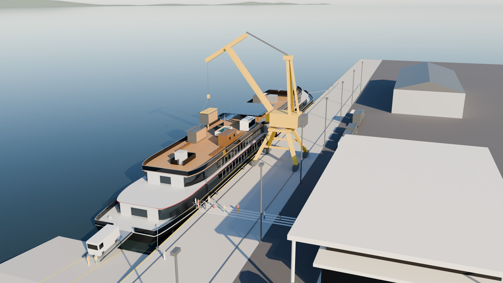

# «Волжский Горизонт» - колёсное круизное судно мелкой осадки

Проект под конкурсное задание УЖЦ ОСК 2026, редакция 2. Прототип по
технике - ПКС-180 «Золотое кольцо» (колёса в нишах, две жилые палубы);
внешность своя, современная: чёрный корпус, светлая лента главной палубы,
красная линия, графитовый ярус кают.

**Главное правило репозитория:** все числа проекта живут в параметрических
библиотеках `src/lib/`, вся графика и документы собираются скриптами из
`scripts/`. Если число встречается в записке или на плане - оно посчитано,
не набрано. Нашли расхождение между своим документом и библиотекой - права
библиотека; нужна правка - говорите Максу, а не правьте сгенерированный файл.



---

## 1. Первый час - всем, по порядку

| # | Что открыть | Зачем | Время |
|---|---|---|---|
| 1 | [`renders/горизонт_2026/лист_проекта_горизонт.png`](renders/горизонт_2026/лист_проекта_горизонт.png), папка [`renders/горизонт_2026/виды/`](renders/горизонт_2026/виды/) | как судно выглядит: общий вид, борт, солнечная палуба с модулями, у причала | 5 мин |
| 2 | этот README, разделы 2 и 3 | что должен знать каждый и что смотреть именно вам | 10 мин |
| 3 | [`docs/проект/концепция.md`](docs/проект/концепция.md) | почему судно такое: каждое решение с причиной - это ответы на вопросы жюри | 15 мин |
| 4 | [`docs/сводка_состояние.md`](docs/сводка_состояние.md) | что закрыто по КЗ (15 требований) и по матрице оценки, что открыто по строкам - генерируется | 10 мин |
| 5 | [`docs/проект/записка.md`](docs/проект/записка.md) - оглавление и свой раздел | пояснительная записка по десяти блокам КЗ; незаполненные места помечены **НЕ ЗАПОЛНЕНО** | 10 мин |
| 6 | [`docs/задание/KZ_UZhTs_OSK_2026.md`](docs/задание/KZ_UZhTs_OSK_2026.md) и матрица `docs/задание/Zony_otvetsvennosti_2026_UZhTs.xlsx` | само задание и за что дают баллы | 10 мин |
| 7 | [`docs/план/План_работы_команды_УЖЦ_2026.md`](docs/план/План_работы_команды_УЖЦ_2026.md) | кто за что отвечает, гейты и синки | 5 мин |

## 2. Что должен знать каждый

| Характеристика | Значение |
|---|---|
| Длина × ширина корпуса | **140,0 × 16,5 м**; ширина задана маршрутом, длина - компоновкой |
| Габаритная ширина с колёсами | 16,0 м - колёса утоплены в ниши |
| Высота борта / осадка | 3,00 м / **1,26 м** при 2377 т (расчётная 1,30); КЗ: эксплуатация на глубине 1,5 м - 6,5 км/ч по мели |
| Габаритная высота от ВЛ | 9,9 м, рубка стационарная; самый низкий мост маршрута 13,3 м (Затонские мосты, Уфа) |
| Палубы | второе дно · трюм (нежилой, 2,1 м) · главная · средняя · солнечная (открытая) |
| Пассажиры / экипаж | **208 мест в 64 каютах** четырёх категорий, 12 мест М4 / 48 человек |
| Движитель | два гребных колеса Ø4,90 м на миделе, 12 шарнирных плиц, механизм Моргана |
| Энергетика | гибрид: 3 ГДГ по 600 кВт на **метаноле**, батарея 600 кВт·ч, берег, солнце; автономность 15 суток |
| Автомобили | 4 места класса «Б» до 3,5 т: гараж на главной палубе, кормовая аппарель 9 × 3,6 м |
| Сервисы сверх ресторанов | пять: театр-лаунж, спа и фитнес, детский клуб, панорамный салон, галереи к колёсам |
| Маршрут | кольцо Самара - Казань - Уфа - Самара по Волге, Каме и Белой, 15 дней, 2606 км; класс РКО «О 2,0» |
| Солнечная палуба | 18 слотов под контейнеры 20' HC на **72 фундаментах-замках**, шесть тем «трансформера» до 60 т (запас по заданию Глеба 85 т); смена темы - в Самаре краном порта |
| **Узел КД** | **литой фундамент-замок модуля ВГ-2026.46.00** - решение команды 22.09.2026 |

Решения, которые нельзя перепутать на защите:

- **Узел для КД - литой фундамент-замок** для крепления модулей солнечной
  палубы (решение 22.09.2026, он же по заданию Глеба). В плане команды §7
  ещё прежний узел - ось плицы; от него отказались, его документации в
  репозитории нет.
- **Фундамент литой, литейка своя**: корпус 20ГЛ литьём в форму из ХТС,
  конус-замок 40Х, рычаг 09Г2С, четыре болта М24 А4-80 через изолирующие
  втулки на подкладной лист АМг5. Нагрузки - от качки **этого** судна
  (период и крен - из теории корабля), а не из старого проекта.
- **Осадка:** расчётная 1,30, фактическая по нагрузке масс 1,26; узел
  считан на худший период качки в диапазоне осадок 1,20…1,30.
- **Метанол, а не СПГ:** танк СПГ не встаёт ни в трюм, ни под мосты;
  метанол - в цистернах второго дна, бункеровка автоцистерной на любом причале.
- **Смена модуля у причала** (`gorizont_berth`): судно лагом левым бортом,
  портальный кран 16 т достаёт дальний ряд на вылете 20,3 м; трап и
  аппарель не круче 0,08 - проходимы для кресла-коляски.

## 3. Кому что смотреть первым делом

Роли - по плану команды. «Открыто» - строки матрицы, которые на 22.09 не
закрыты; живой список - `docs/сводка_состояние.md`, раздел 4.

| Кто | Роль по плану | Открыть первым | За вами открыто |
|---|---|---|---|
| **Владимир** | докладчик, чек-лист КЗ (C4) | `docs/сводка_состояние.md` §1 - все 15 требований КЗ сходятся, у каждого место; `python scripts/сверка_требований_КЗ.py` - чек-лист «требование → где закрыто»; `концепция.md` - ответы на «почему»; лист проекта и `виды/` | творческое задание - 5 мемов к 24.09 (2 балла, с Андреем); прогон регламента |
| **Маша** | интеграция, ПЗ, презентация, персонал, риски | `docs/проект/записка.md` целиком - она сводит; разделы 5 и 8; `docs/проект/персонал_и_дорожная_карта.md`; схемы `02б_загрузка_персонала.png`, `03_оргструктура.png`; `docs/команда/README.md` - что из ваших файлов встроено | записка 5.3…5.5 (подбор, оплата, обучение - 2,5); подтвердить оценки и мероприятия реестра рисков (3,5 частично); кооперация по судну (1,5); презентация (3,5); все разделы и вёрстка ПЗ в А4 (2); сквозная проверка «вход → выход» (2) |
| **Лена** | финмодель | записка раздел 6 (6.1…6.6 пусты - ваши); входы для затрат: трудоёмкость и численность - `персонал_и_дорожная_карта.md`; спецификация узла - `renders/горизонт_2026/чертежи/46_спецификация_лист1…2.png`; мощности, оборудование и программа выпуска узла - `docs/проект/узел_фундамент_twistlock.md` §7…10; нагрузка масс судна - `docs/проект/теория_корабля.md`, А.2 | затраты, себестоимость, цена, выручка, точка безубыточности, окупаемость, NPV/IRR, схема финансирования - около 19 баллов; ставки для `gorizont_build.затраты_на_персонал` |
| **Иван** | рынок, маршрут | записка 1.1 (1.1.2…1.1.5 пусты), 1.1.7 - сегменты уже посчитаны (`gorizont_market`); карта маршрута `схемы/04а_маршрут_карта.png`; замечания к «Маршрутам» - `gorizont_route.ЗАМЕЧАНИЯ` и концепция §8 | объём рынка, объём продаж, конкуренты, маркетинговая стратегия, цены и сеть для ППО - 5,5 балла; стоимость единицы на рынке - с Леной |
| **Глеб** | технология, материалы; модули солнечной палубы | `docs/проект/узел_фундамент_twistlock.md` - ваш «Чертёж крепления» стал узлом КД: материалы §3, литьё и подготовка формы §5, оснастка §6, мощности §7, планировка §9; карты ЕСТД `renders/горизонт_2026/чертежи/46_МК_*, 46_ОК*, 46_КЭ*, 46_ККИ*`; модульное решение - `docs/проект/модульное_решение.md`, листы `CAD/модули/МР-01…03`; кадр `виды/11_смена_модуля.jpg` | сверить принятое: оборудование литейки, загрузку цехов, планировку (2 балла частично); прислать остальные файлы «пачки» креплений - в репозитории только `Чертёж крепления.jpg` |
| **Андрей** | прочность, планировка участка | узел §4 - расчёт по качке судна, 44 проверки; теория корабля `docs/проект/теория_корабля.md` (остойчивость А.3, прочность А.7), листы `CAD/расчёты/РТ-01…09`; планировка `схемы/08_узел_участок.png` | творческое задание (с Владимиром); планировку сверить с цехами верфи |
| **Алексей** | КД узла, работоспособность идеи | СБ и детали: `CAD/узел/ВГ-2026_46_*.dxf` (растр - `renders/горизонт_2026/чертежи_dxf/ВГ-2026_46_*.png`); 3D - `CAD/STEP/VG-2026_46_*.step`; спецификация; рендеры `узел/46_01…03`; эксплуатация - записка раздел 9 | DWG листов узла - `CAD/DWG/узел/` (собраны 23.09); просмотреть КД глазами конструктора |
| **Макс** | 3D, визуализация | `CLAUDE.md` - как устроен репозиторий; `blender/gorizont.blend`; `scripts/blender_*` | взрыв-схема и лист проекта - пересобираются из скриптов; презентационные кадры для Маши |

## 4. Что открыто (43,5 балла из 95 по документам, на 22.09)

| Блок | Баллов | Кто | Что нужно |
|---|---|---|---|
| Экономика и затраты (A, B6) | ≈ 19 | Лена (+ Иван по цене) | финмодель целиком; входы уже есть в библиотеках (см. раздел 3) |
| Персонал: подбор, оплата, обучение (B6) | 2,5 | Маша | записка 5.3…5.5 |
| Риски и кооперация (B2) | 5 частично | Маша | подтвердить оценки реестра рисков; кооперация по судну |
| Рынок (B4) | 5,5 | Иван | записка 1.1.2…1.1.5 |
| Презентация и ПЗ (C1, C2) | 5,5 | Маша | презентация; вёрстка записки в А4 |
| Сквозная связность (B1) | 2 частично | Маша | «вход → выход» после заполнения записки |
| Творческое задание (A) | 2 | Андрей, Владимир | мемы к 24.09 |
| Мощности и планировка узла (B5) | 2 частично | Глеб, Андрей | сверить принятое оборудование и загрузку с данными верфи |

Закрыто 51,5 балла: концепция, дизайн-проект, КД узла, технология и
производство узла, теория корабля, чертежи ОР, модель и визуализация,
требования КЗ (C4).

## 5. Где что лежит

```
docs/задание/            КЗ ред. 2 и матрица оценки - не менять
docs/план/               план и Гант команды - не менять без просьбы
docs/команда/            ваши файлы как получены (байт в байт); что из них встроено - docs/команда/README.md
docs/проект/             концепция, записка, узел КД, модульное решение, теория корабля, персонал и дорожная карта
docs/сводка_состояние.md состояние по КЗ и матрице - генерируется scripts/сводка.py
src/lib/                 параметрические библиотеки: здесь живут все числа (карта - CLAUDE.md)
scripts/                 генераторы: модель, планы, схемы, чертежи, записки, сверки
CAD/                     ОР-01…08, РТ-01…09, МР-01…03, КД узла в DXF; DWG/ - те же в DWG; STEP/, GLB/ - 3D узла
renders/горизонт_2026/   виды, планы, схемы, расчёты, чертежи, узел, каюты, облик - генерируется
blender/gorizont.blend   модель судна с солнечной палубой; собирается с нуля blender_судно.собрать()
```

Картинки для презентации:

| Что | Где |
|---|---|
| судно целиком, борт, корма, нос, вид сверху | `renders/горизонт_2026/виды/01…08_*.jpg` |
| у причала, смена модуля, сход на берег | `renders/горизонт_2026/виды/10_у_причала.jpg`, `11_смена_модуля.jpg`, `12_сход_на_берег.jpg` |
| взрыв-схема судна | `renders/горизонт_2026/виды/09_взрыв_схема.jpg` |
| узел: сборка, взрыв-схема, отливка со стержнем | `renders/горизонт_2026/узел/46_01…03_*.png` |
| интерьеры кают | `renders/горизонт_2026/каюты/00_лист_кают.png` |
| планы палуб | `renders/горизонт_2026/планы/` |
| маршрут, дорожная карта, оргструктура, модули, производство узла | `renders/горизонт_2026/схемы/` |
| чертежи в растре | `renders/горизонт_2026/чертежи_dxf/`, `…/чертежи/` |

## 6. Как пересобрать и проверить

```bash
pip install -r requirements.txt
cd src && python -m lib.gorizont_ga && cd ..      # вместимость и проверки компоновки
python scripts/сверка_требований_КЗ.py             # требования КЗ и матрица оценки
python scripts/сводка.py                           # docs/сводка_состояние.md
python scripts/записка.py                          # docs/проект/записка.md
python scripts/записка_фундамента.py               # docs/проект/узел_фундамент_twistlock.md
```

Остальные проверки и сборка модели в Blender - `CLAUDE.md`.

## 7. Правила для всех

1. Числа - только из библиотек или сгенерированных документов; руками не переписывать.
2. Свои файлы - в `docs/команда/` как есть; Макс встроит их в библиотеки и
   допишет строку в `docs/команда/README.md`.
3. Сгенерированные файлы (`записка.md`, `сводка_состояние.md`, `теория_корабля.md`,
   `узел_фундамент_twistlock.md`, всё в `renders/`) руками не правятся:
   правка пропадёт при следующей сборке. Текст для записки - присылать,
   он встанет в скрипт.
4. `docs/задание/` не менять никогда; `docs/план/` - только по просьбе.
