# Пояснительная записка

## ВОЛЖСКИЙ ГОРИЗОНТ. Колёсное круизное судно мелкой осадки

Команда **УЖЦ ОСК 2026**. Конкурсное задание по компетенции «Управление
жизненным циклом изделия», чемпионат АО «ОСК» 2026 года, редакция 2.

Редакция от 24.09.2026. Все числа записки получены расчётом по единой
параметрической модели судна и пересчитываются при изменении исходных
данных.

> **Требования к оформлению при вёрстке в PDF** (приложение к КЗ):
> формат А4, шрифт не менее 11, ГОСТ Р 2.105, сквозная нумерация страниц,
> не более 100 страниц. Внизу каждой страницы:
> «№ блока. Наименование блока. УЖЦ ОСК 2026. Номер страницы (по порядку).»
> Номер и наименование блока - слева, наименование команды - по центру,
> номер страницы - справа.

---

## 1 Маркетинговая документация

### 1.1 Анализ рынка

Рынок речных круизов в России растёт, порог входа на него высокий - новое пассажирское судно стоит дорого и строится несколько лет. По данным Минтранса, в 2025 году пассажирские перевозки речным транспортом выросли на 7 % и достигли 13 млн человек, туристические перевозки выросли на 28 %. Рост сдерживает флот - спрос растёт быстрее, чем обновляются суда. Рассмотренные суда-аналоги на Волге и Каме построены в 1957 и 1973 годах (1.1.6).

Основные клиенты - семьи с детьми, пары старшего возраста, компании друзей и молодёжь, маломобильные пассажиры с сопровождающими, а также заказчики фрахта и корпоративных заездов. Факторы роста - внутренний туризм, государственная поддержка судостроения, переход на экологичное топливо (метанол, гибридные установки) и недостаток предложения в формате «река + автомобиль» и на малых реках.

Внешние факторы разобраны PEST-анализом (политические, экономические, социально-культурные и технологические факторы):

Таблица 1

| Группа факторов | Фактор | Что это значит для проекта |
|---|---|---|
| Политические | Государственная поддержка внутреннего туризма и обновления речного флота | Спрос на новые суда и маршруты, доступ к мерам поддержки |
|  | Меры поддержки постройки судов с экологичными энергетическими установками | Метанол и гибридная установка отвечают этому направлению |
|  | Ужесточение экологических требований | Очистка и повторное использование сточных вод, ход на батарее в черте городов |
| Экономические | Курс рубля и ограничения выездного туризма | Спрос переходит на внутренние маршруты |
|  | Рост цены дизельного топлива | Метанол и береговое питание снижают зависимость от дизельного топлива |
|  | Устойчивый платёжеспособный спрос на каюты высокого класса | Каюты бизнес и люкс, а на солнечной палубе - президентская тема модулей |
| Социально-культурные | Совмещение работы и отдыха в поездке | Деловая тема модулей - кабинеты и переговорные на солнечной палубе |
|  | Рост значения инклюзивного туризма | 12 мест М4, 4 лифта |
|  | Интерес к этнотуризму | Казань и Уфа на маршруте, программа о татарской и башкирской культуре |
| Технологические | Метанольные двигатели и гибридные энергетические установки | 3 ГДГ на метаноле по 600 кВт и аккумуляторная батарея |
|  | Солнечные модули и накопители энергии на судах | Солнечные модули 24 кВт над атриумом |
|  | Колёсный движитель для мелководья | КПД колеса 0,68 при осадке 1,26 м |

Сильные и слабые стороны проекта, возможности и угрозы рынка сведены в SWOT-анализ (сильные стороны, слабые стороны, возможности, угрозы):

Таблица 2

| Сильные стороны (S) | Слабые стороны (W) |
|---|---|
| S1. Модульная солнечная палуба - 6 тем на 18 слотах, тема меняется за смену | W1. Высокая стоимость постройки нового судна |
| S2. Осадка 1,26 м - Белая до Уфы и перекаты Камы всю навигацию | W2. Длительный срок окупаемости |
| S3. Гараж на 4 автомобиля класса «Б» - формат «река + автомобиль» | W3. Сезонность - навигация 184 суток, май - октябрь, зимой стоянка |
| S4. Гибридная установка - метанол, батарея, солнечные модули | W4. Нет известной марки на старте продаж |
| S5. 12 мест М4 и 4 лифта |  |
| **Возможности (O)** | **Угрозы (T)** |
| O1. Рост внутреннего туризма - туристические перевозки речным транспортом выросли на 28 % в 2025 году | T1. Повторение решений проекта - колёсного хода и мелкой осадки - другими операторами |
| O2. Государственная поддержка экологичного флота | T2. Экономическая нестабильность и снижение платёжеспособного спроса |
| O3. Формат «река + автомобиль» у речных круизных судов не представлен | T3. Ограничения поставок импортных комплектующих |
| O4. Рост инклюзивного туризма | T4. Изменение и ужесточение норм для судов на метаноле |
| O5. Развитие инфраструктуры метанольного топлива | T5. Дальнейшее обмеление рек |

Перекрёстная матрица SWOT-анализа даёт четыре стратегии:

Таблица 3

|  | Возможности (O) | Угрозы (T) |
|---|---|---|
| **Сильные стороны (S)** | **Стратегия S-O, рост.** Колёсный ход и метанол - основание для участия в программах поддержки экологичного флота (S4, O2). Гараж - вход в нишу автотуризма (S3, O3). Каюты М4 и лифты - предложение для инклюзивного туризма (S5, O4). | **Стратегия S-T, защита.** Осадка 1,26 м - запас на обмеление рек (S2, T5). Метанол, батарея и береговое питание снижают зависимость от цены дизельного топлива (S4, T2). Модульные темы меняют продукт без переоборудования судна, если конкуренты повторят формат (S1, T1). |
| **Слабые стороны (W)** | **Стратегия W-O, развитие.** Субсидии и льготное финансирование экологичного флота снижают стоимость постройки и срок окупаемости (W1, W2, O2). Партнёрство с поставщиками метанола на маршруте, бункеровка автоцистерной у причала (O5). Рост внутреннего туризма - время строить марку через выставки и партнёров (W4, O1). | **Стратегия W-T, удержание.** Смена модульной темы за смену под спрос сезона и фрахт судна целиком в межсезонье (W3, T2). Раннее бронирование со скидкой снижает риск незагрузки рейса (W2, T2). Отечественные комплектующие там, где они есть, - при выборе поставщиков (W1, T3). |

**Вывод по анализу рынка.** Рынок речных круизов растёт, а предложение ограничено числом и возрастом судов. Проект опирается на государственную поддержку экологичного флота, мелкую осадку и формат «река + автомобиль». Слабые места - стоимость постройки и срок окупаемости, их закрывают меры поддержки и гибкость продукта.

#### 1.1.1 Сегмент рынка

Семейный круиз по трём рекам с заходом в Уфу по Белой. Мелкая осадка 1,26 м открывает Белую и перекаты Камы, куда крупный круизный флот не идёт. Кольцо из Самары - посадка и высадка в одном порту. Гараж на четыре автомобиля, шесть кают М4, современный облик вместо ретро-стилизации.

Сегмент - речные круизы на 10…15 суток по Волге, Каме и Белой с посадкой и высадкой в Самаре. Ценовой уровень семейный (четырёхместные каюты стандарт и семейные) с бизнес- и люкс-каютами для пар 45+. Технический признак сегмента - осадка не более 1,26 м и проход под мостами высотой 13,3 м - маршруты, закрытые для судов с осадкой свыше 2,5 м, и Белая до Уфы, куда крупный круизный флот не заходит.

Сегменты пассажиров выделены по типам кают, которые они занимают. Запрос каждого сегмента и функции судна, которые на него отвечают:

Таблица 4

| Сегмент | Каюты, доля мест | Запрос потребителя | Требуемые функции |
|---|---|---|---|
| Семьи с детьми школьного возраста | стандарт, семейная, 76,9 % | Семейный отдых без перелётов, каникулы на воде. Готовый продукт - проживание, питание, экскурсии и анимация без отдельной организации. Экскурсии по выбору, а не по жёсткому расписанию, выбор порта окончания круиза. Безопасность и досуг детей на борту. | Четырёхместные каюты - стандарт у борта и семейные внутри. Детский и подростковый клуб, творческая мастерская, детская тема модулей на солнечной палубе. Семейные тарифы, дети до 12 лет бесплатно на верхних местах. Онлайн-конструктор экскурсий в портах стоянок. Ограждения, мягкое покрытие игровых зон, медпункт. |
| Пары 45+ и путешественники старшего возраста | бизнес, люкс, 11,5 % | Неспешный отдых, тишина и качество, а не скорость. Музеи, исторические и купеческие города, местная кухня. Свобода в выборе досуга и экскурсий. Высокий уровень сервиса. | Каюты бизнес 15 м² и люкс 18 м² с панорамным остеклением во всю ширину каюты. Ресторан в две смены, бар-лаунж. Спа с сауной, хаммамом и процедурными, фитнес, панорамный салон-обсерватория. Экскурсионная программа в 10 портах маршрута. |
| Компании друзей и молодёжь | эконом, 5,8 % | Доступный совместный отдых на 15 дней. Общение, вечерние программы, музыка. Свобода в выборе экскурсий и порта окончания круиза. | Каюты эконом - внутренние двухместные со световодом и виртуальным окном. Театр-лаунж, вечером клуб, бар-лаунж, открытые палубы. Событийная тема модулей на солнечной палубе - клуб, кино, дискотека. Групповые тарифы, раннее бронирование. |
| Маломобильные пассажиры с сопровождающими | стандарт М4, 5,8 % | Отдых без барьеров. Каюты, оборудованные с учётом потребностей людей с инвалидностью. Выбор удобного порта окончания круиза. | 12 мест в 6 каютах стандарт М4 - круг разворота 1,5 м, душ без порога. 4 лифта на 3 трап-холлах, двери в свету не менее 0,90 м. Телескопический трап и кормовая аппарель. Путь эвакуации 1,2 м, медпункт, обученный персонал. Адаптированные экскурсии по выбору. |

**Вывод по сегментам.** Ядро продукта - семьи с детьми, 76,9 % мест. Их дополняют пары старшего возраста (11,5 %), которым важны комфорт и культурная программа, и маломобильные пассажиры с сопровождающими (5,8 %), для которых решает доступность. Компании друзей и молодёжь (5,8 %) занимают каюты эконом и добирают загрузку в начале и в конце навигации. Экскурсии с отдельной оплатой и выбор порта окончания круиза отвечают запросу всех сегментов на свободу выбора. Численность сегментов, география и каналы продаж - 1.1.7, ёмкость рынка - 1.1.2, суда-аналоги - 1.1.6.

#### 1.1.2 Объём рынка

Объём рынка оценён в три ступени - TAM (общий объём рынка), SAM (доступный объём рынка) и SOM (достижимая доля нового оператора). Счёт идёт в пассажирах в год, одна путёвка - один пассажир. База оценки - около 750 000 пассажиров речных круизов в 2025 году, около 6 % от 13 млн пассажиров речного транспорта. Сегменты 2 и 3 оценены по возрастной структуре 200 000 пассажиров круизов, сегмент 4 - от числа людей с инвалидностью в России. Доли сегментов в базе и доли целевых клиентов - оценка ПЭУ.

База сегментов 1…3 уже в пассажирах, число групп (заказов) получено делением на число мест в каюте сегмента. В сегменте 4 база - люди с инвалидностью, каждый едет с сопровождающим, и пассажиров вдвое больше, чем групп. Расчёт объёма рынка:

Таблица 5

| Сегмент | База оценки | Потенциальных клиентов | Доля целевых, % | Ёмкость, пассажиров в год | Групп (заказов) |
|---|---|---|---|---|---|
| Семьи с детьми школьного возраста | 25 % от 750 000 пассажиров речных круизов 2025 года | 187 500 пассажиров | 80 | 150 000 | 37 500 по 4 человека |
| Пары 45+ и путешественники старшего возраста | 54 % от 200 000 пассажиров круизов, возраст 45 лет и старше | 108 000 пассажиров | 10 | 10 800 | 5400 по 2 человека |
| Компании друзей и молодёжь | 14 % от 200 000 пассажиров круизов, возраст 18…40 лет | 28 000 пассажиров | 5 | 1400 | 700 по 2 человека |
| Маломобильные пассажиры с сопровождающими | 11 000 000 людей с инвалидностью в России | 11 000 000 человек | 0,005 | 1100 | 550 по 2 человека |
| **TAM** - общий объём рынка | сумма сегментов |  |  | **163 300** | 44 150 |
| **SAM** - доступный объём рынка | 25 % TAM - маршрут в одном регионе, Волга, Кама и Белая |  |  | **40 825** |  |
| **SOM** - достижимая доля | 5 % SAM - консервативная доля нового оператора |  |  | **2041** |  |

В деньгах по средневзвешенной цене путёвки 147 846 руб. (1.1.4) доступный объём рынка SAM - 6,04 млрд руб. в год, достижимая доля SOM - 301,8 млн руб. План продаж судна - 1944 путёвки за навигацию (1.1.3) - занимает 95,2 % SOM и 4,8 % SAM (рисунок 1). Одному судну не нужна доля рынка больше консервативной оценки для нового оператора.

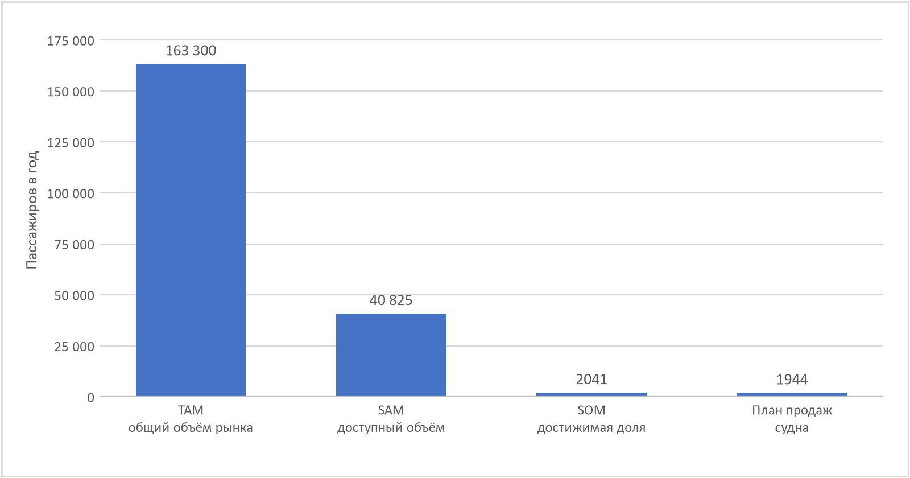

Рисунок 1 - Объём рынка TAM, SAM, SOM и план продаж судна

#### 1.1.3 Объём продаж в сегменте

Объём продаж считается в путёвках - одна путёвка на одного пассажира на полный круиз 15 суток - от мест в каютах по общему расположению и числа рейсов за навигацию. Плановая загрузка 85 % - оценка ПЭУ:

Таблица 6

| Показатель | Значение |
|---|---|
| Пассажирских мест на судне | 208 |
| Рейсов за навигацию (184 суток, оборот 16 суток) | 11 |
| Мест за навигацию | 2288 |
| Плановая загрузка | 85 % |
| **Продано путёвок за навигацию** | **1944** |
| Доля плана в SOM, достижимой доле рынка | 95,2 % |
| Доля плана в SAM, доступном объёме рынка | 4,8 % |
| Доля плана в TAM, общем объёме рынка | 1,2 % |

Продажи по сегментам (рисунок 2):

Таблица 7

| Сегмент | Каюты | Мест за навигацию | Продано путёвок | Доля продаж, % | Доля в ёмкости сегмента, % |
|---|---|---|---|---|---|
| Семьи с детьми школьного возраста | стандарт, семейная | 1760 | 1496 | 77,0 | 1,0 |
| Пары 45+ и путешественники старшего возраста | бизнес, люкс | 264 | 224 | 11,5 | 2,1 |
| Компании друзей и молодёжь | эконом | 132 | 112 | 5,8 | 8,0 |
| Маломобильные пассажиры с сопровождающими | стандарт М4 | 132 | 112 | 5,8 | 10,2 |
| **Итого** |  | 2288 | **1944** | 100 |  |

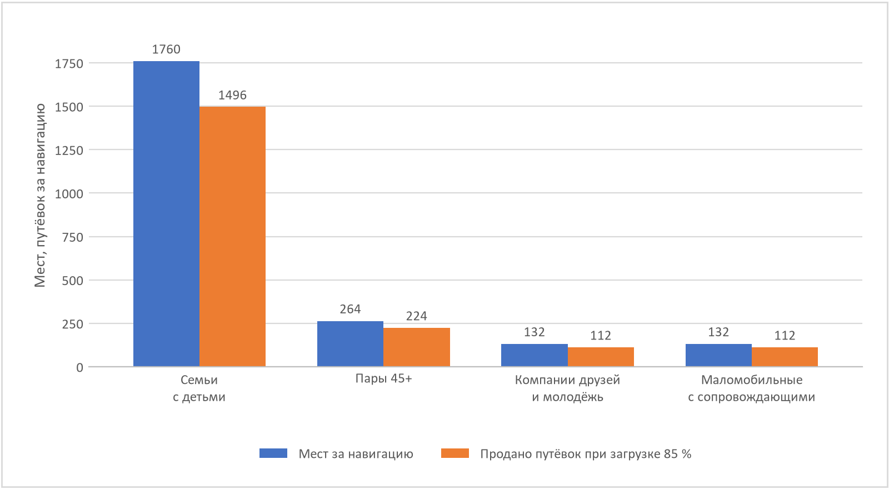

Рисунок 2 - Продажи путёвок по сегментам за навигацию

Основной объём продаж - семьи с детьми, 77,0 % путёвок, это ядро продукта. Пары старшего возраста, молодёжь и маломобильные пассажиры дают остальные 23,0 % и поддерживают загрузку в начале и в конце навигации. Малые сегменты требуют большей доли своей ёмкости - до 10,2 % против 1,0 % у семей, поэтому каюты эконом и М4 открыты для продажи всем сегментам. Объём продаж в штуках - 1944 путёвки за навигацию. Доступный объём рынка SAM в 21 раз больше плана продаж одного судна.

#### 1.1.4 Ориентировочная стоимость единицы изделия

Для пассажира единица продукта - путёвка на круиз 15 суток. Цены по типам кают - оценка ПЭУ по ценам аналогов, число кают и мест - по общему расположению:

Таблица 8

| Тип каюты | Каюта | Кают / мест | Круиз 15 суток, руб./чел. | Сутки при неполном рейсе, руб./чел. | Выручка за рейс при полной загрузке, руб. |
|---|---|---|---|---|---|
| Люкс | бортовая двухместная 18 м², панорамное остекление | 6 / 12 | 275 000 | 18 500 | 3 300 000 |
| Бизнес | бортовая двухместная 15 м², панорамное остекление | 6 / 12 | 200 000 | 13 500 | 2 400 000 |
| Стандарт | бортовая четырёхместная 12 м², два нижних и два верхних откидных места, панорамное остекление | 22 / 88 | 140 000 | 9500 | 12 320 000 |
| Стандарт М4 | бортовая двухместная 18 м² для группы мобильности М4, панорамное остекление | 6 / 12 | 126 000 | 8400 | 1 512 000 |
| Семейная | внутренняя четырёхместная 11,9…14,2 м² с перегородкой, световод и виртуальное окно | 18 / 72 | 140 000 | 9500 | 10 080 000 |
| Эконом | внутренняя двухместная 8,5 м², световод и виртуальное окно | 6 / 12 | 95 000 | 6500 | 1 140 000 |
| **Итого** |  | 64 / 208 |  |  | **30 752 000** |

По категориям КЗ цена круиза на человека - эконом 95 000 руб., стандарт 140 000 руб., бизнес 200 000 руб., люкс 275 000 руб. Каюта стандарт М4 - 126 000 руб., семейная четырёхместная - по цене стандарта. Цена суток при неполном рейсе - для пассажира, который садится или сходит в промежуточном порту, например в Казани или Уфе. Полный круиз дешевле 15 таких суток на 0…2,6 %.

**Средневзвешенная цена путёвки** - 147 846 руб. за круиз 15 суток, 9856 руб. в сутки. Это выручка рейса при полной загрузке 30 752 000 руб., делённая на 208 мест, и цена продукта для пассажира.

Для заказчика единица изделия - судно. Ориентировочная цена головного судна - 2554,0 млн руб. без НДС и 3115,8 млн руб. с НДС, серийные строятся по той же цене с меньшей себестоимостью (6.1, 6.2).

Дополнительные услуги оплачиваются отдельно:

Таблица 9

| Услуга | Цена | Примечание |
|---|---|---|
| Гараж, автомобиль класса «Б» | 30 000 руб. за автомобиль на рейс | Всегда отдельно, 4 места |
| Экскурсии | 2 500…6 000 руб./чел. | По выбору пассажира, онлайн-конструктор |
| Спа-процедуры | 3 000…8 000 руб. | Прайс-лист на борту |
| Модули солнечной палубы | 2 500 руб./ч | Кроме президентской темы |

Цены сопоставлены с ценами аналогов на Волге и Каме. Цены аналогов - оценка ПЭУ, наша цена суток - цена круиза, делённая на 15 суток:

Таблица 10

| Судно или круиз | Маршрут | Суток | Цена, руб./чел. | Цена суток, руб. | Наша каюта, руб. в сутки | Сравнение цены суток |
|---|---|---|---|---|---|---|
| «Александр Невский» | Самара - Волгоград | 8 | 51 500…66 800 | 6438…8350 | эконом 6333, стандарт 9333 | Эконом дешевле на 2…24 %, стандарт дороже на 12…45 % |
| «Принцесса Анабелла» | Самара - Уфа - Казань | 10…12 | от 137 000 | от 11 417…13 700 | стандарт 9333 | Стандарт дешевле на 18…32 % |
| «Игорь Стравинский» | премиальный круиз | 15 | 214 000 | 14 267 | бизнес 13 333 | Бизнес дешевле на 6,5 % |
| «Дягилевская Пермь» | премиальный круиз | 10…12 | от 235 000 | от 19 583…23 500 | люкс 18 333 | Люкс дешевле на 6…22 % |

Эконом по цене суток на уровне нижней цены «Александра Невского», стандарт дороже его, но на 18…32 % дешевле «Принцессы Анабеллы». Бизнес и люкс дешевле премиальных круизов. Круиз стандарт 140 000 руб. за 15 суток сопоставим с ценой 10…12-суточного круиза «Принцессы Анабеллы» от 137 000 руб.

#### 1.1.5 Объём выручки от реализации

Выручка считается по типам кают - цена круиза, умноженная на число проданных путёвок при загрузке 85 % и 11 рейсах за навигацию. Дополнительные услуги - спа, бар, магазины, экскурсии, гараж, модули солнечной палубы - приняты 15 % круизной выручки по оценке ПЭУ:

Таблица 11

| Статья | Продано путёвок | Цена, руб./чел. | Выручка за навигацию, руб. | Доля, % |
|---|---|---|---|---|
| Люкс | 112 | 275 000 | 30 800 000 | 9,3 |
| Бизнес | 112 | 200 000 | 22 400 000 | 6,8 |
| Стандарт | 823 | 140 000 | 115 220 000 | 34,9 |
| Стандарт М4 | 112 | 126 000 | 14 112 000 | 4,3 |
| Семейная | 673 | 140 000 | 94 220 000 | 28,5 |
| Эконом | 112 | 95 000 | 10 640 000 | 3,2 |
| **Круизы, итого** | **1944** |  | **287 392 000** | 87,0 |
| Дополнительные услуги, 15 % круизной |  |  | 43 108 800 | 13,0 |
| **Выручка за навигацию** |  |  | **330 500 800** | 100 |

В среднем за рейс круизная выручка 26,1 млн руб., при полной загрузке 30,8 млн руб. Судно работает одну навигацию в год, годовая выручка равна выручке за навигацию - 330,5 млн руб. Гараж даже при полной загрузке всех рейсов даёт не более 1,32 млн руб. (4 места × 11 рейсов × 30 000 руб.), основная часть дополнительной выручки - экскурсии, спа и бар. Структура выручки - на рисунке 3.

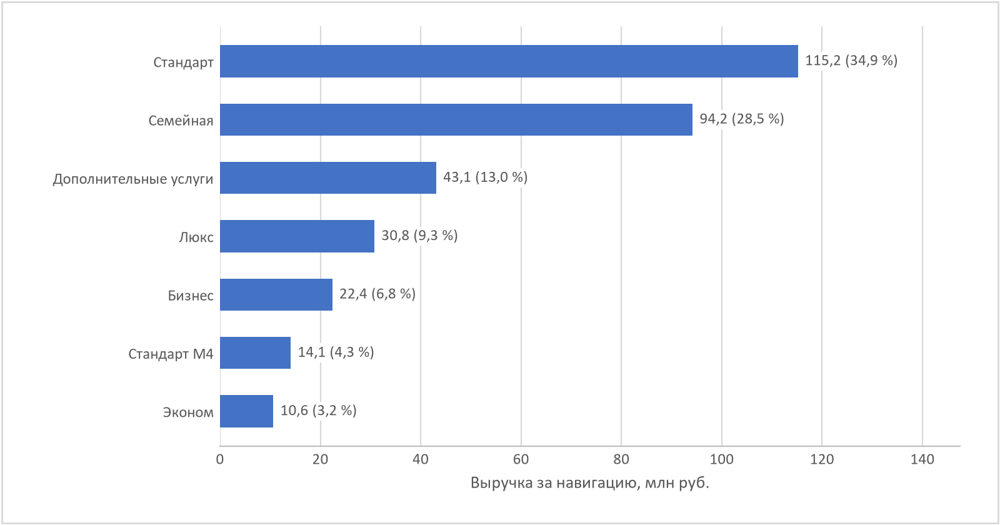

Рисунок 3 - Структура выручки за навигацию

**Вывод по выручке.** Четырёхместные каюты стандарт и семейные дают 72,9 % круизной выручки - это ядро семейного сегмента. Каюты бизнес и люкс занимают 11,5 % мест и дают 18,5 % круизной выручки. Выручка посчитана по ценам полного круиза при загрузке 85 %.

#### 1.1.6 Конкурентные преимущества

Преимущества посчитаны, а не заявлены:

Таблица 12

| Преимущество | Чем подтверждено |
|---|---|
| Осадка 1,26 м | маршруты с лимитирующими глубинами закрыты для судов с осадкой свыше 2,5 м, расчёт посадки - приложение А.2 |
| Габаритная высота 9,90 м при мосте 13,3 м | рубка стационарная. Над солнечной палубой свободно 5,5 м - 18 слотов под контейнерные модули на фундаментах-твистлоках, 6 тем круизов (листы МР-01…03) |
| КПД движителя 0,68 | против 0,33 у предельного по осадке винта ⌀0,76 м - приложение А.5 |
| Перевозка автомобилей | 4 места класса «Б» до 3,5 т - у речных круизных судов этого нет |
| Доступность | 12 мест группы мобильности М4 при 11 требуемых, в 6 каютах стандарт М4 |
| Возврат сточных вод | два контура, серый и чёрный, экономия 22 м³ пресной воды в сутки |

Для сравнения с судами-аналогами взяты критерии - осадка, класс РКО, выход на Белую до Уфы, доступная среда, энергетическая установка, общественные помещения, год постройки, перевозка автомобилей и число пассажиров на метр длины. Данные аналогов - оценка ПЭУ:

Таблица 13

| Критерий | «Александр Невский» (проект 588) | «Принцесса Анабелла» (проект 463-П) | «Волжский Горизонт» |
|---|---|---|---|
| Осадка | 2,4…2,46 м | 1,98…2,0 м | 1,26 м |
| Класс РКО | «М» | речной | «О 2,0» |
| Белая до Уфы (в межень 1,6…2,2 м) | только в весеннее половодье | только в весеннее половодье | вся навигация, май - октябрь |
| Доступная среда | нет | нет | 12 мест М4, 4 лифта |
| Энергетическая установка | дизель-электрическая, 3 × 6NVD48U | дизельная, 2 × D11643M01P | гибридная - 3 ГДГ на метаноле по 600 кВт, батарея, солнечные модули 24 кВт |
| Общественные помещения | ресторан, бар, музыкальный салон | ресторан, бар, солярий | театр-лаунж с лекторием, спа и фитнес, детский и подростковый клуб с творческой мастерской, панорамный салон-обсерватория, модульная солнечная палуба |
| Постройка | 1957, модернизирован | 1973, модернизация 2006 и 2022 | новое судно, передача заказчику в 2030 |
| Перевозка автомобилей | нет | нет | 4 места класса «Б» |
| Пассажиров на 1 м длины | около 2,5 | нет данных | 1,49 |

Рассмотренные суда-аналоги построены 53 и 69 лет назад, работают на дизельном топливе, не перевозят автомобили и не имеют кают для маломобильных пассажиров. На Белую до Уфы они выходят только в весеннее половодье - в межень глубины 1,6…2,2 м не дают запаса под килём при их осадке. Их сильная сторона - сложившаяся клиентская база и известность операторов, которых у нового судна на старте продаж нет (W4).

#### 1.1.7 Целевая аудитория и сегментация

Семейный круиз по трём рекам с заходом в Уфу по Белой. Мелкая осадка 1,26 м открывает Белую и перекаты Камы, куда крупный круизный флот не идёт. Кольцо из Самары - посадка и высадка в одном порту. Гараж на четыре автомобиля, шесть кают М4, современный облик вместо ретро-стилизации.

Таблица 14

| Сегмент | Каюты | Мест на рейс | Доля, % | Мест за навигацию | Мотив | Где искать |
|---|---|---|---|---|---|---|
| Семьи с детьми школьного возраста | стандарт, семейная | 160 | 76,9 | 1760 | каникулы на воде без перелёта - Казань, Уфа, Жигули, замок Гарибальди, Чёртово городище. Четыре места в каюте по цене семейного тарифа | школьные каникулы в расписании рейсов, семейные тарифы «дети до 12 бесплатно на верхних местах», туроператоры Поволжья, соцсети регионов |
| Пары 45+ и путешественники старшего возраста | бизнес, люкс | 24 | 11,5 | 264 | неспешное кольцо по трём рекам, музеи и купеческие города, каюты с панорамным окном, ресторан в две смены | круизные агрегаторы, клубы повторных гостей, программы лояльности, печатные каталоги операторов |
| Компании друзей и молодёжь | эконом | 12 | 5,8 | 132 | самый дешёвый билет на 15 дней с Уфой и Казанью. Внутренняя двухместная с виртуальным окном | ранние продажи с глубокой скидкой, коллаборации с вузами, короткие видео из рейса |
| Маломобильные пассажиры с сопровождающими | стандарт М4 | 12 | 5,8 | 132 | каюты М4 с кругом разворота 1,5 м и душем без порога, лифты на всех трап-холлах, путь эвакуации 1,2 м - круиз, который реально доступен | общества инвалидов, социальные туроператоры, программы субсидируемого отдыха |

Рейсов в навигацию 11 (184 суток на Каме и Белой, оборот 16 суток), мест на рейс 208, за навигацию 2288. Сверх кают спрос дают ещё три группы.

- **Автотуристы.** Свой автомобиль в гараже. Выезд в Уфе и Казани на своей машине, обратно - на теплоходе.
- **Корпоративные и групповые заезды.** Театр-лаунж на 68 мест и ресторан в две смены - выездные сессии, юбилеи, фрахт судна целиком в межсезонье.
- **Модульные темы на солнечной палубе.** Контейнерные модули на фундаментах-твистлоках. Деловая, оздоровительная, детская, событийная и президентская темы меняются за смену под спрос сезона - от терм на палубе до президентского люкса.

Маршрут Самара - Казань - Уфа - Самара (Волга, Кама, Белая), 2606 км по фарватеру за 15 дней (рисунки 4 и 5). Путь по фарватеру выгружен в GeoJSON для мобильного приложения. Ёмкость рынка, цены и конкуренты - 1.1.2…1.1.6.

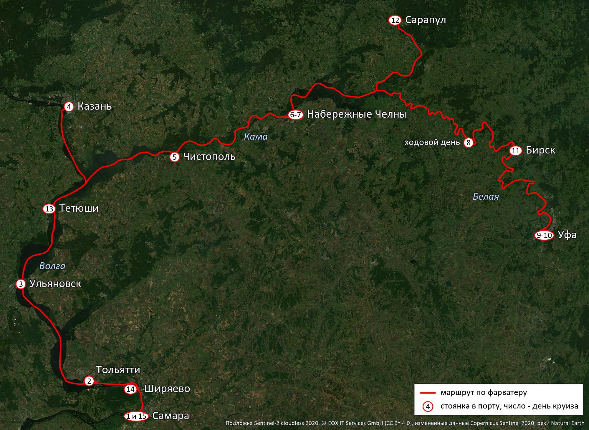

Рисунок 4 - Маршрут на спутниковом снимке

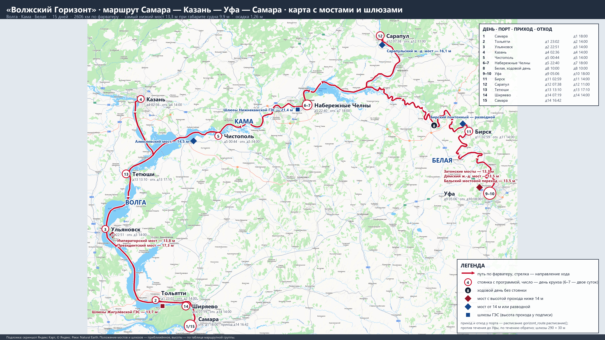

Рисунок 5 - Маршрут с мостами и шлюзами

#### 1.1.8 Маркетинговая стратегия

Стратегия построена по модели 4P - продукт, цена, сбыт, продвижение:

Таблица 15

| Элемент | Решения |
|---|---|
| Продукт | 1) Колёсное круизное судно мелкой осадки 1,26 м - Белая до Уфы и перекаты Камы, куда суда с осадкой около 2 м и больше в межень не заходят. 2) Модель «круиз-конструктор» - каюта, питание и общественные помещения в цене путёвки, экскурсии, гараж и спа отдельно, выбор порта окончания круиза. 3) Градация сервиса по 6 типам кают в четырёх категориях КЗ - эконом, стандарт, бизнес, люкс. 4) Перевозка 4 автомобилей класса «Б», 12 мест М4, модульная солнечная палуба с 6 темами, ужин с капитаном. 5) Гибридная энергетика - метанол, батарея, солнечные модули, ход на батарее в черте городов без выхлопа. Современный облик вместо ретро-стилизации. |
| Цена | 1) Каюты бизнес и люкс - ниже цен премиальных аналогов при сопоставимом уровне кают, бизнес 200 000 руб. против 214 000 руб. у «Игоря Стравинского». 2) Каюты эконом и стандарт - на уровне рынка, 6333 и 9333 руб. в сутки полного круиза. 3) Средневзвешенная цена путёвки 147 846 руб. за 15 суток, 9856 руб. в сутки. 4) Гибкое ценообразование - сезон, загрузка рейса, раннее бронирование со скидкой 15 %. 5) Дополнительная выручка - экскурсии, гараж, спа, модули солнечной палубы по отдельному прайсу. |
| Сбыт | 1) Прямые продажи - собственный сайт с онлайн-конструктором круиза, отдел продаж. 2) Партнёрская сеть - туроператоры и турагентства Поволжья, комиссия 10…12 %. 3) Корпоративное направление - фрахт, корпоративные заезды, MICE (деловой туризм - встречи, поощрительные поездки, конференции, выставки). 4) Раннее бронирование - продажи за 6 месяцев до рейса со скидкой 15 %. 5) Групповые продажи - тарифы для компаний друзей, семейных групп, обществ инвалидов. |
| Продвижение | 1) Интернет - SEO (поисковая оптимизация), контекстная реклама, SMM (продвижение в социальных сетях) во ВКонтакте и Telegram, блогеры-путешественники и автоблогеры. 2) PR (связи с общественностью) - выставки MITT и «Интурмаркет», пресс-туры для журналистов и блогеров, съёмка колёсного хода с дрона, видео смены модульных тем. 3) Партнёрства - автоклубы, общества и фонды инвалидов, коворкинги и IT-сообщества, туроператоры Поволжья, вузы. 4) Акция «Собери свой круиз» - скидка 10 % при покупке трёх и более экскурсий, программа лояльности для повторных гостей. |

**Вывод по маркетинговой стратегии.** Стратегия опирается на продукт, отличный от рассмотренных аналогов. Это колёсное судно мелкой осадки с гаражом, каютами М4 и модульной солнечной палубой, которое продаётся по модели «круиз-конструктор». Цены массовых кают на уровне рынка, премиальных - ниже аналогов. Сбыт идёт через прямые продажи, партнёрскую сеть и корпоративных клиентов, продвижение - через интернет, выставки и сообщества целевых сегментов. На этом строится плановая загрузка 85 % во всех четырёх сегментах.

## 2 Дизайн-проект

### 2.1 Графическое изображение проекта

**Палитра.**

Таблица 16

| Назначение | Цвет |
|---|---|
| графит | `#2E3338` |
| графит_тёмный | `#20242A` |
| графит_светлый | `#3C444C` |
| графит_серебро | `#A9AFB5` |
| чёрный | `#15181C` |
| красный | `#C8102E` |
| красный_тёмный | `#9E0C24` |
| белый | `#EDEFF1` |
| серый_тёплый | `#C9CDD2` |
| стекло | `#1B2733` |
| стекло_тон | `#252f38` |
| дерево | `#B08658` |
| дерево_тёмное | `#6E4F30` |
| сталь | `#8A9099` |

**Разделение по высоте.** Тёмный низ зрительно опускает судно на воду, светлый верх делает его лёгким, на стыке - фирменная красная полоса.

Таблица 17

| Пояс | Цвет | От | До |
|---|---|---|---|
| подводная часть | графит_тёмный | основная | 1,20 м |
| борт корпуса | графит | 1,20 м | 3,00 м |
| акцентная полоса | красный | 1,10 м | 1,45 м |
| надстройка | белый | 3,00 м | верх |

У красной полосы светлая отбивка 40 мм, так как контраст красного к графиту 2.17 при пороге читаемости 3,0 - оба цвета тёмные, и с берега полоса сливалась бы с бортом. Яркость красного не повышается, чтобы цвет оставался фирменным. Светлая отбивка даёт контраст 11.06.

Радиус скругления надстройки в плане 1.20 м, передней кромки 2.40 м, фаска видимых рёбер 0.15 м, завал бортов 6.0°, непрерывная лента остекления высотой 1.85 м на 0.45 м от палубы.

Облик в 2D (рисунки 6…8), виды трёхмерной модели (рисунки 9…16, солнечная палуба - с модулями темы «президентская»), взрыв-модель (рисунок 17), судно у причала порта приписки, смена модуля краном и сход на берег (рисунки 18…20). Общее расположение - чертежи ОР-01…08.

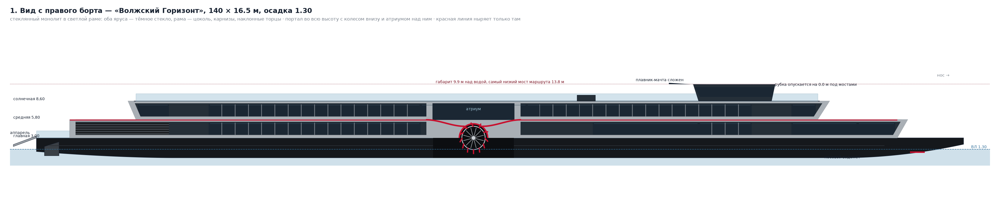

Рисунок 6 - Облик судна, вид сбоку

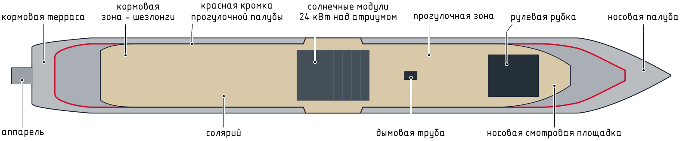

Рисунок 7 - Облик судна, вид сверху

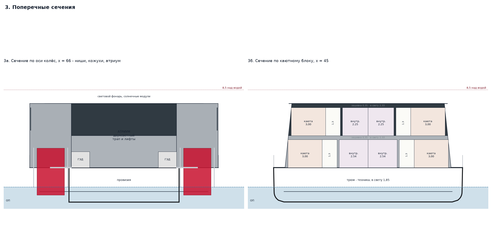

Рисунок 8 - Облик судна, поперечные сечения

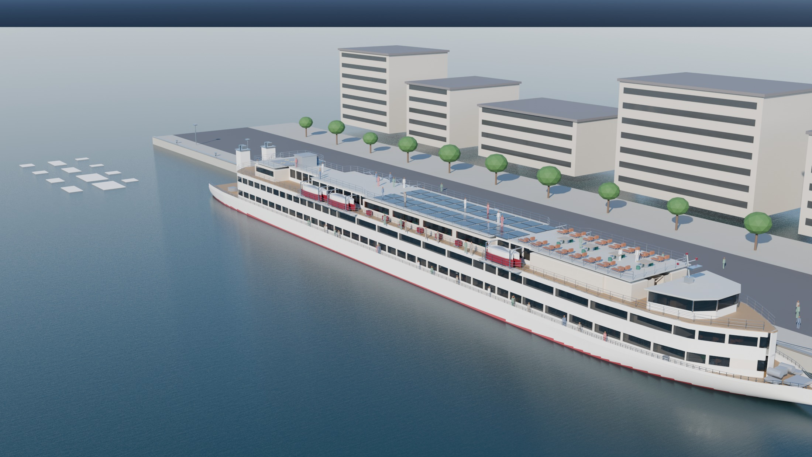

Рисунок 9 - Общий вид судна

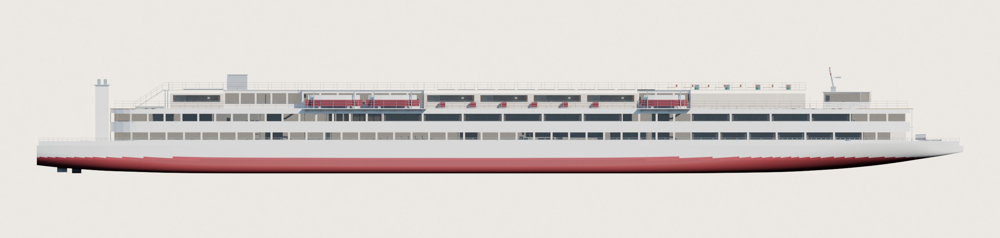

Рисунок 10 - Судно, вид с борта

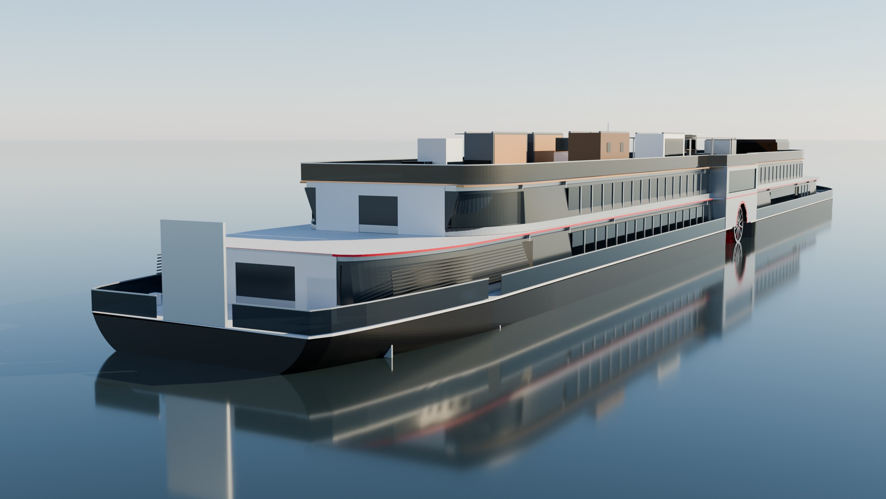

Рисунок 11 - Корма и гребное колесо

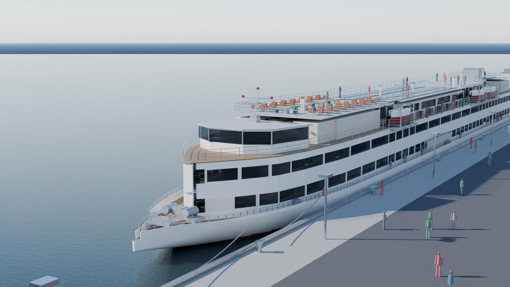

Рисунок 12 - Нос и рулевая рубка

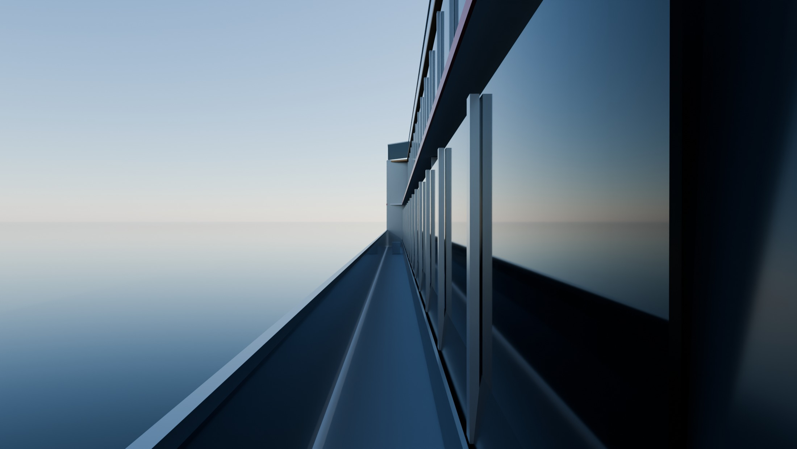

Рисунок 13 - Прогулочная палуба

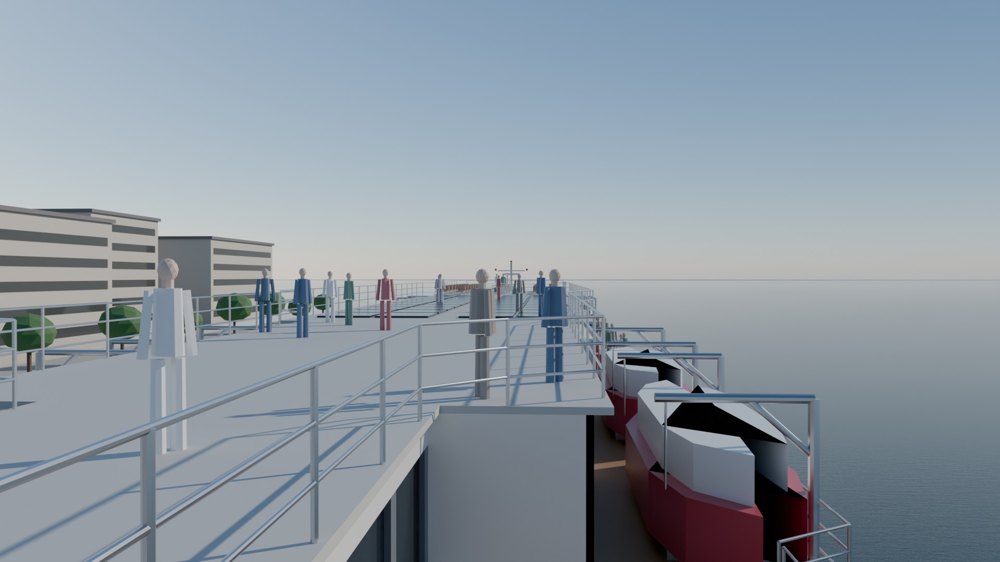

Рисунок 14 - Солнечная палуба с модулями темы «президентская»

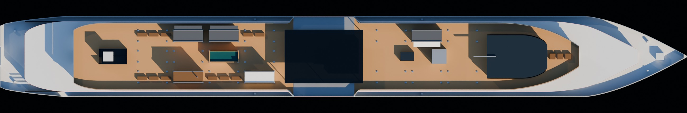

Рисунок 15 - Судно, вид сверху

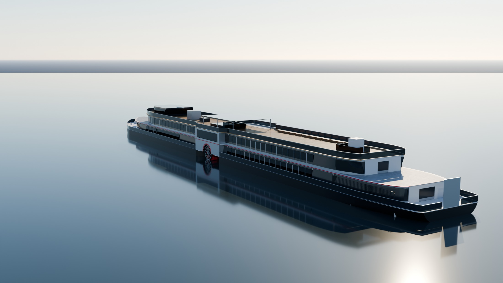

Рисунок 16 - Судно, вид с кормы

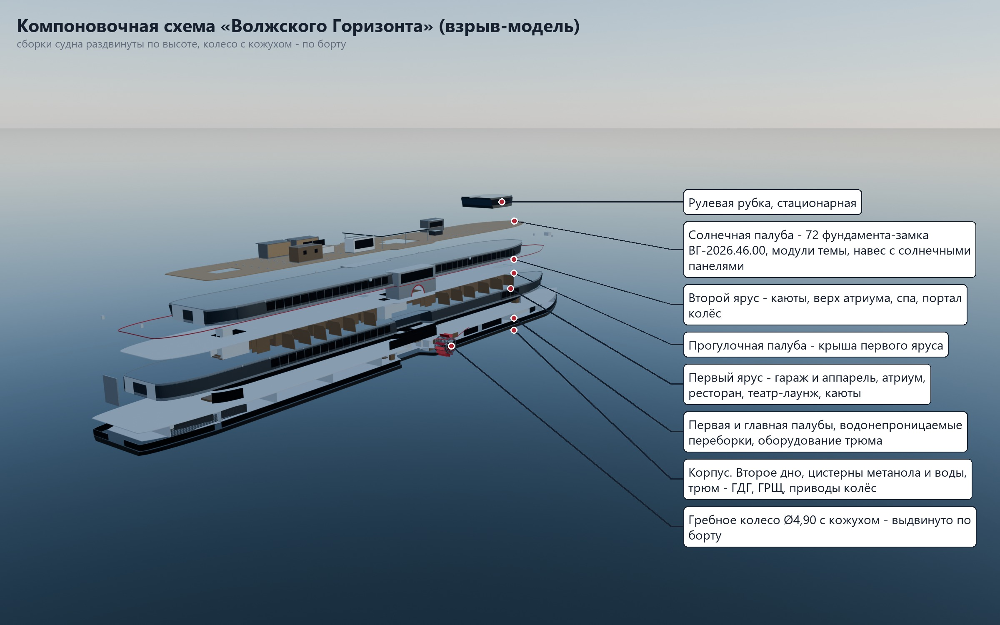

Рисунок 17 - Компоновочная схема (взрыв-модель)

Рисунок 18 - Судно у причала порта приписки

Рисунок 19 - Смена модуля краном причала

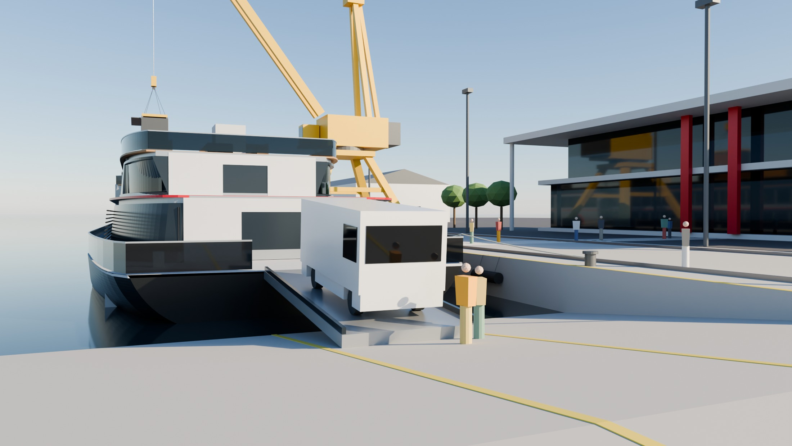

Рисунок 20 - Сход пассажиров по трапу и автомобилей по аппарели

### 2.2 Общественные помещения, развлечения и сервисы

Расстановка помещений, мебели и посадочных мест - на планах палуб (рисунки 21…23) и чертежах ОР-01…03.

Культурно-развлекательные сервисы:

- Театр-лаунж (концерты, кинопоказы, лекторий, вечером клуб).
- Спа-комплекс с банным блоком и фитнес-залом.
- Детский и подростковый клуб.
- Творческая мастерская народных промыслов Поволжья.
- Панорамный салон-обсерватория с лекторием «Города Кругосветки».

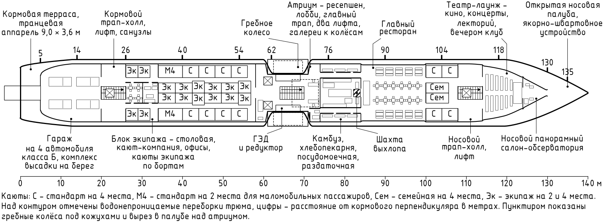

Рисунок 21 - План главной палубы

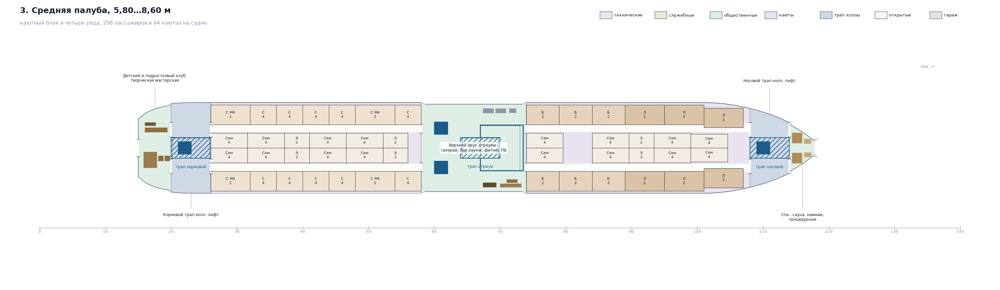

Рисунок 22 - План средней палубы

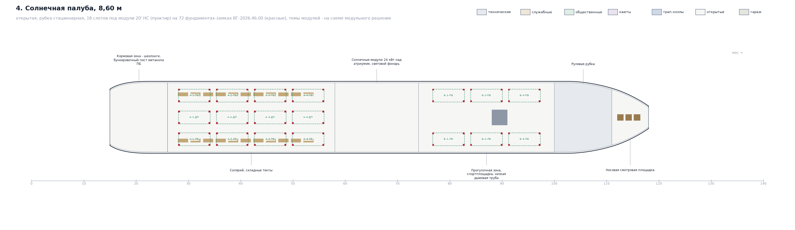

Рисунок 23 - План солнечной палубы

Таблица 18

| Помещение | Палуба | x, м | м² | Мест | Для кого и почему здесь |
|---|---|---|---|---|---|
| Атриум - ресепшен, лобби, главный трап, два лифта, галереи к колёсам | главная | 58…74 | 178 |  | всем. Ресепшен, лобби, галереи к гребным колёсам - «машина, которую видно» (витражи в щеках кожухов), центр судна на оси колёс |
| Главный ресторан | главная | 84…100 | 222 | 108 мест в смену | все 208 пассажиров в две смены. Рядом камбуз, под ним провизионные кладовые с лифтом - короткая раздача |
| Театр-лаунж - кино, концерты, лекторий, вечером клуб | главная | 114…124 | 112 | 68 сидячих + бар | вечерняя программа для всех. Днём лекторий и кино для семей и пар 45+, вечером клуб для компаний, 68 мест - корпоративные и групповые заезды |
| Носовой панорамный салон-обсерватория | главная | 124…130 | 26 |  | пары 45+ и все, кто хочет вид вперёд по курсу - бар, диваны, лекторий «Города Кругосветки» |
| Детский и подростковый клуб, творческая мастерская | средняя | 15…20 | 58 |  | семьи с детьми - три четверти мест на судне. Творческая мастерская промыслов Поволжья. Выход на кормовую террасу-крышу, в стороне от кают |
| Верхний ярус атриума - галереи, бар-лаунж, фитнес ПБ | средняя | 58…74 | 213 |  | бар-лаунж и фитнес на галереях над колёсами - дневное место встречи. Без выделенной площади, на проёме атриума |
| Спа - сауна, хаммам, процедурные | средняя | 114…118 | 19 |  | сауна, хаммам, процедурные - пары 45+ и оздоровительные рейсы, в носу, вдали от кают и машин |

Бары - бар-лаунж на галерее атриума (средняя), бар носового салона (главная), бар солнечной палубы. Медпункт и изолятор - в атриуме за кожухом ЛБ. Все общественные помещения выходят на три трап-холла с лифтами, путь эвакуации шириной не менее 1,2 м.

**Солнечная палуба** - солярий и шезлонги, бар, спортплощадка, смотровая. Отдельно - модульные темы на фундаментах-твистлоках (листы МР-01…03, документ «Модульное решение солнечной палубы») - тема меняется за смену краном причала, всё в пределах 85 т и расчётной осадки.

Таблица 19

| Тема | Что это | Модули | т | кВт |
|---|---|---|---|---|
| деловая | деловые круизы - восемь кабинетов и переговорных по бортам, бар | офис × 8, бар × 1 | 33,0 | 56 |
| оздоровительная | термы на палубе - четыре сауны с купелями, два мелких бассейна в ДП, два кабинета процедур, бар | спа × 4, бассейн × 2, офис × 2, бар × 1 | 60,4 | 92 |
| детская | детские круизы - шесть игровых модулей, клубный блок для анимации, бар | детский × 6, клуб × 3, бар × 1 | 34,2 | 35 |
| событийная | диско, кино, театр, свадьбы - два клубных блока по три секции, гримёрная, бар | клуб × 6, офис × 1, бар × 1 | 31,8 | 44 |
| президентская | остров на плаву - люкс из двух секций с террасой, сауна, мелкий бассейн, кабинет, бар | спа × 1, люкс × 2, бассейн × 1, офис × 1, бар × 1 | 36,4 | 45 |

### 2.3 Интерьеры кают и отделка по классам

Шесть типов кают на 208 пассажиров (стандарт 28, эконом 24, бизнес 6, люкс 6), из них шесть кают М4 на 12 мест. Планировки с проверкой эргономики по СанПиН 2.5.2-703-98 (49 проверок) - на рисунке 24, интерьеры по три ракурса на тип - на рисунке 25. Отделка задана по классам кают - чем выше класс, тем дороже материалы, и рендеры собраны из тех же цветов.

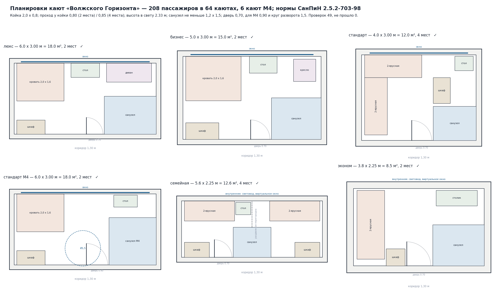

Рисунок 24 - Планировки кают шести типов

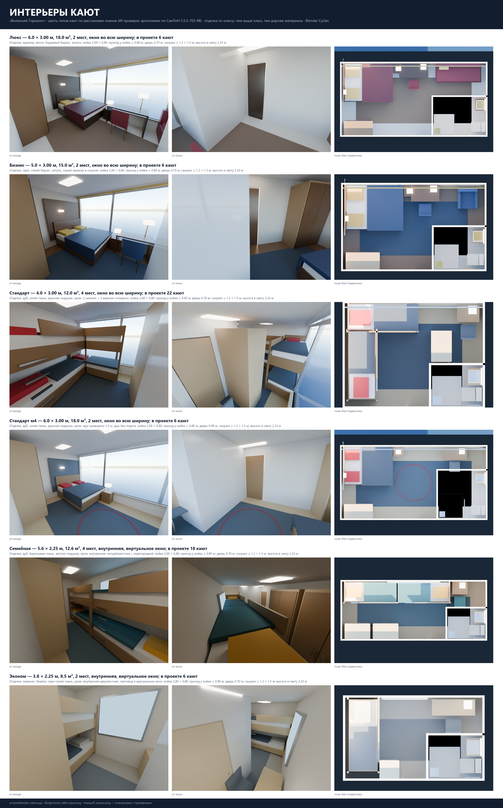

Рисунок 25 - Интерьеры кают шести типов

Таблица 20

| Класс | Отделка |
|---|---|
| эконом | ламинат, берёза, серо-синяя ткань, хром |
| стандарт | дуб, синяя ткань, красная подушка, хром |
| семейная | дуб, бирюзовая ткань, жёлтая подушка, хром |
| бизнес | орех, синий бархат, латунь, серый мрамор в санузле |
| люкс | мрамор, венге, бордовый бархат, золото |
| стандарт М4 | дуб, синяя ткань, красная подушка, хром |

### 2.4 Модельный ряд

Три версии на одном корпусе (рисунок 26) - корпус, набор, энергетическая установка, колёса и все расчёты общие, меняется только насыщение жилых палуб по сетке шпаций 550 мм. Построена и посчитана версия «Классик».

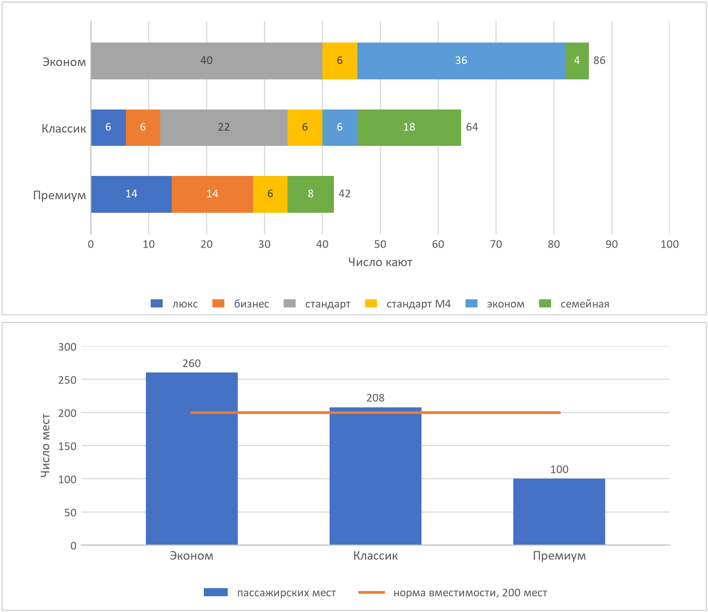

Рисунок 26 - Модельный ряд, три версии на одном корпусе

Таблица 21

| Версия | Кают | Мест | Экипаж | На борту | Площадь кают, м² | Разница с «Классиком», м² | м² кают на место | Мест М4, есть и нужно | Не менее 200 мест |
|---|---|---|---|---|---|---|---|---|---|
| ВГ-140-Э Эконом | 86 | 260 | 48 | 308 | 946,2 | +98,1 | 3,64 | 12 и 13 | да |
| ВГ-140-К Классик | 64 | 208 | 48 | 256 | 848,1 | 0 | 4,08 | 12 и 11 | да |
| ВГ-140-П Премиум | 42 | 100 | 48 | 148 | 670,8 | -177,3 | 6,71 | 12 и 5 | нет |

- **Эконом.** Максимальная вместимость - короткие маршруты выходного дня и корпоративные рейсы. Тот же фронт бортов - люксы 6,0 м и бизнес 5,0 м заменены стандартами 4,0 м с откидными верхними койками. Внутренние семейные - двухместными эконом.
- **Классик.** Базовая версия, построена в модели - баланс цены и комфорта. Все чертежи, расчёты и рендеры проекта выполнены для этой версии.
- **Премиум.** Минимум кают, максимум площади на пассажира и общественных пространств. Бортовые ряды - только люкс и бизнес по 2 места. Внутренние эконом объединены в семейные и лаунжи палуб, спа расширяется на освободившийся ряд.

«Эконом» на 260 мест требует 13 мест М4 при 12 имеющихся, в этой версии добавляется каюта М4.
«Премиум» на 100 мест не отвечает КЗ по вместимости и предлагается как версия для другого сегмента.

### 2.5 Судовые системы

Таблица 22

| Требование КЗ | Решение | Где обосновано |
|---|---|---|
| Очистка и повторное использование сточных вод | два контура. Чёрные - вакуумные туалеты, буфер 4 м3 -> мембранный биореактор -> УФ -> танк очищенной 8 м3 -> обратно на смыв, серые - буфер 16 м3 -> биоблок -> УФ -> танк очищенной 24 м3 -> мытьё палуб, обмывка борта, балласт, экономия пресной воды 22 м³ в сутки | схема очистки. Станции СОСВ-Ч и СОСВ-С в трюме x 5…14, лист ОР-04 |
| Гибридная электроустановка | метаноло-электрическая гибридная - 3 ГДГ по 600 кВт, батарея 600 кВт·ч, солнечные модули 24 кВт, береговое питание, на ходу 1280 кВт из 1800, на стоянке 698 кВт | электробаланс, лист РТ-07 |
| Топливо СПГ, метанол или водород | метанол (двухтопливные ГДГ с дизельным запальным), 215 м³ метанола на 15 суток в цистернах второго дна с коффердамами, запальное дизельное 12 м³. Бункеровка автоцистерной на любом причале | цистерны второго дна, лист ОР-04 |
| Раннее предупреждение качки | две U-образные успокоительные цистерны УЦ-1, УЦ-2 (x 46…58 и 84…96), вода 84 т (3,5 % водоизмещения), крен на резонансе с 19,8° до 10,9°. Период цистерны настроен на период качки судна 3,35 с сечением канала. Датчики - MRU, гирокомпас, волномерный радар, метеостанция, акселерометры | расчёт качки, приложение А.6 |
| Автономное управление и исключение столкновений | Судно с автоматическим управлением, экипаж на борту (вторая степень по градации ИМО MASS), 9 датчиков (два радара, АИС, лидар, камеры, тепловизоры, ГНСС RTK, эхолот, микрофоны). Потребная дальность обнаружения 601 м при реакции 26 с, выбег до остановки 174 м за 71 с. Отказоустойчивость - 5 сценариев деградации | расчёт дальности обнаружения и выбега |
| Комплекс высадки на необорудованный берег | в кормовом блоке главной палубы x 5…20 вместе с гаражом - телескопический трап по левому борту, пост дронов, швартовное устройство, транцевая аппарель 9,0 × 3,6 м | план главной палубы, лист ОР-01 |
| Модульные решения по каютам и сервисам | 18 слотов под контейнерные модули на солнечной палубе, шесть тем круизов, модельный ряд из трёх версий по каютам | разделы 2,2 и 2,4, листы МР-01…03 |

## 3 Конструкторская документация

**Узел - ВГ-2026.46.00 «Фундамент-замок модуля (твистлок «ласточкин хвост»)»**. Он держит модульные номера «трансформера» на солнечной палубе, на судне 72 фундамента под угловыми фитингами контейнеров. Узел собирается из четырёх основных деталей и шайбы-подковы и выпускается как самостоятельное производство в арендованном цехе рядом с верфью. Полный разбор - в записке к узлу ВГ-2026.46.00.

- **Корпус, поз. 1** - отливка из стали 20ГСЛ 175 × 160 × 76 мм, 7,55 кг. Снизу две опорные полосы «ласточкина хвоста», ими корпус приварен к платику. Сверху плечо под фитинг и центратор 60 × 116 мм, который входит в отверстие фитинга ISO 1161 и принимает сдвиг. Сквозное отверстие Ø30 под вал запора, внутри полость рукоятки с поворотом на 74°.
- **Стержень, поз. 2** - рукоятка Ø14 из круга 40Х на резьбе в валу, поворачивает запор от выреза до выреза корпуса.
- **Элемент запирающий (конус-голова), поз. 3** - поковка 40Х, голова 104 × 54 мм, вал Ø30.
- **Платик, поз. 4** - лист 09Г2С 375 × 280 × 20 мм, четыре овала 26 × 45 под болты М24 А4-80, окно под шайбу.
- **Шайба разрезная (подкова), поз. 5** - лист 09Г2С, Ø50 × 12 мм в проточке вала под корпусом. Отрыв идёт с вала через шайбу на низ корпуса вокруг отверстия, стержень только поворачивает запор.

Платик ставится на подкладной лист АМг5, приваренный к настилу над подпалубной балкой, через изолирующую прокладку, болты в изолирующих втулках. Высота опоры над настилом 77 мм, масса узла 27,1 кг, с подкладным листом 30,1 кг.

### 3.1 Чертёж узла

Сборочный чертёж ВГ-2026.46.00 СБ (рисунок 27), чертежи деталей ВГ-2026.46.01…05 и спецификация по ГОСТ 2.106 на двух листах. Состав узла:

Рисунок 27 - Узел ВГ-2026.46.00, сборочный чертёж

Таблица 23

| Поз. | Обозначение | Наименование | Кол. | Материал | Масса, кг |
|---|---|---|---|---|---|
| 1 | ВГ-2026.46.01 | Корпус (отливка) | 1 | Сталь 20ГСЛ ГОСТ 977-88 | 7,55 |
| 2 | ВГ-2026.46.02 | Стержень Ø14 × 127 | 1 | Круг 40Х ГОСТ 2590-2006 | 0,15 |
| 3 | ВГ-2026.46.03 | Элемент запирающий (конус-голова) | 1 | Сталь 40Х, поковка КП 590 | 1,45 |
| 4 | ВГ-2026.46.04 | Платик 375 × 280 × 20 | 1 | Лист 09Г2С ГОСТ 19281-2014 | 14,93 |
| 5 | ВГ-2026.46.05 | Шайба разрезная (подкова) Ø50/22,5 × 12 | 1 | Лист 09Г2С ГОСТ 19281-2014 | 0,12 |
| 6 | ВГ-2026.46.06 | Прокладка изолирующая 375 × 280 × 3 | 1 | СТЭФ ГОСТ 12652-74 | 0,56 |
| 7 | ВГ-2026.46.07 | Втулка изолирующая Ø32/24,5 × 14 | 4 | СТЭФ ГОСТ 12652-74 | 0,01 |
| 8 | ВГ-2026.46.08 | Шайба изолирующая Ø50/25 × 3 | 4 | СТЭФ ГОСТ 12652-74 | 0,01 |
| 9 | ВГ-2026.46.09 | Лист подкладной 425 × 330 × 8 (ставится верфью при постройке) | 1 | АМг5 ГОСТ 21631-76 | 2,97 |
| 10 |  | Болт М24×80 А4-80 ГОСТ Р ИСО 4014-2013 | 4 |  | 0,40 |
| 11 |  | Гайка М24 самоконтрящаяся А4-80 ГОСТ Р 50273-92 | 4 |  | 0,11 |
| 12 |  | Шайба 24 увеличенная А4-80 ГОСТ 6958-78 | 4 |  | 0,05 |

### 3.2 3D модель узла

Корпус - 3D-модель конструктора в формате STEP, одно тело объёмом 961,6 см³ и массой 7,55 кг. Из неё взяты все размеры корпуса - опорные полосы хвоста, плечо под фитинг, центратор, отверстие, полость рукоятки и длина сварного шва 726 мм. Платик, запор, стержень и шайба подобраны по массе модели МКЭ 24,51 кг, её центру тяжести и моментам инерции. Масса стальных деталей узла - 24,20 кг, расхождение с моделью МКЭ -1,3 %. Виды модели - на рисунках 28 и 29.

Рисунок 28 - Узел ВГ-2026.46.00, сборка

Рисунок 29 - Узел ВГ-2026.46.00, взрыв-схема

### 3.3 Материалы с обоснованием выбора

Отчёты МКЭ выполнены для корпуса и платика из проката 09Г2С и ВСт3сп5. Литейных марок 09Г2С и ВСт3сп5 в ГОСТ 977-88 нет, поэтому корпус - литая сталь 20ГСЛ, свариваемая, применяется для судового литья. Запас по текучести пропорционален пределу текучести, для 20ГСЛ при нагрузке отчёта он не ниже 3,05 × 294 / 225 = 3,98. Сравнение материалов для корпуса:

Таблица 24

| Материал | Стандарт | σт, МПа | σв, МПа | δ, % | KCU, кДж/м² | Запас при 33,1 кН | Вывод |
|---|---|---|---|---|---|---|---|
| 20Л | ГОСТ 977-88 | 216 | 412 | 22 | 491 | 2,93 | запас по текучести на 27 % ниже 20ГСЛ, эксплуатационный случай не проходит |
| 25Л | ГОСТ 977-88 | 235 | 441 | 19 | 392 | 3,19 | ниже ударная вязкость, а узел работает на удар - посадка модуля краном |
| 20ГЛ | ГОСТ 977-88 | 275 | 540 | 18 | 491 | 3,73 | близка к 20ГСЛ, но предел текучести на 6 % ниже |
| 20ГСЛ | ГОСТ 977-88 | 294 | 540 | 18 | 491 | 3,99 | принято. Самая прочная из свариваемых литых сталей без закалки, судовое литьё, приварка к платику и заварка дефектов без подогрева |
| 35ХГСЛ | ГОСТ 977-88 | 343 | 590 | 14 | 294 | 4,65 | прочнее, но ударная вязкость ниже на 40 %, сварка с подогревом и повторной термообработкой |
| ВЧ 50 | ГОСТ 7293-85 | 320 | 500 | 7 | - | 4,34 | к платику не приварить, удлинение 7 %, хрупкость при ударе на морозе |
| 09Г2С | ГОСТ 19281-2014 | 300 | 450 | 21 | - | 4,07 | марки для литья в ГОСТ 977-88 нет. Корпус из проката - сварная конструкция из многих деталей |
| ВСт3сп5 | ГОСТ 14637-89 | 225 | 450 | 26 | - | 3,05 | то же, наименьший запас в отчётах МКЭ |

Запирающий элемент - поковка 40Х КП 590 после улучшения, стержень - круг 40Х в улучшенном состоянии, платик - 09Г2С класса 325, шайба-подкова - тоже 09Г2С, режется плазмой в своём цехе без термообработки, крепёж - А4-80, изоляция - стеклотекстолит СТЭФ, подкладной лист - АМг5. **Сталь корпуса судна** - 09Г2С, сравнение с ВСт3сп5 и AH36. Расчётное напряжение общей прочности 78.4 МПа (прогиб на волне класса «М»). ВСт3сп5. Допускаемое 141 МПа - ниже расчётного. Чтобы пройти, связи нужно усилить на 38 %, масса корпуса вырастет с 896 до 1239 т. При этом экономии нет - 76.8 млн ₽ против 69.9 млн ₽ у 09Г2С - дешёвая сталь съедает выигрыш массой. AH36 прошла бы с запасом 172 % и дала бы 45 т экономии, но стоит 95.4 млн ₽ - на 36 % дороже, и срок поставки 8…12 недель. 09Г2С проходит с запасом 149 %, держит ударную вязкость при -40 °C (ледовые усиления «лёд 20») и есть на складе.

### 3.4 Расчёт на прочность узла

Нагрузки - от качки этого судна (приложение А.6). Период бортовой 3,26 с - самый короткий при осадках 1,20…1,30 м, крен на резонансе 19,8° без успокоителей (предельный случай, допускаемые 0,8σт) и 10,9° с цистернами (эксплуатация, 0,6σт), ось через ЦТ, ветер РКО класса «О». Расчётный модуль - самый тяжёлый из тем круизов, бассейн 13,5 т. Глубокий бассейн 18 т в темы не входит и на эти фундаменты не ставится. Модули тяжелее 10 т ставятся только в ряд ДП - в бортовом ряду к вертикальному ускорению от качки добавляется ε·y, и бассейн 13,5 т дал бы на опору 106,7 кН с запасом по МКЭ 1,23 при нужном 1,25, а в ДП - 88,5 кН и запас 1,49. Во всех темах бассейн стоит в ДП, предел по массе в бортовом ряду - 13,3 т.

Таблица 25

| Случай | Сжатие, кН | Отрыв, кН | Сдвиг, кН |
|---|---|---|---|
| Эксплуатация | 65,0 | 5,0 | 50,6 |
| Предельный | 88,5 | 26,2 | 89,5 |
| Посадка краном | 99,3 | - | - |
| Статика, вес модуля на 4 опоры | 33,1 | - | - |
| SWL опоры | 100 | 10 | 55 |

**Расчёт методом конечных элементов.** Сборка корпуса, платика и запора рассчитана в APM FEM для КОМПАС-3D v25, расчётное ядро APM Structure3D имеет аттестационный паспорт программы для ЭВМ № 488 от 19.12.2019, Ростехнадзор. Сетка - 10-узловые тетраэдры со стороной до 5 мм, 251 698 элементов, 420 713 узлов. Нагрузка - сила 33 100 Н вертикально вниз на плечо, вес модуля «бассейн» 13,5 т на четыре опоры. Закрепления - три группы граней по UX, UY, UZ, реакции 27 280 и 7 428 Н. Масса модели 24,51 кг, центр тяжести 0,31, 2,65, -41,43 мм. Результаты:

Таблица 26

| Параметр | 09Г2С | ВСт3сп5 | 20ГСЛ, пересчёт |
|---|---|---|---|
| Предел текучести, МПа | 300 | 225 | 294 |
| Эквивалентное напряжение по Мизесу, наибольшее, МПа | 192,3 | 192,3 | - |
| Перемещение, мм | 0,0028 | 0,0028 | - |
| Запас по текучести, не ниже | 4,06 | 3,05 | 3,98 |
| Запас по прочности, не ниже | 6,10 | 6,10 | 7,31 |

На расчётное сжатие запас пересчитывается линейно, n = 3,98 × 33,1 / P:

Таблица 27

| Случай | Сжатие P, кН | Запас n | Нужно |
|---|---|---|---|
| Эксплуатация | 65,0 | 2,03 | 1,67 |
| Предельный | 88,5 | 1,49 | 1,25 |
| Посадка краном | 99,3 | 1,33 | 1,25 |

**Отрыв и сдвиг** отчёт МКЭ не покрывает, они проверены аналитически. Наименьший запас по каждому элементу:

Таблица 28

| Элемент | Случай | Значение | Допускается | Запас |
|---|---|---|---|---|
| Стержень поз. 2 Ø14 - изгиб при повороте | предельный | 371,2 МПа | 472,0 МПа | 1,27 |
| Балка Т 260 × 8 / 130 × 12 АМг5 - изгиб | эксплуатация | 52,1 МПа | 75,0 МПа | 1,44 |
| Болт М24 А4-80 - растяжение | предельный | 314,5 МПа | 480,0 МПа | 1,53 |
| Настил АМг5 под изолирующей шайбой - смятие | эксплуатация | 71,9 МПа | 112,5 МПа | 1,56 |
| Втулка изолирующая - смятие | предельный | 66,6 МПа | 110,0 МПа | 1,65 |
| Сдвиг платика - держит трение | эксплуатация | 50,6 кН | 84,0 кН | 1,66 |
| Шайба поз. 5 - изгиб кольца | предельный | 108,5 МПа | 260,0 МПа | 2,40 |
| Шайба поз. 5 - смятие буртом вала | предельный | 116,6 МПа | 357,5 МПа | 3,06 |
| Платик 09Г2С у болта - изгиб | предельный | 82,3 МПа | 260,0 МПа | 3,16 |
| Шов корпуса с платиком, катет 10 | предельный | 32,8 МПа | 135,2 МПа | 4,12 |
| Стык - нераскрытие | предельный | 21,2 кН | 90,5 кН | 4,27 |
| Бурт вала - срез | предельный | 63,3 МПа | 271,4 МПа | 4,29 |
| Болт М24 - срез при проскальзывании | предельный | 63,4 МПа | 276,0 МПа | 4,35 |
| Шайба поз. 5 - срез по кромке отверстия корпуса | предельный | 30,5 МПа | 149,5 МПа | 4,91 |
| Вал поз. 3 - растяжение по отверстию | предельный | 91,4 МПа | 472,0 МПа | 5,16 |
| Конус-голова - изгиб лепестка | предельный | 74,0 МПа | 472,0 МПа | 6,38 |
| Вал поз. 3 - растяжение по проточке | предельный | 69,0 МПа | 472,0 МПа | 6,84 |
| Центратор - смятие о стенку отверстия фитинга | предельный | 39,9 МПа | 323,4 МПа | 8,11 |
| Стержень поз. 2 - смятие в отверстии вала | предельный | 54,8 МПа | 649,0 МПа | 11,85 |
| Низ корпуса 20ГСЛ - смятие шайбой | предельный | 26,4 МПа | 323,4 МПа | 12,27 |
| Конус-голова 40Х - смятие днища фитинга | предельный | 14,7 МПа | 302,5 МПа | 20,55 |

Проверок узла (качка, прочность, литьё, цех, сроки, себестоимость) - 62, не выполнено 0.

## 4 Технология и организация производства

### 4.1 Технологический процесс изготовления узла

Узел - самостоятельное производство из четырёх деталей и шайбы в отдельном цехе. Материал входит в цех и расходится на две стороны. С одной стороны литейный участок - корпус поз. 1 литьём в разовые песчаные формы из холоднотвердеющей смеси, две отливки в опоке, плавка стали 20ГСЛ в индукционной печи, заливка при 1550…1600 °С, охлаждение в форме не менее 6 ч, выбивка, обрубка и зачистка, нормализация и отпуск. С другой стороны машина плазменной резки - платики поз. 4 из листа 09Г2С в размер, с овалами и окном за одну программу раскроя, и шайбы-подковы поз. 5 из листа 12 мм. Запирающий элемент поз. 3 приходит поковкой по кооперации, стержень поз. 2 делается из круга, обе детали обрабатываются на токарном станке. Ветки сходятся на сварке корпуса с платиком, дальше окраска - грунт ГФ-021 в два слоя с сушкой и эмаль ПФ-115, сборка - вал в корпус сверху, шайба снизу через окно платика, стержень через прорезь, приёмка и склад готовой продукции.

Таблица 29

| Деталь | Опер. | Операция | Оборудование | Тшт, ч |
|---|---|---|---|---|
| поз. 1 | 005 | Модели и стержневые ящики | Кооперация - модельный цех | 0,00 |
| поз. 1 | 010 | Стержневая | Смеситель ХТС, ящики стержневые ВГ-2026.46.01-СЯ1, -СЯ2 | 0,12 |
| поз. 1 | 015 | Формовочная | Смеситель ХТС, вибростол, опоки 600 × 400 × 160/80, модели ВГ-2026.46.01-МД | 0,45 |
| поз. 1 | 020 | Плавка и заливка | Печь индукционная ИСТ-0,16, ковш 0,25 т со стендом подогрева, пирометр | 0,25 |
| поз. 1 | 025 | Охлаждение и выбивка | Решётка выбивная | 0,06 |
| поз. 1 | 030 | Обрубная | Пневмошлифмашины DAEWOO 180 мм и DG-38LS, компрессор | 0,45 |
| поз. 1 | 035 | Термическая | Электропечь камерная сопротивления ПН-12-2 | 0,07 |
| поз. 1 | 040 | Контроль отливки | Стол ОТК, шаблоны, твердомер переносной | 0,12 |
| поз. 1 | 045 | Сверлильная | Станок 2Н135, зенкер Ø29,7, развёртка Ø30H9, кондуктор | 0,15 |
| поз. 4 | 005 | Программирование раскроя | Система подготовки управляющих программ | 0,00 |
| поз. 4 | 010 | Плазменная резка | Машина плазменной резки с ЧПУ NUMOREX NXB | 0,06 |
| поз. 4 | 015 | Зачистная | Пневмошлифмашина угловая DAEWOO | 0,15 |
| поз. 4 | 020 | Сверлильная | Станок 2Н135, сверло Ø26, кондуктор овалов | 0,20 |
| поз. 4 | 025 | Контроль | Штангенциркуль, линейка | 0,04 |
| поз. 5 | 005 | Плазменная резка | Машина плазменной резки с ЧПУ NUMOREX NXB | 0,02 |
| поз. 5 | 010 | Зачистная | Шлифмашина прямая Daewoo DG-38LS | 0,08 |
| поз. 5 | 015 | Контроль | Штангенциркуль | 0,02 |
| поз. 3 | 005 | Поковка | Кооперация - кузнечное производство | 0,00 |
| поз. 3 | 010 | Входной контроль | Твердомер переносной, штангенциркуль | 0,04 |
| поз. 3 | 015 | Токарная | Станок 16К20, патрон трёхкулачковый | 0,38 |
| поз. 3 | 020 | Сверлильная | Станок 2Н135, кондуктор, метчик М14×1,5 | 0,12 |
| поз. 3 | 025 | Слесарная | Шлифмашина прямая Daewoo DG-38LS | 0,12 |
| поз. 3 | 030 | Контроль | Калибр-скоба Ø30f9 | 0,04 |
| поз. 2 | 005 | Заготовка | Покупка | 0,00 |
| поз. 2 | 010 | Токарная | Станок 16К20 | 0,13 |
| узел | 005 | Сварочная | Полуавтомат 400 А, стол сварочный, фильтровентиляционный агрегат | 0,40 |
| узел | 010 | Контроль сварки | Шаблон сварщика УШС, лупа | 0,05 |
| узел | 015 | Окрасочная | Камера окрасочно-сушильная, краскораспылитель | 0,30 |
| узел | 020 | Сборочная | Верстак | 0,25 |
| узел | 025 | Приёмо-сдаточный контроль | Толщиномер покрытий, клеймо | 0,10 |
| узел | 030 | Консервация и упаковка | Поддоны, стеллаж | 0,05 |

Карты технологического процесса по ЕСТД - маршрутные карты корпуса, платика, шайбы, запирающего элемента, стержня и сборки, операционные на стержни, формовку и плавку, карта эскизов формы, карта контроля - выпущены отдельным комплектом.

### 4.2 Чертёж оснастки

Серия 77 отливок мала, поэтому оснастка деревянная - модели ВГ-2026.46.01-МД с литниковой системой и прибылями, размеры больше детали на усадку 2,0 %, и стержневые ящики -СЯ1 и -СЯ2 для стержня отверстия и стержня полости рукоятки. Литейная форма в сборе - на рисунке 30:

- опоки 600 × 400 × 160/80 мм, разъём по опорным полосам, две отливки в верхней полуформе, смесь 0,084 т на форму
- прибыли - две открытые 37 × 125 × 60 мм на плече с модулем 14,8 мм при нужном 14,5, под утепляющей засыпкой
- литниковая система - металла на форму 26,1 кг, заливка 7,7 с, стояк Ø29, 4 питателя в торцы полос по разъёму, выход годного 57,9 %
- груз на форму 20 кг против подъёмной силы металла 1,0 кН.

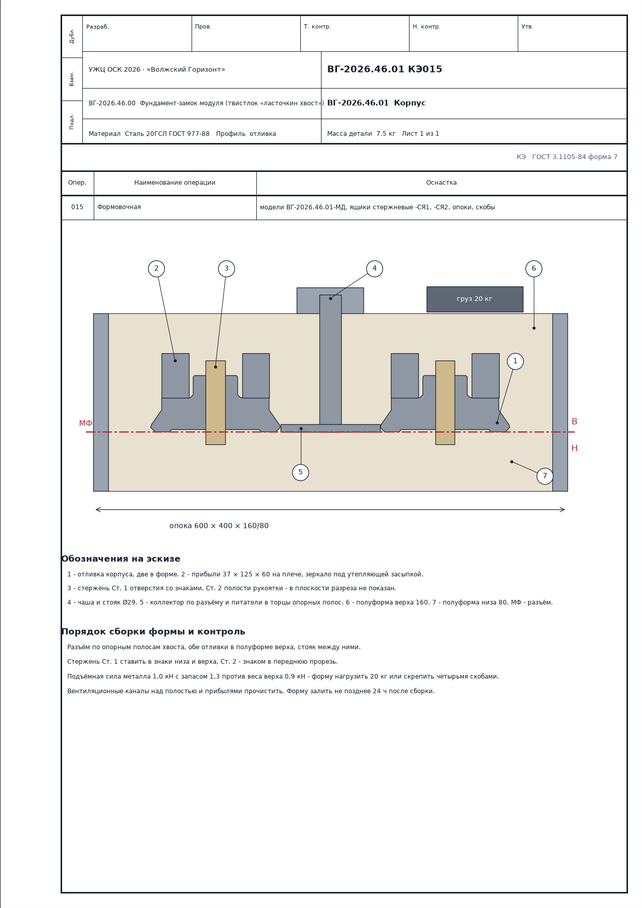

Рисунок 30 - Литейная форма корпуса в сборе, карта эскизов

### 4.3 Анализ текущих мощностей предприятия

Цех оснащается под узел. Оборудование, его назначение и цена - принято по рыночным ценам 2026 года:

Таблица 30

| Оборудование | Назначение | Кол. | Способ | Цена, руб. |
|---|---|---|---|---|
| Печь индукционная тигельная ИСТ-0,16 с преобразователем частоты и градирней | плавка стали 20ГСЛ, 160 кг | 1 | покупка | 6 800 000 |
| Ковш разливочный чайниковый 0,25 т и стенд подогрева | подогрев ковша до 750 °С, заливка | 1 | покупка | 380 000 |
| Смеситель ХТС лопастной 0,1 м³ | смесь для форм и стержней | 1 | покупка | 450 000 |
| Стол вибрационный формовочный 1,0 × 1,0 м | уплотнение форм | 1 | покупка | 220 000 |
| Опоки сварные 600 × 400 × 160/80 со штырями | формы, оборот раз в сутки | 8 | покупка | 25 000 за шт. |
| Решётка выбивная инерционная | выбивка отливок | 1 | покупка | 320 000 |
| Пневмошлифмашины угловые DAEWOO (круг 180 мм) и прямые Daewoo DG-38LS | обрубка, зачистка отливок и платиков | 5 | покупка | 18 000 за шт. |
| Компрессор винтовой 11 кВт, 1,6 м³/мин, 8 бар, с ресивером | сжатый воздух для пневмоинструмента | 1 | покупка | 650 000 |
| Электропечь камерная сопротивления ПН-12-2 | нормализация и отпуск отливок, садка 100 кг | 1 | покупка | 950 000 |
| Машина плазменной резки с ЧПУ NUMOREX NXB, поле 2000 × 6000 мм, источник 125 А | раскрой листа 09Г2С 20 мм | 1 | покупка | 4 800 000 |
| Станок вертикально-сверлильный 2Н135 | отверстие Ø30 корпуса, овалы платика, отверстия поз. 2 и 3 | 1 | покупка | 950 000 |
| Станок токарно-винторезный 16К20, РМЦ 1000 | вал поз. 3, стержень поз. 2 | 1 | покупка | 2 900 000 |
| Полуавтомат сварочный 400 А, стол сварочный, фильтровентиляционный агрегат | сварка корпуса с платиком | 1 | покупка | 420 000 |
| Камера окрасочно-сушильная тупиковая 3 × 3 × 2,5 м, подогрев до 110 °С | грунт, эмаль, сушка | 1 | покупка | 1 450 000 |
| Верстаки слесарные и сборочные | сборка, слесарные работы | 3 | покупка | 30 000 за шт. |
| Стол контроля, плита поверочная, мерительный инструмент, твердомер, толщиномер, шаблоны | контроль | 1 | покупка | 280 000 |
| Вентиляция литейного участка - зонт над печью, отсосы обрубки | удаление газов и пыли | 1 | покупка | 900 000 |
| Стеллажи, поддоны, тележки гидравлические | склады материалов и готовой продукции | 1 | покупка | 220 000 |
| Блок-контейнеры бытовые - раздевалка, душ, конторка мастера | бытовые помещения | 2 | аренда | 14 000 в месяц |

Трудоёмкость узла 4,22 ч, партии 77 шт - 332 ч. Серия 71 шт отливается за 8 плавок, одна в день, срок серии 12 рабочих дней. Узкое место - вибростол формовки, 50,7 % фонда за срок серии, остальное оборудование загружено меньше (рисунок 31).

Рисунок 31 - Загрузка оборудования цеха серией фундаментов

### 4.4 Схема производства и кооперации

Цепочка производства - закупка материала, плавка с одной стороны, резка листа с другой, общий участок мехобработки, сварки, окраски и сборки, приёмка, склад, отгрузка на верфь (рисунок 32). Исполнители и численность - по трудоёмкости серии и её сроку:

Рисунок 32 - Схема производства и кооперации узла

Таблица 31

| Штатная единица | Человек | Загрузка на человека за серию, % |
|---|---|---|
| Начальник участка (мастер) | 1 | весь срок |
| Плавильщик и термист | 1 | 33,1 |
| Сварщик-сборщик, оператор плазменной резки и маляр | 1 | 92,2 |
| Литейщик-формовщик | 2 | 57,7 |
| Станочник (токарь, сверловщик) | 1 | 78,9 |
| Контролёр ОТК | 1 | 29,0 |
| Кладовщик | 1 | 0,5 ставки |
| Итого | 8 |  |

Покупается и заказывается на стороне:

Таблица 32

| Что | У кого | Вид |
|---|---|---|
| Лом стальной, ферросплавы, алюминий, бой стекла | металлоторговля | покупка |
| Песок кварцевый, смола, отвердитель, противопригарная краска | поставщик формовочных материалов | покупка |
| Лист 09Г2С 1500 × 6000 × 20 под платики и лист 1000 × 1500 × 12 под шайбы | металлобаза | покупка |
| Поковки поз. 3 из стали 40Х, улучшение на КП 590 | кузнечное производство | кооперация |
| Круг 40Х Ø16 улучшенный для поз. 2 | металлобаза | покупка |
| Деревянные модели, стержневые ящики, кондукторы | модельный цех | кооперация |
| Химический анализ, механические испытания образцов, пробная и разрушающая нагрузка | аккредитованная лаборатория | кооперация |
| Проволока Св-08Г2С, защитный газ | поставщик сварочных материалов | покупка |
| Грунт ГФ-021, эмаль ПФ-115, растворитель | поставщик лакокрасочных материалов | покупка |
| Болты, гайки, шайбы А4-80, изоляция СТЭФ, фиксатор резьбы | поставщик крепежа | покупка |
| Надзор, акт испытаний установочной партии | Российское классификационное общество | надзор |

### 4.5 Планировка участка производства

Цех - арендованный ангар 36 × 24 м рядом с верфью в Санкт-Петербурге, кран-балка подвесная 2 т, подключение 250 кВт. Ворота въезда в одном торце, выезда в другом, между ветками проезд 5 м. Литейная ветка - вдоль одной стены, плазменная - вдоль другой, общий участок, сборка и склад готовой продукции - у выезда, окрасочная камера - в углу. Под участками 446 м² из 864, остальное - проезды и проходы не уже 1 м (рисунок 33).

Рисунок 33 - Планировка цеха фундаментов в ангаре

### 4.6 Сроки подготовки и освоения, программа выпуска

Программа - 72 на палубу, 4 ЗИП и 1 на разрушающие испытания, всего 77, установочная партия 6. Сроки привязаны к дорожной карте постройки, выпуск кончается задолго до установки на судне на достройке (рисунок 34):

Таблица 33

| Этап | Начало | Конец | Кто |
|---|---|---|---|
| РКД узла, расчёт, согласование с РКО | 21.01.2027 | 17.02.2027 | ПБ |
| Технология, карты ЕСТД, программы раскроя | 18.02.2027 | 10.03.2027 | технолог, мастер |
| Договор аренды ангара, заказ оборудования | 30.07.2027 | 19.08.2027 | УРП, МТО |
| Поставка и монтаж оборудования, подключение, пусконаладка | 20.08.2027 | 30.09.2027 | поставщики, мастер |
| Модели, стержневые ящики, кондукторы | 16.08.2027 | 10.09.2027 | модельный цех, кооперация |
| Поковки поз. 3, лист, шихта, покупные изделия | 30.07.2027 | 09.09.2027 | МТО, кооперация |
| Набор и обучение персонала, аттестация сварщика | 17.09.2027 | 30.09.2027 | мастер, УП |
| Пробная плавка, установочная партия 6 шт | 01.10.2027 | 14.10.2027 | цех узла |
| Испытания установочной партии, акт РКО | 15.10.2027 | 28.10.2027 | ОТК, лаборатория, РКО |
| Серия 71 шт | 29.10.2027 | 15.11.2027 | цех узла |
| Приёмка серии, консервация, отгрузка на склад верфи | 16.11.2027 | 22.11.2027 | ОТК, кладовщик |
| Освобождение площадки | 23.11.2027 | 06.12.2027 | мастер |
| Подкладные листы на настиле солнечной палубы | 03.02.2028 | 01.03.2028 | корпусный цех |
| Установка 72 фундаментов на судне | 10.10.2028 | 23.10.2028 | достроечный цех |

Рисунок 34 - Сроки подготовки и освоения производства фундаментов

Испытания:

Таблица 34

| Испытание | Содержание |
|---|---|
| Приёмо-сдаточные, 100 % | ВИК отливок и швов, размеры, поворот запора от выреза до выреза без заеданий, толщина покрытия |
| Механические свойства литья, от каждой плавки | химсостав, σ0,2, σв, δ, ψ, KCU на образцах в лаборатории по ГОСТ 977-88 |
| Пробная нагрузка, 3 шт от установочной партии и 1 шт от каждых 25 серийных | сжатие и отрыв до предельной расчётной нагрузки, выдержка 5 мин. Остаточной деформации нет, запор поворачивается |
| Разрушающие, 1 шт от установочной партии | отрыв до разрушения, разрушающая нагрузка не ниже двух предельных расчётных |

#### Себестоимость узла

Ставки и цены - принято по рыночным ценам 2026 года. Аренда ангара - 3,6 мес, оборудование - амортизация за этот срок.

Таблица 35

| Статья | Партия 77 шт, руб. | На узел, руб. |
|---|---|---|
| Шихта - лом, ферросплавы, алюминий, с угаром и возвратом прибылей | 28 408 | 369 |
| Лист 09Г2С 20 и 12 мм под платики и шайбы | 163 202 | 2 120 |
| Поковки поз. 3 и круг поз. 2 из стали 40Х | 219 335 | 2 849 |
| Формовочные материалы - песок, смола, отвердитель, краска | 32 183 | 418 |
| Модели, стержневые ящики, кондукторы | 250 000 | 3 247 |
| Сварочные материалы - проволока, газ | 19 157 | 249 |
| Лакокрасочные материалы | 5 575 | 72 |
| Крепёж А4-80 и изоляция СТЭФ | 908 215 | 11 795 |
| Оплата труда с начислениями | 1 296 548 | 16 838 |
| Аренда ангара | 2 021 760 | 26 257 |
| Оборудование - амортизация за срок, аренда бытовых блоков | 825 000 | 10 714 |
| Электроэнергия | 88 729 | 1 152 |
| Испытания, лаборатория, надзор РКО | 403 000 | 5 234 |
| Накладные расходы участка, 10 % | 626 111 | 8 131 |
| Итого | 6 887 223 | 89 444 |

**Себестоимость узла - 89 444 руб. за штуку. В стоимость судна - 6 887 223 руб., это 72 фундамента по 95 656 руб. с учётом ЗИП и испытательного образца.**

## 5 Персонал

### 5.1 Организационная структура предприятия

Верфь - АО «Адмиралтейские верфи», Санкт-Петербург. Генеральный директор. Заместители по производству (основные производственные цеха, производственно-плановое управление, сдаточная команда ПОИК), по МТО, по экономике и финансам, по персоналу. Главный инженер с техническим управлением, проектным бюро «Без границ» и службой качества с выходом на Российское классификационное общество (РКО). Схема с численностью участков - на рисунке 35.

Рисунок 35 - Организационная структура верфи под проект

### 5.2 Численность и состав занятого персонала

Трудоёмкость - по Приказу Минпромторга № 958 (прил. 10, табл. 3) на водоизмещение порожнем 1966 т из нагрузки масс - удельная 188.3 чел·ч/т, головное судно 529 410 чел·ч, электромонтаж 52 941, проектирование 32 579, всего 614 931 чел·ч. Численность по этапам - из их длительности в дорожной карте (блок 7) по формуле N = T / (мес × 165 ч × 1.05).

Таблица 36

| Вид работ | чел·ч | Этап, мес | Человек | Профессия |
|---|---|---|---|---|
| Обработка деталей корпуса | 33 750 | 8,4 | 24 | корпусники |
| Предварительная сборка конструкций | 81 397 | 8,4 | 56 | корпусники |
| Формирование корпуса на стапеле | 94 632 | 7,3 | 75 | корпусники |
| Трубомонтажные работы | 46 985 | 15,6 | 18 | трубопроводчики |
| Механомонтажные работы | 41 691 | 15,6 | 16 | механики |
| Достроечные работы | 107 867 | 11,3 | 56 | достройщики |
| Испытания судна | 49 632 | 3,1 | 94 | сдаточная команда |
| Изготовление изделий МСЧ | 73 456 | 11,8 | 37 | достройщики |
| Электромонтаж | 52 941 | 11,3 | 28 | электромонтажники |
| Эскизный проект | 1 629 | 1,4 | 7 | ИТР проектирования |
| Технический проект | 6 516 | 1,8 | 21 | ИТР проектирования |
| Рабочая КД | 24 434 | 5,3 | 27 | ИТР проектирования |

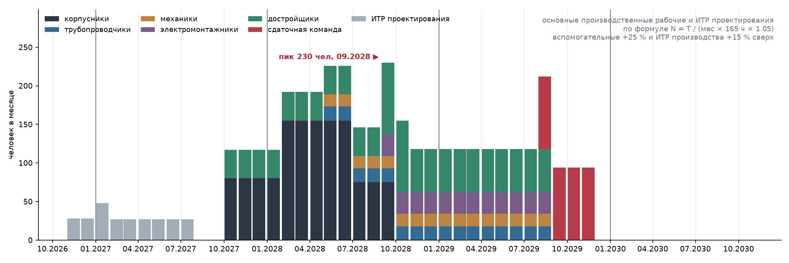

Рисунок 36 - Загрузка персонала по месяцам постройки

Пик (рисунок 36) - 230 основных производственных рабочих в 09.2028. Со вспомогательными (58) и ИТР производства (35) - до 323 человек, средняя численность на постройке 108. Затраты на персонал - 6.5.

### 5.3 Система подбора персонала

Рабочие основных профессий - штат верфи, их численность по этапам постройки - в 5.2. Под проект подбираются руководство производством и инженерная группа, 77 человек. Оклады - по вакансиям Санкт-Петербурга на hh.ru на 2026 год. Группа формируется с 16.08.2027 за 43 рабочих дня (задача 9.2 дорожной карты), руководство производством выходит к началу корпусообработки 14.10.2027.

Таблица 37 - Штат руководства производством и инженерной группы проекта

| Должность | Человек | Оклад, руб./мес | Категория | Статья затрат |
|---|---|---|---|---|
| Заместитель главного инженера | 1 | 130 000 | АУП | общехозяйственные |
| Ведущий конструктор | 4 | 170 000 | ИТР | общехозяйственные |
| Ведущий технолог | 4 | 100 000 | ИТР | общехозяйственные |
| Ведущий специалист технического контроля | 3 | 150 000 | ИТР | общехозяйственные |
| Ведущий экономист | 2 | 120 000 | АУП | общехозяйственные |
| Ведущий инженер-технолог | 4 | 150 000 | ИТР | общехозяйственные |
| Инженер-конструктор 1 категории | 4 | 150 000 | ИТР | общехозяйственные |
| Технолог 1 категории | 5 | 120 000 | ИТР | общехозяйственные |
| Начальник производства | 1 | 200 000 | АУП | общепроизводственные |
| Начальник участка | 5 | 170 000 | ИТР | общепроизводственные |
| Старший мастер участка | 7 | 180 000 | ИТР | общепроизводственные |
| Мастер участка | 7 | 130 000 | ИТР | общепроизводственные |
| Специалист по охране труда | 2 | 120 000 | ИТР | общепроизводственные |
| Специалист по МТО | 2 | 150 000 | ИТР | общепроизводственные |
| Наладчик систем | 10 | 100 000 | ИТР | общепроизводственные |
| Кладовщик | 7 | 75 000 | ВПР | общепроизводственные |
| Строитель кораблей | 7 | 120 000 | ИТР | общепроизводственные |
| Специалист по связям с общественностью | 2 | 80 000 | служащий | коммерческие |

### 5.4 Система оплаты труда и мотивации

Основные производственные рабочие получают сдельную оплату по нормо-часам. Стоимость нормо-часа задана по видам работ на 2026 год и индексируется - 1,081 на 2027 год, 1,155 на 2028 год и 1,235 на 2029 год. Выполнение норм принято с коэффициентом 1,05. АУП и ИТР получают оклад и премию 10 % к окладу. Дополнительная заработная плата - 13,36 % от основной, это 33 дня отпуска, нетрудоспособности и медицинских обследований на 247 рабочих дней. Страховые взносы - 32,8 %. Система оплаты и мотивации разрабатывается с 16.07.2027 (задача 9.1).

Таблица 38 - Стоимость нормо-часа по видам работ

| Вид работ | Стоимость н·ч 2026, руб. | 2027 | 2028 | 2029 |
|---|---|---|---|---|
| Обработка деталей корпуса | 1043,15 | 1127,65 | 1204,84 | 1288,29 |
| Предварительная сборка конструкций | 1043,15 | 1127,65 | 1204,84 | 1288,29 |
| Формирование корпуса на стапеле | 1043,15 | 1127,65 | 1204,84 | 1288,29 |
| Изготовление изделий МСЧ | 919,97 | 994,49 | 1062,57 | 1136,16 |
| Механомонтажные работы | 1146,25 | 1239,10 | 1323,92 | 1415,62 |
| Трубомонтажные работы | 1146,25 | 1239,10 | 1323,92 | 1415,62 |
| Достроечные работы | 909,05 | 982,68 | 1049,95 | 1122,68 |
| Электромонтажные работы | 979,36 | 1058,69 | 1131,16 | 1209,51 |
| Испытания судна | 921,45 | 996,09 | 1064,27 | 1137,99 |

### 5.5 Система обучения и подготовки кадров

Обязательное обучение проходит до начала постройки - с 14.10.2027 за 40 рабочих дней (задача 9.3). Оно закрывает допуски к электроустановкам и испытаниям, поверку средств измерений, работу с плавучим краном, подготовку по Кодексу ПДНВ для сдаточной команды, пожарную безопасность и охрану труда. Затраты - 1,65 млн руб. в ценах 2027 года, входят в общепроизводственные.

Таблица 39 - Обязательное обучение персонала

| Организация | Тема | Человек | Затраты, руб. |
|---|---|---|---|
| АНО ДПО «Учебный центр «Перспектива» | Эксплуатация электроустановок для испытаний и измерений | 30 | 131 040 |
| АНО ДПО «Прикамский институт безопасности» | Поверка и калибровка средств измерений теплотехнических величин | 15 | 124 800 |
| АНО ДПО «ДВИПРАЗ» | Поверка и калибровка средств геометрических измерений | 25 | 13 676 |
| ЧОУ ДПО «Учебный центр «Конфакт» | Проверка знаний машиниста плавучего крана | 35 | 72 800 |
| ЧОУ ДПО «Морские системы» | Подготовка по разделу A-VI/1 Кодекса ПДНВ | 20 | 151 840 |
| ООО МУИЦ «Меркурий» | Специалист по пожарной профилактике | 100 | 36 400 |
| ЧОУ ДПО «Спутник» | Техносферная безопасность, охрана труда | 150 | 126 048 |
| ЧОУ ДПО «Морские системы» | Специалист по спасательным шлюпкам и плотам, раздел A-VI/2 Кодекса ПДНВ | 30 | 93 600 |
| ИП Климчук В. А. | Обучение по охране труда, общий договор | по договору | 391 872 |
| ИП Лысенко И. М. | Обучение по электробезопасности, общий договор | по договору | 185 319 |
| АНО ДПО «ПРОФАТОМЭНЕРГО» | Обучение по радиационной безопасности, общий договор | по договору | 318 614 |
| **Итого** |  |  | **1 646 009** |

## 6 Экономика и финансы

Затраты посчитаны по статьям калькуляции верфи и разнесены по годам постройки 2027…2029 по дорожной карте (блок 7). Полный расчёт с формулами - приложение Б (книга Excel), здесь - итоги.

### 6.1 Расчёт стоимости изделия

Металл закупается по массе корпуса 806,6 т (сталь D36) и надстройки 136,3 т (АМг5) из нагрузки масс с коэффициентом использования металла 0,85 - 949 т стали и 160 т алюминия. Цены материалов - предложения поставщиков и торговых площадок 2026 года без НДС 22 % с индексом цен на 2027 год. Покупные комплектующие - по технико-коммерческим предложениям, фундаменты-замки модулей - по себестоимости узла (блок 4). Транспортно-заготовительные расходы - 1,1 % от материалов и ПКИ.

Таблица 40 - Покупные комплектующие изделия

| Покупное изделие | Поставщик | Основание | Сумма, млн руб. |
|---|---|---|---|
| Оборудование дизель-электрического комплекса - три двухтопливных дизель-генератора 600 кВт (дизель, метанол), ГРЩ, гребные электродвигатели колёс 2 × 550 кВт, преобразователи | Weichai Power Co., Ltd. (Marine Division) | ТКП № 1 | 67,6 |
| Гребные колёса с механизмом поворота плиц и сопутствующее оборудование | ООО «Плато-Инжиниринг» | ТКП № 2 | 13,5 |
| Оборудование и арматура общесудовых систем и систем СЭУ | ООО «Промтехнологии» | ТКП № 3 | 36,8 |
| Система вентиляции и кондиционирования воздуха | поставщик по ТКП № 4 | ТКП № 4 | 228,0 |
| Фундаменты-замки модулей солнечной палубы ВГ-2026.46.00 (твистлок «ласточкин хвост»), с ЗИП и испытаниями | цех узла верфи | себестоимость узла | 6,9 |
| **Итого** |  |  | **352,8** |

Трудоёмкость постройки - 611 469 н·ч, это трудоёмкость из 5.2 с коэффициентом выполнения норм 1,05. По годам она разнесена по рабочим дням задач дорожной карты - 54 765 н·ч в 2027 году, 343 629 в 2028 году и 213 075 в 2029 году. Общепроизводственные затраты - руководство производством с начала корпусообработки до передачи судна и обязательное обучение, общехозяйственные - инженерная группа проекта с её формирования (5.3). Коммерческие расходы - маркетинг и связи с общественностью от подписания договора. Прибыль - 15 % от полной себестоимости.

Таблица 41 - Калькуляция себестоимости и цены головного судна

| Статья | Всего, млн руб. | 2027 | 2028 | 2029 |
|---|---|---|---|---|
| Материалы | 227,8 | 227,8 | 0,0 | 0,0 |
| Покупные комплектующие изделия | 352,8 | 352,8 | 0,0 | 0,0 |
| Транспортно-заготовительные расходы | 6,4 | 6,4 | 0,0 | 0,0 |
| Основная заработная плата | 720,4 | 59,5 | 404,2 | 256,7 |
| Дополнительная заработная плата | 96,3 | 7,9 | 54,0 | 34,3 |
| Страховые взносы | 267,9 | 22,1 | 150,3 | 95,5 |
| Общепроизводственные затраты | 325,7 | 30,1 | 140,9 | 154,7 |
| Общехозяйственные затраты | 208,6 | 30,0 | 85,1 | 93,5 |
| **Производственная себестоимость** | **2205,8** | **736,6** | **834,5** | **634,7** |
| Коммерческие расходы | 15,0 | 4,2 | 5,2 | 5,6 |
| **Полная себестоимость** | **2220,8** | **740,9** | **839,7** | **640,3** |
| Прибыль | 333,1 |  |  |  |
| **Цена судна без НДС** | **2554,0** |  |  |  |
| НДС 22 % | 561,9 |  |  |  |
| **Цена судна с НДС** | **3115,8** |  |  |  |

Структура цены - на рисунке 37. Самая крупная статья - основная заработная плата, 32 % полной себестоимости. Головное судно строится с полной трудоёмкостью, серийные дешевле (6.2).

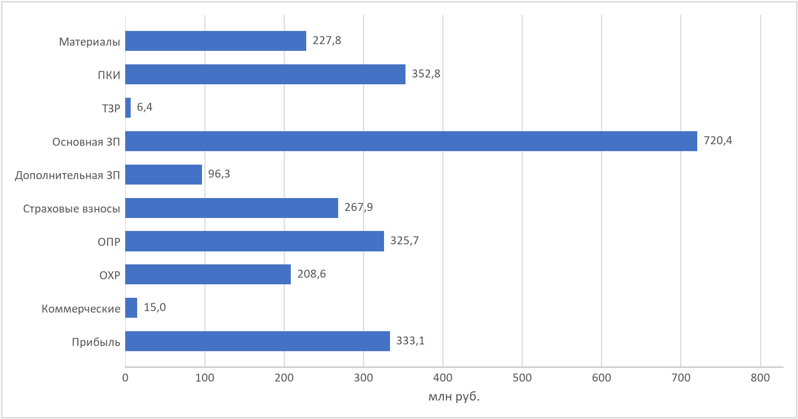

Рисунок 37 - Структура цены головного судна по статьям

**Цена головного судна - 2554,0 млн руб. без НДС, 3115,8 млн руб. с НДС.** Это ориентировочная стоимость единицы изделия для заказчика (1.1.4).

### 6.2 Точка безубыточности и срок окупаемости

Серийное судно строится по той же документации, трудоёмкость у него меньше в 1,3 раза - коэффициент головного судна по Приказу Минпромторга № 958, прил. 7. Прямые затраты серийного судна - материалы, ПКИ и оплата труда с взносами. Постоянные затраты года - штат АУП и ИТР и маркетинг. Цена серийного судна, как и головного, - себестоимость и прибыль 15 %:

Таблица 42 - Серийное судно и точка безубыточности

| Показатель | Значение |
|---|---|
| Прямые затраты серийного судна, млн руб. | 1421,2 |
| Постоянные затраты в год, млн руб. | 199,9 |
| Себестоимость серийного судна при темпе одно в год, млн руб. | 1621,2 |
| Цена серийного судна без НДС, млн руб. | 1864,4 |
| Маржинальный доход с судна, млн руб. | 443,1 |
| Точка безубыточности, судов в год | 0,45 |

Точка безубыточности - 0,45 судна в год, производство прибыльно уже при одном судне в год. Доступный объём рынка равен продажам 21 судна такого типа (1.1.3), программа принята из головного и 5 серийных судов, по одному в год с 2031 года. Цены после 2029 года растут на 6 % в год.

Таблица 43 - Денежный поток программы, млн руб.

| Год | НИОКР и оборудование | Затраты на постройку | Выручка без НДС | Денежный поток | Накопленный | Накопленный дисконтированный |
|---|---|---|---|---|---|---|
| 2026 | 8,8 | 0,0 | 0,0 | -8,8 | -8,8 | -8,8 |
| 2027 | 65,6 | 740,9 | 0,0 | -806,5 | -815,3 | -710,1 |
| 2028 | 0,0 | 839,7 | 0,0 | -839,7 | -1655,0 | -1345,0 |
| 2029 | 0,0 | 640,3 | 0,0 | -640,3 | -2295,3 | -1766,1 |
| 2030 | 0,0 | 0,0 | 2554,0 | 2554,0 | 258,6 | -305,8 |
| 2031 | 0,0 | 1821,6 | 2094,8 | 273,2 | 531,9 | -170,0 |
| 2032 | 0,0 | 1930,8 | 2220,5 | 289,6 | 821,5 | -44,8 |
| 2033 | 0,0 | 2046,7 | 2353,7 | 307,0 | 1128,5 | 70,6 |
| 2034 | 0,0 | 2169,5 | 2494,9 | 325,4 | 1453,9 | 177,0 |
| 2035 | 0,0 | 2299,7 | 2644,6 | 345,0 | 1798,9 | 275,1 |

Потоки - на рисунке 38. При ставке дисконтирования 15 % (ключевая ставка Банка России с премией за риск) чистая приведённая стоимость NPV - 275,1 млн руб., индекс доходности PI - 1,16, внутренняя норма доходности IRR - 20,8 %. Инвестиции программы - всё, что вложено до первой выручки, это НИОКР, оборудование цеха узла и постройка головного судна. Срок окупаемости - 4 года, дисконтированный - 7 лет от начала проекта в 2026 году.

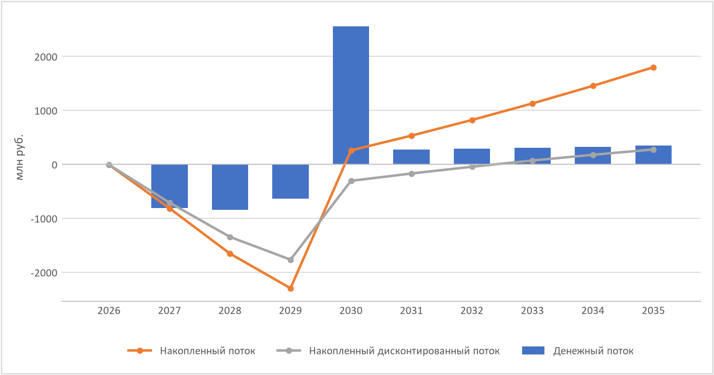

Рисунок 38 - Денежный поток программы постройки

### 6.3 Затраты на оборудование, модернизацию и ремонт

Судно строится на действующих мощностях верфи - стапель, достроечная набережная и цеха, их анализ - задача 1.3 дорожной карты. Новое оборудование покупается только для цеха фундаментов-замков (блок 4), всего на 22,07 млн руб.:

Таблица 44 - Оборудование цеха узла

| Оборудование | Кол. | Цена, руб. | Сумма, руб. |
|---|---|---|---|
| Печь индукционная тигельная ИСТ-0,16 с преобразователем частоты и градирней | 1 | 6 800 000 | 6 800 000 |
| Ковш разливочный чайниковый 0,25 т и стенд подогрева | 1 | 380 000 | 380 000 |
| Смеситель ХТС лопастной 0,1 м³ | 1 | 450 000 | 450 000 |
| Стол вибрационный формовочный 1,0 × 1,0 м | 1 | 220 000 | 220 000 |
| Опоки сварные 600 × 400 × 160/80 со штырями | 8 | 25 000 | 200 000 |
| Решётка выбивная инерционная | 1 | 320 000 | 320 000 |
| Пневмошлифмашины угловые DAEWOO (круг 180 мм) и прямые Daewoo DG-38LS | 5 | 18 000 | 90 000 |
| Компрессор винтовой 11 кВт, 1,6 м³/мин, 8 бар, с ресивером | 1 | 650 000 | 650 000 |
| Электропечь камерная сопротивления ПН-12-2 | 1 | 950 000 | 950 000 |
| Машина плазменной резки с ЧПУ NUMOREX NXB, поле 2000 × 6000 мм, источник 125 А | 1 | 4 800 000 | 4 800 000 |
| Станок вертикально-сверлильный 2Н135 | 1 | 950 000 | 950 000 |
| Станок токарно-винторезный 16К20, РМЦ 1000 | 1 | 2 900 000 | 2 900 000 |
| Полуавтомат сварочный 400 А, стол сварочный, фильтровентиляционный агрегат | 1 | 420 000 | 420 000 |
| Камера окрасочно-сушильная тупиковая 3 × 3 × 2,5 м, подогрев до 110 °С | 1 | 1 450 000 | 1 450 000 |
| Верстаки слесарные и сборочные | 3 | 30 000 | 90 000 |
| Стол контроля, плита поверочная, мерительный инструмент, твердомер, толщиномер, шаблоны | 1 | 280 000 | 280 000 |
| Вентиляция литейного участка - зонт над печью, отсосы обрубки | 1 | 900 000 | 900 000 |
| Стеллажи, поддоны, тележки гидравлические | 1 | 220 000 | 220 000 |
| **Итого** |  |  | **22 070 000** |

В себестоимость фундаментов-замков оборудование входит амортизацией за срок работы цеха, в денежном потоке программы - покупкой в 2027 году.

### 6.4 Затраты на строительство или модернизацию площадки

Новая площадка не строится. Цех фундаментов-замков размещается в арендованном ангаре 864 м² по 650 руб./м² в месяц на 3,6 мес, аренда - 2,02 млн руб. и входит в себестоимость узла. Модернизация ангара сводится к монтажу оборудования и подключению 250 кВт (блок 4).

### 6.5 Затраты на персонал

Затраты на персонал - оплата рабочих по трудоёмкости (5.4), штат руководства и инженерной группы на срок проекта (5.3) и обучение (5.5). Всего 1629,5 млн руб., это 73,4 % полной себестоимости:

Таблица 45 - Затраты на персонал

| Статья | 2027, млн руб. | 2028 | 2029 | Всего |
|---|---|---|---|---|
| Основная заработная плата производственных рабочих | 59,5 | 404,2 | 256,7 | 720,4 |
| Дополнительная заработная плата | 7,9 | 54,0 | 34,3 | 96,3 |
| Страховые взносы с оплаты рабочих | 22,1 | 150,3 | 95,5 | 267,9 |
| Руководство производством с премией, ДЗП и взносами | 28,5 | 140,9 | 154,7 | 324,0 |
| Инженерная группа проекта с премией, ДЗП и взносами | 30,0 | 85,1 | 93,5 | 208,6 |
| Связи с общественностью с премией, ДЗП и взносами | 2,9 | 3,7 | 4,0 | 10,6 |
| Обязательное обучение | 1,6 |  |  | 1,6 |
| **Итого** | **152,6** | **838,1** | **638,7** | **1629,5** |

### 6.6 Прочие затраты, НИОКР

НИОКР - проектирование судна проектным бюро, эскизный и технический проект и рабочая конструкторская документация. Трудоёмкость проектирования - 32 579 чел·ч (5.2), час инженера-конструктора с премией, ДЗП и взносами - 1508 руб. Годы - по задачам проектирования дорожной карты:

Таблица 46 - НИОКР

| Стадия | Задача дорожной карты | чел·ч | Затраты, млн руб. |
|---|---|---|---|
| Эскизный проект | Эскизирование | 1629 | 2,46 |
| Технический проект | ОКР (опытно-конструкторская работа) | 6516 | 10,11 |
| Рабочая КД | Составление рабочей конструкторской документации (схемы систем, чертежи) | 24 434 | 39,84 |
| **Итого** |  | **32 579** | **52,41** |

Маркетинг и продвижение - 1,52 млн руб. в год, в калькуляции - коммерческие расходы:

Таблица 47 - Маркетинг и продвижение

| Исполнитель | Вид | Руб. в месяц | Как выполняется |
|---|---|---|---|
| Метрополитен Санкт-Петербурга | Реклама на путевых щитах 4 × 2 м | 124 000 | Макет - отдел по связям с общественностью верфи |
| АО «Адмиралтейские верфи» | Буклеты и раздаточная продукция | 3000 | Типография предприятия, 100 буклетов А4 в месяц по 30 руб., выставки и конференции |
| АО «Адмиралтейские верфи» | Реклама в социальных сетях | 0 | Силами сотрудников в Telegram, MAX и ВКонтакте |

## 7 Дорожная карта реализации проекта

Верфь - АО «Адмиралтейские верфи», Санкт-Петербург. Получение ТЗ 22.09.2026, подписание договора 24.02.2027, сдача 11.01.2030, эксплуатация с навигации 2030. Логика карты - договор, затем рабочая КД, подготовка производства, одобрение проекта РКО и заказ длинноцикловых позиций, затем корпусообработка и секции, стапель 7 месяцев, достройка, швартовные испытания, ходовые в навигацию, освидетельствование РКО, передача и перегон. Карта на 47 задач - на рисунках 39 и 40.

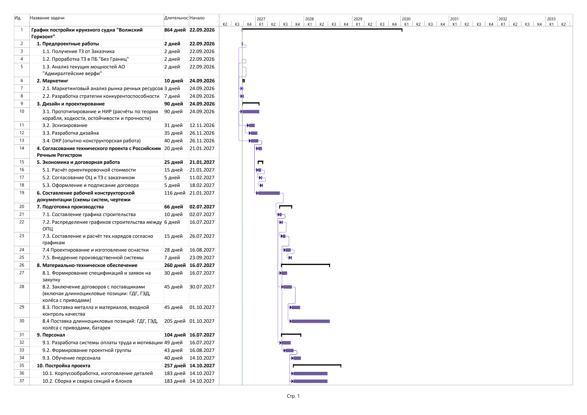

Рисунок 39 - Дорожная карта реализации проекта, лист 1

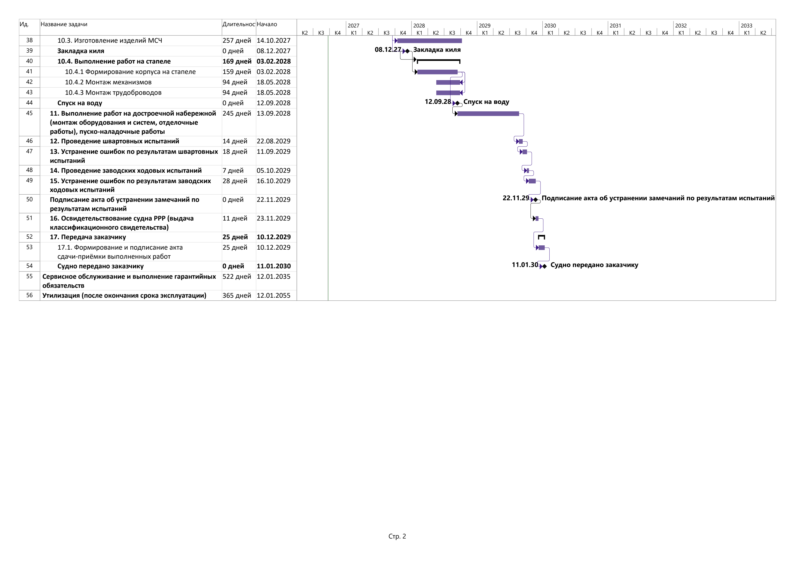

Рисунок 40 - Дорожная карта реализации проекта, лист 2

Таблица 48

| Контрольная точка | Дата |
|---|---|
| Договор подписан | 24 февраля 2027 |
| Закладка киля | 8 декабря 2027 |
| Спуск на воду | 12 сентября 2028 |
| Подписание акта об устранении замечаний по результатам испытаний | 22 ноября 2029 |
| Судно передано заказчику | 11 января 2030 |

## 8 Ограничения и риски проекта

**Ограничения**, вскрытые расчётом:

Таблица 49

| Ограничение | Обоснование |
|---|---|
| Ширина 16,5 м | камеры шлюзов на маршруте 290 × 30 м. Ширина не проектный параметр, а входное условие |
| Осадка 1,26 м при расчётной 1,30 | получена программой снижения массы. Запас под килём на фарватере 1,5 м - 0,24 м, дальше теряется ход на мели |
| Надводный габарит 9,9 м при мосте 13,3 м | таблица мостов маршрута, самый низкий - Затонские мосты в Уфе |
| Перегиб 78 МПа из 195 допускаемых | настил главной палубы 8 мм, тоньше нельзя |
| Колесо и лёд несовместимы | ледовых усилений нет, всесезонность закрывается южным плечом маршрута, а не ледовым классом |
| Шарнир плицы в воде | топляк на Волге - срезной палец в тяге и защитная решётка |
| Масса на солнечной палубе не более 85 т | модули в пределах расчётной осадки и норм РКО, точечные грузы только на фундаменты |

**Реестр рисков**. Вероятность и ущерб по шкале 1…5 - оценка ПБ, оценка - произведение, критичные - от 9.

Таблица 50

| Риск | Откуда виден | Вероятность | Ущерб | Оценка | Антирисковое мероприятие |
|---|---|---|---|---|---|
| Поставка ГДГ, ГЭД, колёс с приводами и батареи дольше 10 месяцев | поставка длинноцикловых (задача 30 в исходной карте) до 13.07.2028, стапель до 12.09.2028 | 3 | 4 | 12 | договоры с поставщиками сразу после подписания контракта. Резерв - погрузка через съёмный лист палубы на достройке |
| Алюминиевая надстройка - квалификация сварщиков и цех под алюминий | программа снижения массы - надстройка из алюминиевого сплава | 3 | 3 | 9 | обучение персонала (задача 34 в исходной карте). Кооперация с верфью, имеющей алюминиевое производство |
| Численность верфи меньше пика 230 человек в 09.2028 | численность по этапам, персонал и дорожная карта | 3 | 3 | 9 | растянуть достройку на 9 месяцев или привлечь подрядчиков на отделку |
| Летнее обмеление Белой ниже 1,6 м закрывает Уфу | глубины маршрута - 1,6…2,2 м в июле - августе при осадке 1,26 м | 3 | 3 | 9 | запас под килём 0,24 м на 1,5 м. Резервная программа с разворотом в Бирске, контроль осадки при загрузке модулей |
| Перегон из Санкт-Петербурга по Ладоге и Онеге судном класса «О» | в карте перегона нет - зона заказчика | 2 | 4 | 8 | разовое разрешение РКО с ограничением по волне и сезону, страхование перегона |
| Осенние шторма на Неве и в Финском заливе сдвигают ходовые испытания | ходовые испытания (задача 48 в исходной карте) - 05.10.2029 - 15.10.2029 | 3 | 2 | 6 | швартовные у стенки к октябрю сделаны, до ледостава в декабре остаётся около полутора месяцев резерва |
| Массы и мощности модулей у поставщиков выше принятых | массы модулей приняты по рынку, предел 85 т | 3 | 2 | 6 | пересчёт темы по спецификации поставщика перед монтажом, проверка массы и осадки по теме |
| Мост ниже заявленного 13,3 м или высокая вода | таблица мостов маршрута, запас 3,4 м | 1 | 4 | 4 | габарит 9,9 м без опускной рубки. Сверка с путевой информацией ГБУ перед навигацией |
| Плотное расписание Сарапул → Тетюши - 484 км, 26 ч хода без резерва | расписание рейса - Сарапул 08:00…11:00, Тетюши с 13:00 | 2 | 2 | 4 | стоянка в Сарапуле 3 ч утром и программа Тетюшей днём и вечером (принято 22.09.2026), при отставании - Сарапул с борта |

## 9 Условия и порядок эксплуатации, программа ППО

### 9.1 Условия эксплуатации

Класс РКО О 2,0, навигация май - октябрь на Каме и Белой, Волга у Самары дольше. Маршрут Самара - Казань - Уфа - Самара (Волга, Кама, Белая), 2606 км по фарватеру за 15 суток, кольцо из Самары. Путь по фарватеру - на рисунках 4 и 5, мосты и шлюзы с высотой прохода - на рисунке 5. Программа по дням и расписание стоянок приведены в таблице.

Таблица 51

| День | Порт | Приход | Отход | Программа |
|---|---|---|---|---|
| 1 | Самара |  | день 1 18:00 | Посадка на Самарском речном вокзале, приветственный ужин, вечерняя программа |
| 2 | Тольятти | день 1 23:02 | день 2 14:00 | Автобусная экскурсия к Замку Гарибальди в Хрящевке на берегу Жигулёвского моря |
| 3 | Ульяновск | день 2 22:51 | день 3 14:00 | Исторический центр (Венец), музей-заповедник «Родина В. И. Ленина» |
| 4 | Казань | день 4 02:36 | день 4 14:00 | Казанский Кремль, мечеть Кул-Шариф, улица Баумана |
| 5 | Чистополь | день 5 00:44 | день 5 14:00 | Купеческий город - музей Бориса Пастернака, Никольский собор |
| 6-7 | Набережные Челны | день 5 22:40 | день 7 18:00 | Ночью шлюз Нижнекамской ГЭС. Автобус по плотине в Елабугу - Чёртово городище, Шишкин, Цветаева, второй день - набережная и КАМАЗ |
| 8 | Белая, ходовой день | день 8 10:00 | день 8 10:00 | Извилистое русло Белой без остановок - лекции о башкирской культуре, кино, кулинарные мастер-классы |
| 9-10 | Уфа | день 9 05:06 | день 10 18:00 | Причал у Монумента Дружбы, Салават Юлаев, Национальный музей, Арт-квадрат, башкирский ужин с кумысом |
| 11 | Бирск | день 11 02:59 | день 11 14:00 | Город-крепость, интерактивная программа о купеческом быте XIX века |
| 12 | Сарапул | день 12 07:38 | день 12 11:00 | Утренняя стоянка - дача Башенина, дегустация сарапульских сладостей |
| 13 | Тетюши | день 13 13:10 | день 13 17:10 | Приход днём - театрализованная «Встреча с царь-рыбой», Музей истории рыболовства |
| 14 | Ширяево | день 14 07:19 | день 14 14:00 | Попова гора, дом-музей Ильи Репина, Жигулёвские горы |
| 15 | Самара | день 14 16:42 |  | Прибытие в первой половине дня, окончание круиза |

Расписание - отход из Самары в 18:00, ход 17.5 км/ч минус течение до Уфы и плюс после, программа в порту с 08:00. Проверка - приход не позже планового дня и 20:00.

Глубины по участкам.

- Волга и Кама, Самара - Набережные Челны. Глубина 4,0…10+ м, фарватер 200…1000 м (ограничений нет).
- Белая, устье - Уфа. Глубина 1,6…2,2 м, фарватер 50…60 м (излучины и радиусы, летнее обмеление).

Мосты и шлюзы по плечам - таблица из 15 позиций, предел 13.3 м при габарите 9.9 м, самые низкие Затонские мосты (Уфа) 13,3, Рязановский мост 13,5, Дёмский железнодорожный мост (Уфа) 13,5, Бельский мостовой переход (Уфа) 13,5. Бирский понтонный мост разводится по графику. Шлюзы 290 × 30 м.

Принятые допущения по программе маршрута.

- **Стоянка в Уфе «3 дня или расширенная двухдневная».** Три дня не помещаются в 15 дней при Бирске на 11-й, принято двое суток, дни 9-10.
- **Два моста М-12 через Белую, 21,4 и 14,5 м.** Трасса пересекает Белую один раз у Дюртюлей, 21,4 совпадает со шлюзами Нижнекамской ГЭС, 14,5 - с мостом через Каму, принята меньшая высота - в запас.
- **Самый низкий мост.** Не Императорский в Ульяновске 13,8, а Затонские мосты в Уфе 13,3 - предел по высоте пересчитан, габарит судна 9,9 м проходит с запасом.
- **Бирский понтонный мост разводной.** В программу стоянки в Бирске (день 11) и прохода на Уфу нужен график разводки.
- **Плечо Набережные Челны → Уфа за полтора суток.** Против течения Белой ~3 км/ч. Около 36 ч хода при 40 ч в распоряжении - проходит.
- **Сарапул (день 12) → Тетюши (день 13).** 484 км по фарватеру - 26 ч хода даже по течению, за сутки с дневной стоянкой не успеть. Принято - Сарапул - утренняя стоянка 3 ч, Тетюши - приход около 13:00 и программа до вечера.

### 9.2 Порядок эксплуатации

Таблица 52

| Что | Как |
|---|---|
| Автономность | 15 суток - топливо 215 м³ метанола и 12 м³ запального, вода со станцией очистки (экономия 22 м³/сут), провизия в трюме под камбузом |
| Бункеровка | метанол - автоцистерной на любом причале через пост на солнечной палубе ПБ (x 15…26), стоянка Самара - базовая |
| Энергия на стоянке | береговое питание или один ГДГ - нагрузка 698 кВт. На ходу 1280 кВт из 1800, резерв для модулей на стоянке 502 кВт |
| Посадка и груз | осадка 1,26 м. Каждая тонна на палубе - тонна водоизмещения - до 89 т до расчётной осадки 1,30, контроль при смене модульной темы |
| Модульные темы | смена темы краном причала за смену. 1) Проверить фундаменты слота - конусы вдоль слота, рукоятки в положении «открыто», розетка сред закрыта крышкой. 2) Кран причала 16 т (до дальнего слота 20,3 м) проносит модуль над соседними с зазором 0,5 м, ставит по маркировке настила. 3) Опустить модуль на четыре конуса, перевести рукоятки во второй вырез корпуса - замки заперты, проверить щупом зазор под фитингом. 4) Подключить розетку - питание, вода, стоки, связь, проверить герметичность и УЗО. 5) Записать в журнал тему, слоты, массы. Пересчитать посадку и остойчивость, при необходимости откорректировать балласт. Демонтаж - в обратном порядке. Фундаменты остаются на палубе, рукоятки - «открыто», розетка закрывается, освободившийся слот - снова солярий. |
| Автономное управление | вторая степень по градации ИМО MASS - экипаж на борту. Расхождение по ППВВП, при отказах - ручное управление в течение 5 минут |
| Гребные колёса | плица сменная - ось с кривошипом заменяется на плаву через галерею кожуха. Срезной палец в тяге защищает механизм от топляка |
| Зимний отстой | с ноября по апрель - стоянка, снятие модулей, ревизия колёс и плиц, докование по графику РКО |

### 9.3 Программа послепродажного обслуживания

Гарантийное обслуживание верфи - 522 рабочих дней после сдачи (12.01.2030 - 13.01.2032, задача карты «Сервисное обслуживание и гарантийные обязательства») - две навигации с бригадой верфи на плановых стоянках в Самаре. ЗИП на судне - комплект плиц с осями (24 плиц на двух колёсах), втулки подшипников, срезные пальцы, фундаменты-твистлоки. Сервис после гарантии - по договору с верфью или сервисным центром в Самаре. Цены сервиса, состав сервисной сети и порядок обслуживания в межнавигационный период - блок 6.

## 10 Выводы по проекту

1. Судно на 208 пассажиров в 64 каютах четырёх категорий, 12 мест М4, 4 автомобиля, автономность 15 суток, габарит 9.9 м под мостом 13.3 м, осадка 1.26 м при расчётной 1.30.

2. Рыночное предложение - семейный круиз на 15 суток по Волге, Каме и Белой с заходом в Уфу, куда крупный флот не идёт - 2288 мест за навигацию в 11 рейсов. Конкурентные преимущества посчитаны (1.1.6) - осадка, колёсный движитель с КПД 0.68, гараж, доступность, модульная солнечная палуба.

3. Конструкторская часть закрыта - теория корабля (приложение А, листы РТ-01…09), общее расположение ОР-01…08 в DXF и DWG, 3D-модель без пересечений, узел КД «фундамент-замок модуля» с чертежами, 3D, спецификацией, материалами и расчётом по качке судна, модульное решение солнечной палубы (листы МР-01…03).

4. Постройка - АО «Адмиралтейские верфи», Санкт-Петербург, ТЗ 22.09.2026, договор 24.02.2027, сдача 11.01.2030. Трудоёмкость по № 958, численность по этапам с пиком 230 человек.

5. Технология узла - отдельный цех в арендованном ангаре. Литьё корпуса, плазменная резка платика, мехобработка поковки запора, сварка, окраска и сборка, карты ЕСТД, оснастка, мощности, кооперация, планировка, сроки и себестоимость узла (блок 4). Анализ рынка, объём продаж и выручка - блок 1. Персонал - подбор, оплата и обучение (5.3…5.5).

6. Цена головного судна - 2554,0 млн руб. без НДС, 3115,8 млн руб. с НДС. Точка безубыточности серии - 0,45 судна в год, NPV программы из головного и 5 серийных судов - 275,1 млн руб., дисконтированный срок окупаемости - 7 лет (блок 6, приложение Б).

---

## Приложение А. Расчёты по теории корабля

Приложение содержит расчёты плавучести, остойчивости, непотопляемости, ходкости, качки и общей прочности судна.

### А.1 Главные размерения и элементы теоретического чертежа

Таблица А.1

| Величина | Значение |
|---|---|
| Длина наибольшая | 140,0 м |
| Длина по ватерлинии | 135,5 м |
| Ширина корпуса | 16,5 м |
| Габаритная ширина с колёсами | 16,0 м |
| Высота борта | 3,00 м |
| Осадка в полном грузу | **1,256 м** |
| Осадка носом / кормой | 1,20 / 1,31 м |
| Надводный борт | 1,74 м |
| Габаритная высота от ВЛ | 9,90 м (рубка стационарная) |
| Водоизмещение в полном грузу | 2378 т |
| Коэффициент общей полноты δ | 0,850 |
| Коэффициент полноты ватерлинии α | 0,919 |
| Коэффициент полноты мидель-шпангоута β | 0,982 |
| Площадь ватерлинии | 2045 м² |
| Смоченная поверхность | 2274 м² |
| Аппликата центра величины | 0,65 м |
| Абсцисса центра величины | 67,98 м |
| Поперечный метацентрический радиус | 17,57 м |
| Число тонн на сантиметр осадки | 20,5 т/см |
| Момент дифферентующий на 1 см | 217 т·м |

Обводы заданы не таблицей ординат, а четырьмя распределениями по длине - высотой килевой линии, полуширотой днища, полуширотой борта и развалом борта. Плазовая таблица строится из них той же геометрией сечения, которой пользуется плазовщик - плоское днище, скуловая дуга, касательная и к днищу и к борту, прямой борт с развалом. Поэтому таблицу можно снять с плаза и пересчитать вручную - ординаты сойдутся.

Форма продиктована осадкой. Водоизмещение при 1,5 м даёт только полнота, поэтому цилиндрическая вставка тянется от 0,16 до 0,80 длины - почти две трети корпуса идут одним сечением. Гребных валов нет, и кормовая оконечность не обязана сужаться под винты - она остаётся полной, что и даёт δ = 0,850. Ниши колёс на миделе входят в обводы - полуширота там срезана стенкой ниши, и вся гидростатика считается с ними.

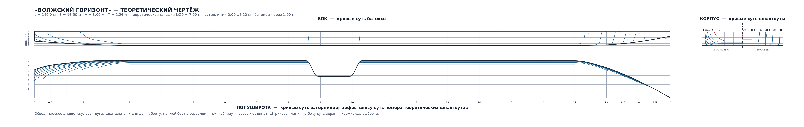

Рисунок А.1 - Теоретический чертёж

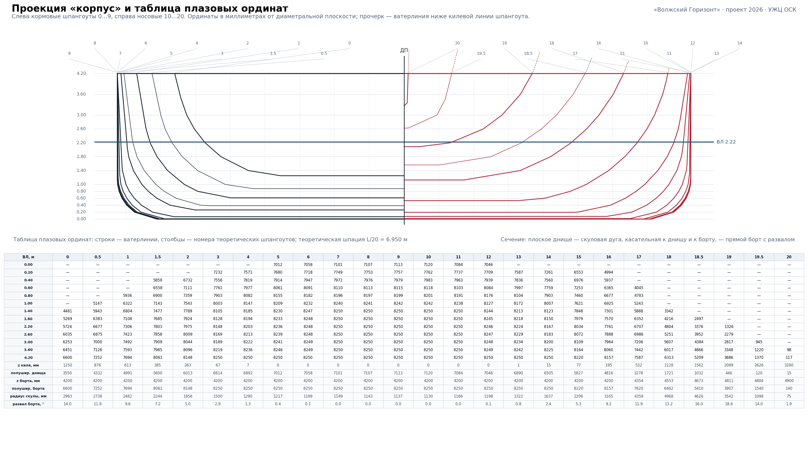

Рисунок А.2 - Проекция «корпус» и плазовые ординаты

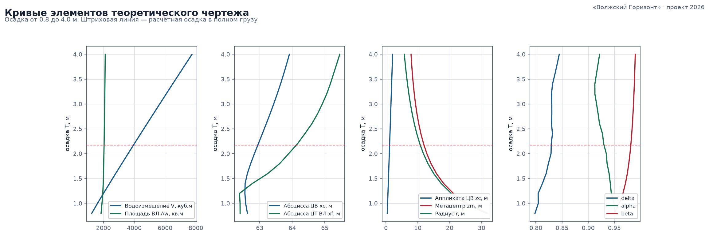

Рисунок А.3 - Кривые элементов теоретического чертежа

### А.2 Нагрузка масс и посадка

Таблица А.2

| Составляющая | Масса, т | Доля |
|---|---|---|
| Порожнём | 1966 | 83 % |
| Дедвейт | 412 | 17 % |
| **Полное водоизмещение** | **2378** | 100 % |

Крупнейшие группы:

Таблица А.3

| Группа | Масса, т | Аппликата ЦТ, м |
|---|---|---|
| Корпус металлический (сталь D36) | 806,6 | 1,48 |
| Системы и трубопроводы | 165,0 | 3,40 |
| Надстройка и рубка (алюминий) | 136,3 | 6,65 |
| Электрооборудование и АСУ | 112,0 | 3,60 |
| Оборудование помещений, главная, лёгкая отделка | 106,2 | 4,30 |
| Оборудование помещений, средняя, лёгкая отделка | 97,8 | 7,10 |
| Запас водоизмещения 3 % | 66,0 | 3,50 |
| Гребные колёса с валами | 62,0 | 2,60 |
| Оборудование помещений, первая, лёгкая отделка | 59,5 | 1,90 |
| Изоляция и зашивка, главная | 46,0 | 4,20 |

Масса корпуса не задана числом, а посчитана по связям - расчёт массы стали складывает обшивку, настилы, переборки и набор по фактическим толщинам и профилям. Поменяется толщина - поедет масса, а за ней осадка, остойчивость и прочность.

Таблица А.4

| Посадка | Значение |
|---|---|
| Средняя осадка | 1,256 м |
| Дифферент | 0,106 м на корму |
| Абсцисса ЦТ | 67,01 м |
| Аппликата ЦТ | 2,68 м |
| Поправка на свободные поверхности | 0,039 м |

**Дифферент лечился расстановкой, а не балластом.** Колёса и их приводы стоят на миделе, машинное отделение - вокруг них (отсек 62…76 м), кладовые провизии - под камбузом, батареи - в носовом отсеке, метанол - двумя группами по обе стороны от машинного отделения. Гараж и станция очистки стоков остаются в корме, и их уравновешивают вода и батареи в носу. Дифферент 0,11 м на корму при полных запасах. Носовая балластная цистерна ЦБЛ-1 (130 м³) держится под дифферентовку на обратном плече рейса, когда топливо выработано.

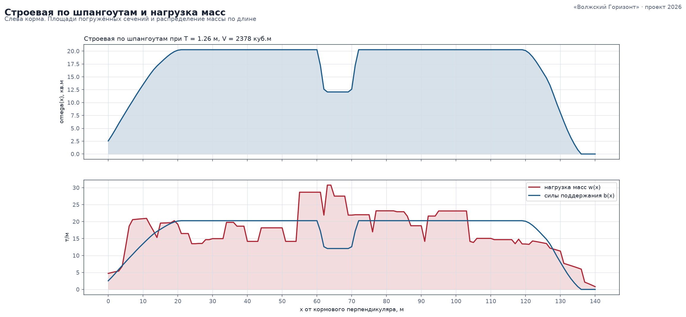

Рисунок А.4 - Строевая по шпангоутам и нагрузка масс

### А.3 Остойчивость

Таблица А.5

| Величина | Значение |
|---|---|
| Начальная метацентрическая высота h | **15,51 м** |
| Аппликата метацентра | 18,23 м |
| Максимальное плечо ДСО | 3,47 м |
| Угол максимума ДСО | 20,0° |
| Угол заката ДСО | 75,6° |
| Площадь парусности | 900 м² |
| Возвышение центра парусности над ВЛ | 3,62 м |
| Критерий погоды K | **31,69** |
| Критерий погоды K с закрытым ярусом главной палубы | 40,80 |
| Амплитуда бортовой качки | 19,8° |
| Кренящий момент от давления ветра | 98 т·м |

**Проверка по нормам Российского классификационного общества, класс О 2,0.**

Таблица А.6

| Показатель | Значение | Норма | Итог |
|---|---|---|---|
| Критерий погоды K | 31,693 | >= 1,000 | проходит |
| Начальная метацентрическая высота h, м | 15,510 | >= 0,200 | проходит |
| Максимальное плечо ДСО, м | 3,468 | >= 0,250 | проходит |
| Угол максимума ДСО, град (B/T = 13,1) | 20,000 | >= 15,000 | проходит |
| Угол заката ДСО, град | 75,574 | >= 55,000 | проходит |
| Плечо ДСО при 30 град, м | 3,212 | >= 0,200 | проходит |
| Работа ДДО до 30 град, м-рад | 1,375 | >= 0,055 | проходит |
| Работа ДДО до 40 град, м-рад | 1,891 | >= 0,090 | проходит |
| Статический крен от ветра, град | 0,152 | <= 12,000 | проходит |
Диаграммы остойчивости построены для корпуса по высоте борта 3,00 м и для корпуса с закрытым ярусом главной палубы до 5,80 м. Проверка по нормам выполнена по одному корпусу, ярус добавляет запас на больших углах крена, и критерий погоды с ним - 40,80.

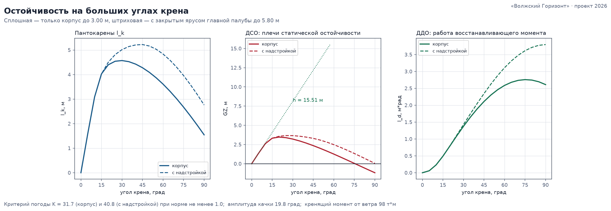

Рисунок А.5 - Диаграммы остойчивости

### А.4 Непотопляемость

Корпус разделён 12 водонепроницаемыми переборками на 13 отсеков. Проверяется затопление каждого отсека в отдельности при коэффициенте проницаемости 0,85.

Таблица А.7

| Отсек | Шпация, м | Объём, м³ | Осадка после, м | Надводный борт, м | Итог |
|---|---|---|---|---|---|
| Ахтерпик, рулевое | 0,0…5,0 | 24 | 1,27 | 1,73 | проходит |
| Очистка стоков, цистерны стоков | 5,0…14,0 | 104 | 1,31 | 1,69 | проходит |
| Вспомогательные механизмы, запальное топливо | 14,0…26,0 | 207 | 1,37 | 1,63 | проходит |
| Насосное, пресная вода, балласт | 26,0…40,0 | 250 | 1,39 | 1,61 | проходит |
| Аварийный сточный, балласт дифферентовки | 40,0…54,0 | 250 | 1,39 | 1,61 | проходит |
| Метанол, кормовая группа (коффердамы) | 54,0…62,0 | 139 | 1,33 | 1,67 | проходит |
| Машинное отделение - ГДГ, приводы колёс | 62,0…76,0 | 187 | 1,35 | 1,65 | проходит |
| ГРЩ, преобразователи, кладовые, вода | 76,0…90,0 | 250 | 1,39 | 1,61 | проходит |
| Метанол, носовая группа, ЦКВ | 90,0…104,0 | 250 | 1,39 | 1,61 | проходит |
| Аккумуляторы, балласт носовой | 104,0…118,0 | 250 | 1,39 | 1,61 | проходит |
| Водомёт, цепной ящик | 118,0…130,0 | 170 | 1,35 | 1,65 | проходит |
| Форпик | 130,0…135,0 | 19 | 1,27 | 1,73 | проходит |
| Таранный отсек | 135,0…140,0 | 1 | 1,26 | 1,74 | проходит |

Не проходит отсеков - 0.

### А.5 Ходкость и движительный комплекс

**Сопротивление корпуса** посчитано по ITTC-57 с формфактором и поправкой на мелководье по Шлихтингу.

Таблица А.8

| Скорость, км/ч | Глубина, м | Сопротивление, кН |
|---|---|---|
| 14,0 | 4 | 56 |
| 14,0 | 8 | 47 |
| 17,5 | 4 | 124 |
| 17,5 | 8 | 84 |
| 19,0 | 4 | 193 |
| 19,0 | 8 | 107 |

**Мелководье.** Поправка на мелководье действительна до числа Фруда по глубине 0,7. Выше судно подходит к критической скорости, и метод неприменим. Поэтому для каждой глубины фарватера в таблице даны критическая скорость, 0,7 от неё и скорость, на которую хватает установленной мощности 1100 кВт.

Таблица А.9

| Глубина фарватера, м | Критическая скорость, км/ч | 0,7 критической, км/ч | Скорость по мощности, км/ч |
|---|---|---|---|
| 4 | 22,6 | 15,8 | 17,8 |
| 5 | 25,2 | 17,6 | 18,6 |
| 6 | 27,6 | 19,3 | 19,1 |
| 8 | 31,9 | 22,3 | 19,7 |
| 10 | 35,7 | 25,0 | 20,1 |
| 15 | 43,7 | 30,6 | 20,5 |

Были выбраны колёса вместо винтов, так как при осадке 1,26 м винт должен уместиться под ватерлинией с заглублением верхней кромки не меньше четверти диаметра, иначе засасывает воздух. Предельный диаметр выходит **0,76 м**, нагрузка на диск Ct = 25,0, и идеальный КПД такого винта - **0,33**, и это верхняя граница. Колесо с шарнирными плицами даёт **0,68**.

Таблица А.10

| Параметр комплекса | Значение |
|---|---|
| Колёс | 2, в бортовых нишах на миделе (x = 66 м) |
| Диаметр × ширина | 4,90 × 3,20 м |
| Плиц на колесе | 12, шарнирная (поворотная), привод от неподвижного эксцентрика |
| Заглубление плицы | 0,75 м |
| Ось колеса | x = 66,0 м, z = 2,96 м |
| Частота вращения | 26,5 об/мин |
| Скольжение | 28,5 % |
| Упор на колесо | 62 кН |
| КПД колеса | 0,68 |
| Мощность на валу колеса | 461 кВт |
| **Мощность с шин на два колеса** | **991 кВт** |

**Что даёт шарнир.** Плица подвешена на оси и удерживается тягой от неподвижного эксцентрика, поэтому идёт через всю дугу почти отвесно и входит в воду кромкой, а не плашмя. Жёсткая радиальная плица на тех же размерениях дала бы КПД 0,60 против 0,68, мощность 1127 кВт против 991 и давление удара 40,6 кПа против 13,2.

Платим механизмом в воде - ось, тяга и эксцентрик работают погружёнными. На Волге идёт топляк, поэтому в тяге ставится срезной палец, а перед колесом - защитная решётка - гнётся дешёвая сменная деталь, а не колесо.

**Кожух.** Верх колеса на 5,30 м от основной плоскости, то есть на 2,30 м выше главной палубы. Опустить колесо нельзя - заглубление плицы задано, диаметр задан упором. Кожух 8,2 × 3,5 × 2,60 м ловит воду, которую плица уносит вверх, и закрывает вращающиеся части от пассажиров.

**Управление.** Два колеса с независимым электроприводом дают дифференциальную тягу - пара колёс 1554 кН·м на плече 12,8 м, с носовым водомётом разворот на месте за 4,8 мин. Два подвесных руля по 4,5 м² за колёсами держат курс на ходу. Водомёт 250 кВт (32 кН) удерживает нос при шлюзовании и швартовке.

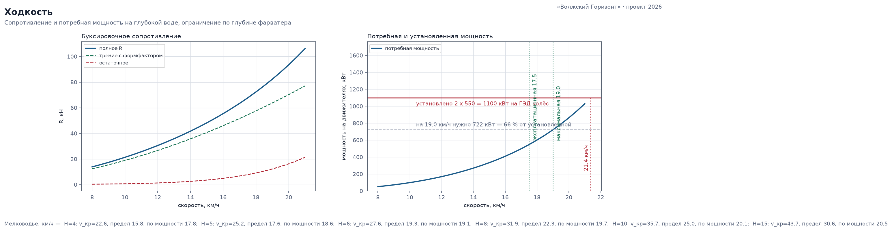

Рисунок А.6 - Сопротивление и потребная мощность

**Электробаланс.** Станция - 3 ГДГ по 600 кВт на метаноле, батарея 600 кВт·ч, солнечные модули 24 кВт, аварийный ДГ 150 кВт. Гребные электродвигатели колёс - 2 × 550 кВт. Наибольшая нагрузка на шинах ГРЩ - 1770 кВт в режиме «ходовой, 17,5 км/ч, фарватер 4 м», её несут 3 ГДГ. Единичную мощность машины проверяет отказ одного ГДГ на фарватере 4 м. Оставшиеся 2 машины по 600 кВт дают ход 13,9 км/ч, машины по 400 кВт дали бы только 5,3 км/ч.

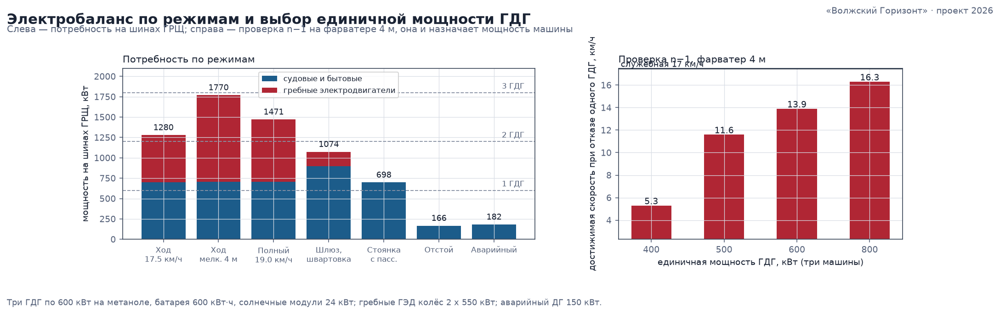

Рисунок А.7 - Электробаланс по режимам

### А.6 Качка

Таблица А.11

| Величина | Значение |
|---|---|
| Период бортовой качки | 3,35 с |
| Период килевой качки | 2,69 с |
| Расчётная высота волны класса О 2,0 | 2,0 м |

Период 3,35 с короткий, качка резкая: при B/T = 13,1 судно очень остойчиво и потому жёстко. Для снижения амплитуды бортовой качки установлены успокоители.

**Успокоители качки.** Две пассивные успокоительные цистерны U-образного типа стоят в корму и в нос от миделя на первой палубе над вторым дном, их ветви - в бортовых отсеках второго дна. Цистерна настроена на период качки судна сечением перепускного канала, уровнем в цистернах управляет система раннего предупреждения качки.

Таблица А.12 - Успокоительные цистерны

| Показатель | Значение |
|---|---|
| Масса воды в двух цистернах | 83,5 т (3,51 % водоизмещения) |
| Период цистерны / период качки судна | 3,35 / 3,35 с |
| Амплитуда бортовой качки без успокоителей | 19,8° |
| Амплитуда бортовой качки с успокоителями | 10,9° (снижение на 45 %) |
| Метацентрическая высота без и с учётом свободной поверхности | 15,51 / 15,48 м |
> Успокоительные цистерны в нагрузку масс не включены - при h = 15,5 м период 3,4 с, и пассивная U-цистерна на такой период получается тяжёлой. Вопрос комфорта закрывается системой раннего предупреждения качки и выбором курса относительно волны, а не массой воды.

### А.7 Общая продольная прочность

Расчёт без единого справочного коэффициента для момента. Строевая нагрузки масс - из таблицы нагрузки, строевая сил поддержания - из обводов, судно уравновешивается на тихой воде и на волне, дальше интегрированием получаются перерезывающая сила и изгибающий момент.

Таблица А.13

| Элемент эквивалентного бруса | Значение |
|---|---|
| Момент инерции | 1,023 м⁴ |
| Момент сопротивления по палубе | 0,622 м³ |
| Момент сопротивления по днищу | 0,754 м³ |
| Нейтральная ось от основной | 1,36 м |
| Материал основных связей | 09Г2С ГОСТ 19281-2014 |
| Допускаемое напряжение | 195 МПа |

Таблица А.14

| Случай | Момент, кН·м | Палуба, МПа | Днище, МПа | Итог |
|---|---|---|---|---|
| тихая вода | -28637 | 46,0 | 38,0 | проходит |
| перегиб | 22115 | 35,5 | 29,3 | проходит |
| прогиб | -48809 | 78,4 | 64,7 | проходит |

Расчётный случай - прогиб - 78 МПа при допускаемых 195, запас 60 %. Волна разряда «О» высотой 2,0 м и длиной 40 м ставится гребнем и подошвой на мидель. Судно длиной 140 м стоит на нескольких таких волнах, поэтому волновой момент невелик и прочность определяет момент на тихой воде - распределение масс по длине.

Ниши колёс на миделе (x 62,4…69,6 м) - вырезы в борту от киля до главной палубы на самом нагруженном участке. Момент через них передают продольные переборки ниш, усиленный настил главной палубы над нишей и коробчатая балка в средней палубе.

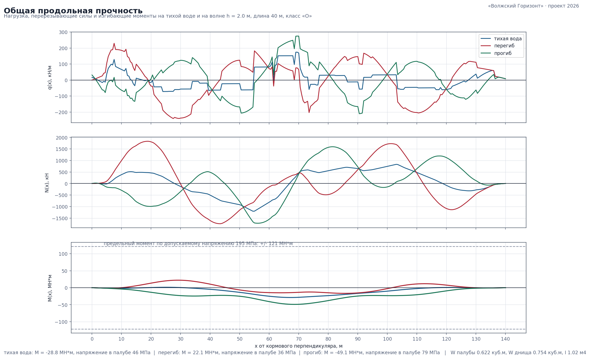

Рисунок А.8 - Общая продольная прочность

