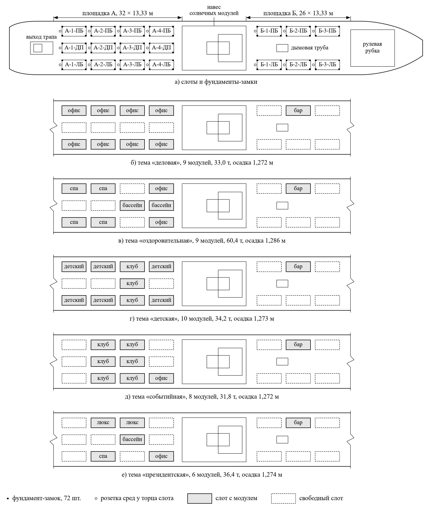

# Модульное решение солнечной палубы (23.09.2026)

Выполнено по техническому заданию на модульное решение и эскизу крепления модуля к палубе. Посадка и остойчивость каждой темы проверены по нормам РРР, мощность модулей - по электробалансу стоянки. Чертежи - листы ВГ-2026 МР-01…03. Расстановка слотов и раскладки модулей по темам показаны на рисунке 1.

Рисунок 1 - Слоты солнечной палубы и раскладки модулей по темам

## 1. Задание и что с ним сделано

| Пункт задания | Решение | Где |
|---|---|---|
| Свободная площадка 32 × 13 м | площадка А - солярий x 26…58, 32 × 13,33 м (три ряда по четыре слота). Плюс площадка Б в прогулочной зоне x 74…100 (два ряда по три слота, труба в ДП) | МР-01 |
| Запас грузоподъёмности ≈ 85 т | принят пределом. По осадке запас 89 т до расчётной 1,30 м (TPC 20,4 т/см), так что 85 т - с запасом | бюджет массы по осадке |
| Пять тем из 20-футовых контейнеров + президентский люкс | шесть тем (с базовой) из 7 типов модулей. Для каждой - масса, мощность, посадка, остойчивость | МР-03, раздел 5 |
| Нагрузка на м² и общий запас | точечно - только на фундаменты над продольными балками, распределённо на настил 5,0 кПа, суммарно ≤ 85 т | раздел 7 |
| Высота не выше 13,8 м - один ярус | модуль с фундаментом 3,03 м при свободных 5,5 м, второй ярус 5,9 м не проходит | высота под мостом |
| Среды для питания | розетка у торца каждого слота - 3 × 400 В, вода, стоки, связь | раздел 6 |
| Концепция «трансформер» | темы меняются сменой модулей на тех же 72 фундаментах, порядок монтажа и демонтажа - раздел 6 | МР-01 |
| Крепление twistlock «ласточкин хвост» на болтах | литой фундамент-замок ВГ-2026.46.00 - корпус 20ГЛ, замок 40Х, 4 болта М24 А4-80 через подкладной лист, КД, расчёт по качке, технология литья | МР-02, КД узла |
| Бассейн - по заданию под вопросом | оставлен мелкий (13,5 т с водой) - проходит по массе и остойчивости, глубокий 18,0 т - нет в темах | раздел 4 |

## 2. Сетка слотов

Контейнер 20' high cube по ISO 668 - 6,058 × 2,438 × 2,896 м, фитинги по ISO 1161 через 5,853 × 2,259 м. Ряды через 4,2 м, между торцами 1,2 м. Проходы - между рядами 1,76 м, у борта 1,25 м (норма 1,2 м, путь эвакуации). Слот адресуется как «А-3-ПБ» - площадка, номер с кормы, ряд.

Площадка А - солярий x 26…58 м, 32 × 13,33 м, 12 слотов в 3 ряда (рисунок 1, а). Площадка Б - прогулочная зона x 74…100 м, 26 × 13,33 м, 6 слотов в 2 ряда, между рядами в ДП дымовая труба (x 81,6…84,4 м). Всего 18 слотов и 72 фундамента-замка, по одному под каждым угловым фитингом. У кормового торца каждого слота - розетка сред.

| Слот | x центра, м | y, м | Шпангоуты | x фундаментов, м | y фундаментов, м | № фундаментов |
|---|---|---|---|---|---|---|
| А-1-ЛБ | 31,113 | -4,20 | 51,1…62,1 | 28,186 / 34,039 | -5,330 / -3,071 | 1…4 |
| А-1-ДП | 31,113 | 0,00 | 51,1…62,1 | 28,186 / 34,039 | -1,129 / 1,129 | 5…8 |
| А-1-ПБ | 31,113 | 4,20 | 51,1…62,1 | 28,186 / 34,039 | 3,071 / 5,330 | 9…12 |
| А-2-ЛБ | 38,371 | -4,20 | 64,3…75,3 | 35,444 / 41,297 | -5,330 / -3,071 | 13…16 |
| А-2-ДП | 38,371 | 0,00 | 64,3…75,3 | 35,444 / 41,297 | -1,129 / 1,129 | 17…20 |
| А-2-ПБ | 38,371 | 4,20 | 64,3…75,3 | 35,444 / 41,297 | 3,071 / 5,330 | 21…24 |
| А-3-ЛБ | 45,629 | -4,20 | 77,5…88,5 | 42,703 / 48,556 | -5,330 / -3,071 | 25…28 |
| А-3-ДП | 45,629 | 0,00 | 77,5…88,5 | 42,703 / 48,556 | -1,129 / 1,129 | 29…32 |
| А-3-ПБ | 45,629 | 4,20 | 77,5…88,5 | 42,703 / 48,556 | 3,071 / 5,330 | 33…36 |
| А-4-ЛБ | 52,887 | -4,20 | 90,7…101,7 | 49,961 / 55,813 | -5,330 / -3,071 | 37…40 |
| А-4-ДП | 52,887 | 0,00 | 90,7…101,7 | 49,961 / 55,813 | -1,129 / 1,129 | 41…44 |
| А-4-ПБ | 52,887 | 4,20 | 90,7…101,7 | 49,961 / 55,813 | 3,071 / 5,330 | 45…48 |
| Б-1-ЛБ | 79,742 | -4,20 | 139,5…150,5 | 76,815 / 82,668 | -5,330 / -3,071 | 49…52 |
| Б-1-ПБ | 79,742 | 4,20 | 139,5…150,5 | 76,815 / 82,668 | 3,071 / 5,330 | 53…56 |
| Б-2-ЛБ | 87,000 | -4,20 | 152,7…163,7 | 84,073 / 89,926 | -5,330 / -3,071 | 57…60 |
| Б-2-ПБ | 87,000 | 4,20 | 152,7…163,7 | 84,073 / 89,926 | 3,071 / 5,330 | 61…64 |
| Б-3-ЛБ | 94,258 | -4,20 | 165,9…176,9 | 91,331 / 97,184 | -5,330 / -3,071 | 65…68 |
| Б-3-ПБ | 94,258 | 4,20 | 165,9…176,9 | 91,331 / 97,184 | 3,071 / 5,330 | 69…72 |

Под каждой линией фитингов (y = -5,33, -3,07, -1,13, 1,13, 3,07, 5,33 м) - подпалубная продольная балка Т 260 × 8 / 130 × 12 АМг5 между рамными бимсами шага 2,2 м. Она разносит точечную нагрузку на набор надстройки.

## 3. Узел крепления - фундамент-замок ВГ-2026.46.00 (лист МР-02)

Узел КД проекта. Литой корпус с упором, который входит в отверстие фитинга ISO 1161, и поворотный конус с рычагом. Поворот рычага на 90° запирает конус в фитинге, фиксатор защёлкивается сам. К настилу опора крепится 4 болтами М24 А4-80 в изолирующих втулках через прокладку из стеклотекстолита и подкладной лист АМг5, приваренный над продольной балкой Т 260 × 8 / 130 × 12. Полная КД, расчёт по качке судна, технология литья, оснастка, мощности и сроки - в документации узла ВГ-2026.46.00.

| Поз. | Наименование | Кол. | Материал | Масса, кг |
|---|---|---|---|---|
| 1 | Корпус (отливка) | 1 | Сталь 20ГЛ ГОСТ 977-88 | 24,99 |
| 2 | Замок - конус с валом | 1 | Сталь 40Х, поковка КП 590 | 2,13 |
| 3 | Рычаг | 1 | Сталь 09Г2С, лист 16 | 1,36 |
| 4 | Шайба упорная Ø58/36,5 × 2 | 1 | БрАЖ9-4 | 0,03 |
| 5 | Прокладка изолирующая 240 × 330 × 3 | 1 | Стеклотекстолит СТЭФ | 0,44 |
| 6 | Втулка изолирующая Ø32/24.5 × 14 | 4 | Стеклотекстолит СТЭФ | 0,01 |
| 7 | Шайба изолирующая Ø50/25 × 3 | 4 | Стеклотекстолит СТЭФ | 0,01 |
| 8 | Лист подкладной 380 × 290 × 8 (ставится верфью при постройке) | 1 | АМг5 ГОСТ 21631-76 | 2,34 |
| 9 | Болт М24×80 А4-80 ГОСТ Р ИСО 4014-2013 | 4 |  | 0,42 |
| 10 | Гайка М24 самоконтрящаяся А4-80 ГОСТ Р 50273-92 | 4 |  | 0,11 |
| 11 | Шайба 24 А4-80 ГОСТ 11371-78 | 8 |  | 0,04 |
| 12 | Гайка круглая шлицевая М33×1,5 ГОСТ 11871-88 | 1 |  | 0,10 |
| 13 | Шайба стопорная многолапчатая 33 ГОСТ 11872-89 | 1 |  | 0,01 |
| 14 | Винт М8×16 ГОСТ Р ИСО 4762-2012 с шайбой Ø40 × 4 | 1 |  | 0,06 |
| 15 | Маслёнка М10×1 ГОСТ 19853-74 | 1 |  | 0,01 |
| 16 | Фиксатор пружинный с кольцом М16×1,5, палец Ø10, ход 12 мм, нерж. | 1 | покупной | 0,12 |

Нагрузки - от качки этого судна - период 3,26 с (самый короткий при осадках 1,20…1,30 м), крен на резонансе 19,8° без успокоителей и 10,9° с цистернами. На опору от самого тяжёлого модуля каталога (18,0 т):

| Случай | Сжатие, кН | Отрыв, кН | Сдвиг, кН |
|---|---|---|---|
| Эксплуатация (цистерны работают) | 99,6 | 13,0 | 67,0 |
| Предельный (резонанс без цистерн) | 142,2 | 59,1 | 119,2 |
| Посадка модуля краном | 132,4 | - | - |
| SWL опоры (маркируется) | 135 | 15 | 70 |

Масса опоры с подкладным листом 34,2 кг, всех 72 - 2,47 т. Сталь на алюминиевый настил - только через изолирующую прокладку и втулки, болты А4-80.

## 4. Типы модулей (принято по рынку)

| Модуль | Масса, т | Мощность, кВт | Ток, А | Вода | Стоки | Что это |
|---|---|---|---|---|---|---|
| офис | 3,6 | 6 | 32 | - | - | переговорная или кабинет на 6…8 мест, панорамные окна, сплит-система, связь |
| спа | 5,5 | 15 | 63 | да | да | сауна с электрокаменкой 12 кВт, купель 1 м³, душ, дерево, своя вентиляция |
| бассейн | 13,5 | 6 | 63 | да | да | чаша 5,5 × 2,2 м глубиной 0,8 м (9,7 м³ воды), насос, фильтр и подогрев, бортик из дерева |
| детский | 3,0 | 2 | 32 | - | - | игровой модуль с откидным бортом-верандой, мягкое покрытие, сетка-ограждение |
| клуб | 4,0 | 5 | 32 | - | - | секция зала. Три секции в одном ряду поперёк палубы под общим тентом - диско, кино, лекторий на 40 мест |
| люкс | 4,8 | 5 | 32 | да | да | секция президентского люкса - спальня или гостиная с санузлом, две секции и терраса между ними |
| бар | 4,2 | 8 | 63 | да | да | бар-кухня на палубе - мойка, холодильники, кофемашина |
| бассейн глубокий | 18,0 | 6 | 63 | да | да | то же с глубиной 1,2 м (14,5 м³) - тяжёл, в темах не используется |

Масса - тара контейнера 2,3 т плюс отделка, оборудование и люди, для бассейна - с водой. Данные поставщиков (материалы задания по модульным гостиницам и термам) заменят эти цифры без изменения листов.

## 5. Темы круизов - «трансформер» (лист МР-03)

| Тема | Модулей | Масса, т | Мощность, кВт | x ЦТ, м | Осадка, м | Дифферент, м | h, м | K погоды | Вода / стоки | Фитинг, кН | Годна |
|---|---|---|---|---|---|---|---|---|---|---|---|
| базовая | 0 | 0,0 | 0 | 66,6 | 1,256 | -0,11 | 15,5 | 31,7 | 0 / 0 | 0 | да |
| деловая | 9 | 33,0 | 56 | 47,7 | 1,272 | -0,14 | 15,2 | 21,7 | 1 / 1 | 24 | да |
| оздоровительная | 9 | 60,4 | 92 | 47,0 | 1,286 | -0,16 | 14,9 | 21,3 | 7 / 7 | 75 | да |
| детская | 10 | 34,2 | 35 | 48,2 | 1,273 | -0,14 | 15,2 | 21,0 | 1 / 1 | 24 | да |
| событийная | 8 | 31,8 | 44 | 49,2 | 1,272 | -0,13 | 15,2 | 22,5 | 1 / 1 | 24 | да |
| президентская | 6 | 36,4 | 45 | 49,1 | 1,274 | -0,14 | 15,2 | 24,1 | 5 / 5 | 75 | да |

Раскладки модулей по слотам показаны на рисунке 1, б…е.

- **деловая** (деловые круизы - восемь кабинетов и переговорных по бортам, бар). Офис в слотах А-1-ЛБ, А-1-ПБ, А-2-ЛБ, А-2-ПБ, А-3-ЛБ, А-3-ПБ, А-4-ЛБ, А-4-ПБ, бар в слоте Б-2-ПБ.
- **оздоровительная** (термы на палубе - четыре сауны с купелями, два мелких бассейна в ДП, два кабинета процедур, бар). Спа в слотах А-1-ЛБ, А-1-ПБ, А-2-ЛБ, А-2-ПБ, бассейн в слотах А-3-ДП, А-4-ДП, офис в слотах А-4-ЛБ, А-4-ПБ, бар в слоте Б-2-ПБ.
- **детская** (детские круизы - шесть игровых модулей, клубный блок для анимации, бар). Детский в слотах А-1-ЛБ, А-1-ПБ, А-2-ЛБ, А-2-ПБ, А-4-ЛБ, А-4-ПБ, клуб в слотах А-3-ДП, А-3-ЛБ, А-3-ПБ, бар в слоте Б-2-ПБ.
- **событийная** (диско, кино, театр, свадьбы - два клубных блока по три секции, гримёрная, бар). Клуб в слотах А-2-ДП, А-2-ЛБ, А-2-ПБ, А-3-ДП, А-3-ЛБ, А-3-ПБ, офис в слоте А-4-ЛБ, бар в слоте Б-2-ПБ.
- **президентская** (остров на плаву - люкс из двух секций с террасой, сауна, мелкий бассейн, кабинет, бар). Спа в слоте А-2-ЛБ, люкс в слотах А-2-ПБ, А-3-ПБ, бассейн в слоте А-3-ДП, офис в слоте А-4-ЛБ, бар в слоте Б-2-ПБ.

Все темы в пределах 85 т и расчётной осадки, нормы РРР по остойчивости выполняются (судно широкое и мелкосидящее, K ≥ 21,0). Самая тяжёлая - «оздоровительная» (60,4 т) - осадка 1,286 м.

## 6. Среды, монтаж и демонтаж

| Среда | Требование на слот |
|---|---|
| Электропитание | 3 × 400 В, 32 А на слот, 63 А для спа, бассейна и бара. Разъём промышленный IP67 в нише настила, кабель в канале вдоль прохода |
| Вода | DN20 холодная и горячая от судовой системы, кран с сухим быстроразъёмом у розетки |
| Стоки | DN50 в серый контур (душ, мойка, купель). Бассейн сливается через фильтр в тот же контур, обратный клапан |
| Связь и сигнализация | пожарный шлейф и общесудовая трансляция по кабелю связи в той же розетке. Модули с печами - с датчиками температуры |
| Климат | сплит-система в составе модуля, конденсат - в стоки, вентиляция саун - своя |
| Крепление | 4 фундамента-замка ВГ-2026.46.00 - конус в нижний фитинг, рычаг на 90° до фиксатора, монтаж краном причала за смену |

Резерв электростанции - на стоянке 502 кВт, на ходу 520 кВт, на мелководье 30 кВт. Тема «оздоровительная» берёт 92 кВт. На мелководье печи саун и подогрев бассейна - от батареи 600 кВт·ч (5,2 ч) или отключаются.

| Шаг | Монтаж и демонтаж |
|---|---|
| 1 | Проверить фундаменты слота - конусы вдоль слота, рычаги открыты и на фиксаторах, розетка сред закрыта крышкой |
| 2 | Кран причала 16 т (до дальнего слота 20,3 м) проносит модуль над соседними с зазором 0,5 м, ставит по маркировке настила |
| 3 | Опустить модуль на четыре конуса, повернуть рычаги на 90° до фиксатора - замки заперты, проверить щупом зазор под фитингом |
| 4 | Подключить розетку - питание, вода, стоки, связь, проверить герметичность и УЗО |
| 5 | Записать в журнал тему, слоты, массы. Пересчитать посадку и остойчивость, при необходимости откорректировать балласт |
| Демонтаж | в обратном порядке. Фундаменты остаются на палубе, рычаги - «открыто», розетка закрывается, освободившийся слот - снова солярий |

## 7. Пределы и условия

- **Масса** - суммарно не более 85 т (задание), что внутри 89 т до расчётной осадки 1,30 м. По мели предел 164 т (расчёт допускаемой нагрузки солнечной палубы).
- **Точечные грузы** - только на фундаменты над продольными балками. На голый настил не более 5,0 кПа (≈ 510 кг/м²).
- **Высота** - один ярус, 3,03 м с фундаментом при свободных 5,5 м под мостом 13,3 м.
- **Симметрия** - y ЦТ модулей не дальше 0,6 м от ДП. Ближе к ЦВ ватерлинии x ≈ 67 м - дифферент не растёт.
- **Проходы** - 1,76 м между рядами, 1,25 м у борта, 1,2 м между торцами, выходы трапов и лифта свободны.
- **Парусность** - каждый модуль добавляет 17,5 м² борта. Критерий погоды остаётся с запасом во всех темах.

## 8. Проверки модульного решения

| Проверка | Значение | Норма |  | Примечание |
|---|---|---|---|---|
| Слотов на двух площадках | 18 шт | 12 | ок | А - 12, Б - 6, фундаментов 72 |
| Проход между рядами и у борта | 1,25 м | 1,2 | ок | три ряда на ширине 13,33 м - между рядами 1,76, у борта 1,25, торцевой 1,2 |
| Один ярус под мостом | 3,03 м | 5,5 | ок | второй ярус не проходит - 5,9 > 5,5 |
| Предел массы по заданию против запаса по осадке | 85,0 т | 89 | ок | 85 т задания не выходят за 89 т до расчётной осадки 1,30 |
| Тема «базовая» | 0,0 т | 85,0 | ок | 0 мод., T 1,256, K 31,7, 0 кВт из 502 на стоянке, y ЦТ 0,00, опора - сжатие 0, отрыв 0 кН |
| Тема «деловая» | 33,0 т | 85,0 | ок | 9 мод., T 1,272, K 21,7, 56 кВт из 502 на стоянке, y ЦТ 0,53, опора - сжатие 24, отрыв 4 кН |
| Тема «оздоровительная» | 60,4 т | 85,0 | ок | 9 мод., T 1,286, K 21,3, 92 кВт из 502 на стоянке, y ЦТ 0,29, опора - сжатие 75, отрыв 10 кН |
| Тема «детская» | 34,2 т | 85,0 | ок | 10 мод., T 1,273, K 21,0, 35 кВт из 502 на стоянке, y ЦТ 0,52, опора - сжатие 24, отрыв 4 кН |
| Тема «событийная» | 31,8 т | 85,0 | ок | 8 мод., T 1,272, K 22,5, 44 кВт из 502 на стоянке, y ЦТ 0,08, опора - сжатие 24, отрыв 4 кН |
| Тема «президентская» | 36,4 т | 85,0 | ок | 6 мод., T 1,274, K 24,1, 45 кВт из 502 на стоянке, y ЦТ 0,54, опора - сжатие 75, отрыв 10 кН |
| Узел крепления ВГ-2026.46.00 - проверки | 0 шт | 0 | ок | 44 проверок узла (качка, прочность, отливка, мощности, сроки), SWL опоры - сжатие 135, отрыв 15, сдвиг 70 кН |

## 9. Открыто

- Узел крепления закрыт КД ВГ-2026.46.00 по эскизу крепления из технического задания. Другие варианты крепления в проект не входят.
- Спецификации поставщиков модулей - массы, мощности, воды. Материалы задания по модульным гостиницам и термам взяты как ориентир.
- Решение по бассейну - мелкий проходит, глубокий нет. Если бассейн исключается - темы «оздоровительная» и «президентская» получают спа вместо него.
- Планировка внутри модулей (президентский люкс, клубный блок из трёх секций) - интерьеры после выбора поставщика.
