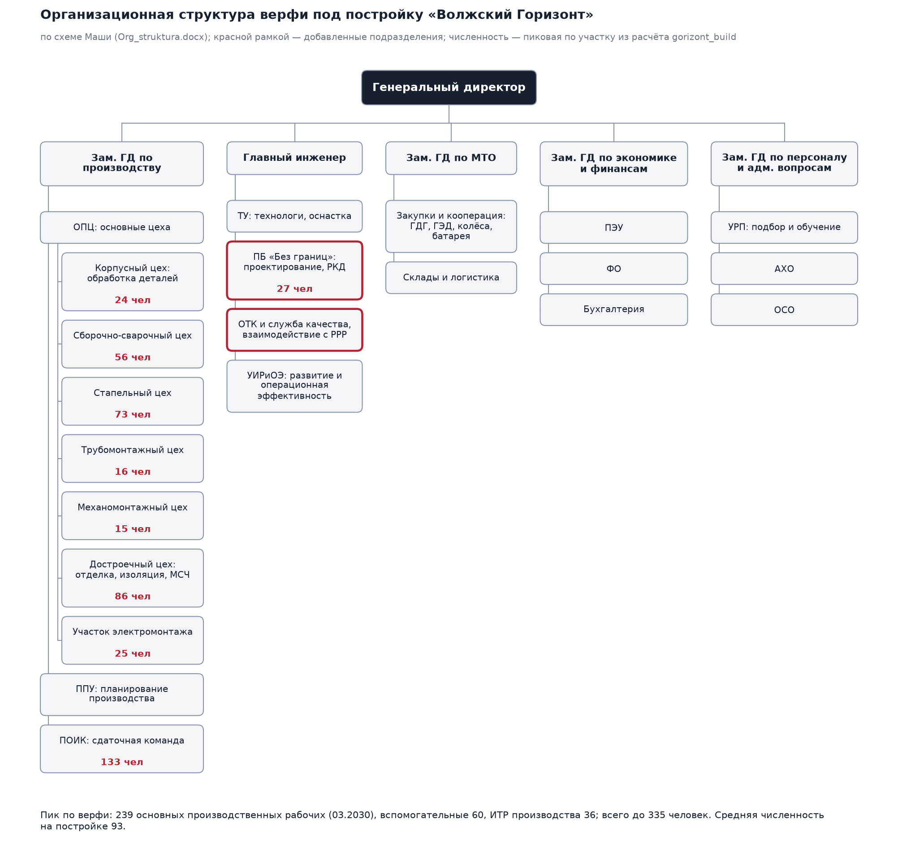
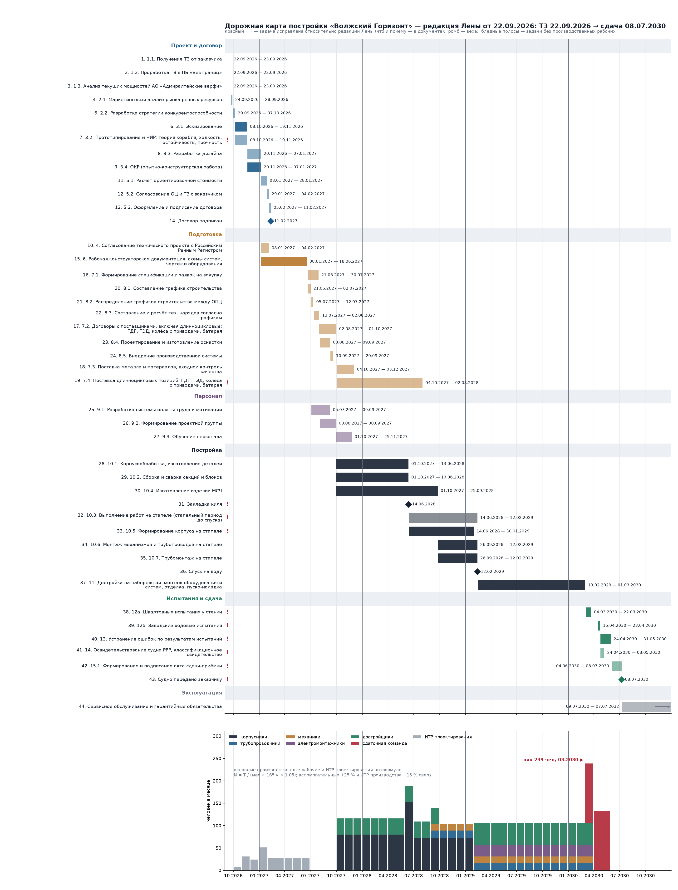

# Персонал и дорожная карта постройки (22.09.2026)

Собрано `scripts/персонал_и_дорожная_карта.py` из `src/lib/gorizont_build.py`. Исходники коллег — `docs/команда/`: пример расчёта численности (Raschet_chislennosti_PRIMER.docx, Лена и Маша), оргструктура (Org_struktura.docx, Маша) и дорожная карта — редакция Лены от 22.09.2026 (Дорожная_карта_Лена.pdf), сменившая первую редакцию Маши. Здесь их методика применена к нашему судну, карта Лены взята за базу, а что в ней не сходится — вынесено в замечания. Числа посчитаны, не набраны.

Закрывает в матрице: r41 и r219 (оргструктура), r220 (численность и структура персонала), r84 (дорожная карта). Даёт вход для r51 (затраты на персонал — нужны ставки Лены) и r87…90 (реестр рисков — заготовки в п. 6).

## 1. Трудоёмкость по методике коллег на наше судно

Пример коллег посчитан на водоизмещение порожнем 3 283 т — это чужое судно. Наше порожнее из нагрузки масс `gorizont_hydro.weight_summary()` — **1 966 т** (корпус из стали D36, надстройка из алюминия, лёгкая отделка). Формула та же: Приказ Минпромторга № 958, прил. 10, табл. 3 — t = 634,36 − 58,82·ln(D); k условий постройки 1,10 (наклонный стапель), k серийности 1,30 (головное), ЭМР 10 % от головного, проектирование 8 % от серийного.

| Величина | Пример коллег (3 283 т) | «Волжский Горизонт» (1 966 т) |
|---|---|---|
| Удельная трудоёмкость, чел·ч/т | 158 | 188,3 |
| Трудоёмкость серийного судна, чел·ч | 570 585 | 407 239 |
| Трудоёмкость головного судна, чел·ч | 741 761 | 529 410 |
| Электромонтажные работы, чел·ч | 74 176 | 52 941 |
| Проектирование, чел·ч | 45 647 | 32 579 |
| Всего с ЭМР и проектированием, чел·ч | 861 584 | 614 931 |
| Пиковая одновременная численность, чел | 432 | 239 |

Проверка методики: при D = 3 283 т библиотека даёт головное 742 339 чел·ч против 741 761 в примере (расхождение 0,08 % — округления в примере).

### Проектирование по стадиям (нормативы ЦНИИ «Румб» № 299024-Н-91)

| Стадия | Доля, % | чел·ч | Когда по карте |
|---|---|---|---|
| Эскизный проект | 5 | 1 629 | 08.10.2026 — 19.11.2026 |
| Технический проект | 20 | 6 516 | 20.11.2026 — 07.01.2027 |
| Рабочая КД | 75 | 24 434 | 08.01.2027 — 18.06.2027 |

## 2. Численность по этапам и профессиям

N = T / (месяцев × 165 ч × 1,05): фонд 1 976 ч в год, коэффициент выполнения норм 1,05 (Приказ № 822). Длительность этапа — из дорожной карты п. 4, а не из предположения, что все этапы равны; поэтому численность по видам работ разная, а не «45 везде», как в примере.

| Вид работ (прил. 1 к № 958) | Доля, % | чел·ч | Этап | мес | чел | Профессия |
|---|---|---|---|---|---|---|
| Обработка деталей корпуса | 6,38 | 33 750 | 01.10.2027 — 13.06.2028 | 8,4 | 24 | корпусники |
| Предварительная сборка конструкций | 15,38 | 81 397 | 01.10.2027 — 13.06.2028 | 8,4 | 56 | корпусники |
| Формирование корпуса на стапеле | 17,88 | 94 632 | 14.06.2028 — 30.01.2029 | 7,6 | 73 | корпусники |
| Трубомонтажные работы | 8,88 | 46 985 | 26.09.2028 — 01.03.2030 | 17,1 | 16 | трубопроводчики |
| Механомонтажные работы | 7,88 | 41 691 | 26.09.2028 — 01.03.2030 | 17,1 | 15 | механики |
| Достроечные работы | 20,38 | 107 867 | 13.02.2029 — 01.03.2030 | 12,6 | 50 | достройщики |
| Испытания судна | 9,38 | 49 632 | 04.03.2030 — 31.05.2030 | 2,2 | 133 | сдаточная команда |
| Изготовление изделий МСЧ | 13,88 | 73 456 | 01.10.2027 — 25.09.2028 | 11,9 | 36 | достройщики |
| Электромонтаж | — | 52 941 | 13.02.2029 — 01.03.2030 | 12,6 | 25 | электромонтажники |
| Эскизный проект | — | 1 629 | 08.10.2026 — 19.11.2026 | 1,4 | 7 | ИТР проектирования |
| Технический проект | — | 6 516 | 20.11.2026 — 07.01.2027 | 1,6 | 24 | ИТР проектирования |
| Рабочая КД | — | 24 434 | 08.01.2027 — 18.06.2027 | 5,3 | 27 | ИТР проектирования |

Середины диапазонов прил. 1 дают 97 %; недостающие 3 % разложены поровну по видам — так же, как в примере коллег.

### Структура персонала

| Категория | Человек | Как посчитано |
|---|---|---|
| Основные производственные рабочие, пик | 239 | сумма профессий в месяце пика (03.2030) |
| Вспомогательные рабочие | 60 | **принято** 25 % от ОПР — подтвердить у Маши |
| ИТР и служащие производства | 36 | **принято** 15 % от ОПР |
| ИТР проектирования (ПБ «Без границ»), пик | 27 | стадия РКД |
| **Всего в пике** | **335** |  |
| Средняя численность на постройке (от договора до сдачи) | 93 | среднее профиля по месяцам |
| Объём работ, чел·мес | 4 022 | сумма профиля |

По профессиям (сумма по этапам, чел): корпусники — 153, трубопроводчики — 16, механики — 15, достройщики — 86, сдаточная команда — 133, электромонтажники — 25, ИТР проектирования — 58.

Профиль загрузки по месяцам — нижняя часть `renders/горизонт_2026/схемы/02_дорожная_карта.png`.

**Затраты на персонал (r51)** считаются `gorizont_build.затраты_на_персонал(ставки)`: чел·ч по профессиям × k_вн × ставка. Ставок в проекте нет — нормо-час ОПР по НПА верфи и ставки ИТР по рынку даёт Лена; до этого функция возвращает None, а не выдуманную сумму.

## 3. Организационная структура

Схема верфи из Org_struktura.docx (ГД → замы по производству, персоналу, экономике, МТО; главный инженер; ОПЦ, ПОИК, ППУ) оставлена. Добавлено то, без чего пассажирское судно не построить и не сдать:

- **ПБ «Без границ»** под главным инженером: в дорожной карте оно есть, в оргструктуре не было; пик 27 человек на стадии РКД.
- **ОТК и служба качества с выходом на Российский Речной Регистр**: одобрение проекта, надзор при постройке, освидетельствование — ПОИК её не заменяет.
- Численность цехов ОПЦ — пиковая по видам работ из п. 2.
- В документе коллег дважды подряд повторён список аббревиатур и вставлена справка «проектное бюро или дочерняя компания» с чужими ссылками — в записку она не идёт; решение проекта: проектное бюро внутри верфи, без отдельного юрлица.

## 4. Дорожная карта постройки

Базовая карта — **редакция Лены от 22.09.2026** (`docs/команда/Дорожная_карта_Лена.pdf`), вторая после карты Маши. В ней учтены наши замечания к первой редакции: рабочая КД, согласование с Регистром, МТО с длинноцикловыми позициями, персонал после договора, производство после подготовки, закладка киля, освидетельствование РРР. Верфь — АО «Адмиралтейские верфи», Санкт-Петербург. Получение ТЗ 22.09.2026, договор 11.02.2027, сдача **08.07.2030**, эксплуатация с навигации 2030. Длительности — в рабочих днях календаря MS Project (пн–пт), даты окончания посчитаны от них.

| № | Ид. у Лены | Группа | Задача | Начало | Окончание | Раб. дней | Кто |  |
|---|---|---|---|---|---|---|---|---|
| 1 | 3 | Проект и договор | 1.1. Получение ТЗ от заказчика | 22.09.2026 | 23.09.2026 | 2 | заказчик |  |
| 2 | 4 | Проект и договор | 1.2. Проработка ТЗ в ПБ «Без границ» | 22.09.2026 | 23.09.2026 | 2 | ПБ «Без границ» |  |
| 3 | 5 | Проект и договор | 1.3. Анализ текущих мощностей АО «Адмиралтейские верфи» | 22.09.2026 | 23.09.2026 | 2 | ППУ |  |
| 4 | 7 | Проект и договор | 2.1. Маркетинговый анализ рынка речных ресурсов | 24.09.2026 | 28.09.2026 | 3 | Иван |  |
| 5 | 8 | Проект и договор | 2.2. Разработка стратегии конкурентоспособности | 29.09.2026 | 07.10.2026 | 7 | Иван |  |
| 6 | 10 | Проект и договор | 3.1. Эскизирование | 08.10.2026 | 19.11.2026 | 31 | Макс, Андрей |  |
| 7 | 11 | Проект и договор | 3.2. Прототипирование и НИР: теория корабля, ходкость, остойчивость, прочность | 08.10.2026 | 19.11.2026 | 31 | Алексей | ! |
| 8 | 12 | Проект и договор | 3.3. Разработка дизайна | 20.11.2026 | 07.01.2027 | 35 | Макс, Андрей |  |
| 9 | 13 | Проект и договор | 3.4. ОКР (опытно-конструкторская работа) | 20.11.2026 | 07.01.2027 | 35 | ПБ «Без границ» |  |
| 10 | 14 | Подготовка | 4. Согласование технического проекта с Российским Речным Регистром | 08.01.2027 | 04.02.2027 | 20 | ПБ, ОТК |  |
| 11 | 16 | Проект и договор | 5.1. Расчёт ориентировочной стоимости | 08.01.2027 | 28.01.2027 | 15 | Лена |  |
| 12 | 17 | Проект и договор | 5.2. Согласование ОЦ и ТЗ с заказчиком | 29.01.2027 | 04.02.2027 | 5 | Лена, ГД |  |
| 13 | 18 | Проект и договор | 5.3. Оформление и подписание договора | 05.02.2027 | 11.02.2027 | 5 | ГД |  |
| 14 | 18 | Проект и договор | ◆ Договор подписан | 11.02.2027 | 11.02.2027 |  | ГД |  |
| 15 | 19 | Подготовка | 6. Рабочая конструкторская документация: схемы систем, чертежи оборудования | 08.01.2027 | 18.06.2027 | 116 | ПБ «Без границ» |  |
| 16 | 21 | Подготовка | 7.1. Формирование спецификаций и заявок на закупку | 21.06.2027 | 30.07.2027 | 30 | МТО |  |
| 17 | 22 | Подготовка | 7.2. Договоры с поставщиками, включая длинноцикловые: ГДГ, ГЭД, колёса с приводами, батарея | 02.08.2027 | 01.10.2027 | 45 | МТО |  |
| 18 | 23 | Подготовка | 7.3. Поставка металла и материалов, входной контроль качества | 04.10.2027 | 03.12.2027 | 45 | МТО, ОТК |  |
| 19 | 23 | Подготовка | 7.4. Поставка длинноцикловых позиций: ГДГ, ГЭД, колёса с приводами, батарея | 04.10.2027 | 02.08.2028 | 218 | МТО, ОТК | ! |
| 20 | 25 | Подготовка | 8.1. Составление графика строительства | 21.06.2027 | 02.07.2027 | 10 | ППУ |  |
| 21 | 26 | Подготовка | 8.2. Распределение графиков строительства между ОПЦ | 05.07.2027 | 12.07.2027 | 6 | ППУ |  |
| 22 | 27 | Подготовка | 8.3. Составление и расчёт тех. нарядов согласно графикам | 13.07.2027 | 02.08.2027 | 15 | ППУ, ТУ |  |
| 23 | 28 | Подготовка | 8.4. Проектирование и изготовление оснастки | 03.08.2027 | 09.09.2027 | 28 | ТУ, Глеб |  |
| 24 | 29 | Подготовка | 8.5. Внедрение производственной системы | 10.09.2027 | 20.09.2027 | 7 | ППУ |  |
| 25 | 31 | Персонал | 9.1. Разработка системы оплаты труда и мотивации | 05.07.2027 | 09.09.2027 | 49 | Маша |  |
| 26 | 32 | Персонал | 9.2. Формирование проектной группы | 03.08.2027 | 30.09.2027 | 43 | Маша, УРП |  |
| 27 | 33 | Персонал | 9.3. Обучение персонала | 01.10.2027 | 25.11.2027 | 40 | Маша, УРП |  |
| 28 | 35 | Постройка | 10.1. Корпусообработка, изготовление деталей | 01.10.2027 | 13.06.2028 | 183 | ОПЦ |  |
| 29 | 36 | Постройка | 10.2. Сборка и сварка секций и блоков | 01.10.2027 | 13.06.2028 | 183 | ОПЦ |  |
| 30 | 38 | Постройка | 10.4. Изготовление изделий МСЧ | 01.10.2027 | 25.09.2028 | 257 | ОПЦ |  |
| 31 | 39 | Постройка | ◆ Закладка киля | 14.06.2028 | 14.06.2028 |  | ГД | ! |
| 32 | 37 | Постройка | 10.3. Выполнение работ на стапеле (стапельный период до спуска) | 14.06.2028 | 12.02.2029 | 174 | ОПЦ | ! |
| 33 | 40 | Постройка | 10.5. Формирование корпуса на стапеле | 14.06.2028 | 30.01.2029 | 165 | ОПЦ | ! |
| 34 | 41 | Постройка | 10.6. Монтаж механизмов и трубопроводов на стапеле | 26.09.2028 | 12.02.2029 | 100 | ОПЦ |  |
| 35 | 42 | Постройка | 10.7. Трубомонтаж на стапеле | 26.09.2028 | 12.02.2029 | 100 | ОПЦ |  |
| 36 | 43 | Постройка | ◆ Спуск на воду | 12.02.2029 | 12.02.2029 |  | ОПЦ |  |
| 37 | 44 | Постройка | 11. Достройка на набережной: монтаж оборудования и систем, отделка, пуско-наладка | 13.02.2029 | 01.03.2030 | 274 | ОПЦ |  |
| 38 | 45 | Испытания и сдача | 12а. Швартовные испытания у стенки | 04.03.2030 | 22.03.2030 | 15 | ПОИК | ! |
| 39 | 45 | Испытания и сдача | 12б. Заводские ходовые испытания | 15.04.2030 | 23.04.2030 | 7 | ПОИК | ! |
| 40 | 46 | Испытания и сдача | 13. Устранение ошибок по результатам испытаний | 24.04.2030 | 31.05.2030 | 28 | ОПЦ, ПОИК | ! |
| 41 | 47 | Испытания и сдача | 14. Освидетельствование судна РРР, классификационное свидетельство | 24.04.2030 | 08.05.2030 | 11 | ОТК, РРР | ! |
| 42 | 49 | Испытания и сдача | 15.1. Формирование и подписание акта сдачи-приёмки | 04.06.2030 | 08.07.2030 | 25 | ГД | ! |
| 43 | 50 | Испытания и сдача | ◆ Судно передано заказчику | 08.07.2030 | 08.07.2030 |  | ГД, заказчик | ! |
| 44 | 51 | Эксплуатация | Сервисное обслуживание и гарантийные обязательства | 09.07.2030 | 07.07.2032 | 522 | верфь, ППО |  |
| 45 | 52 | Эксплуатация | Утилизация после окончания срока эксплуатации | 09.07.2055 | 30.11.2056 | 365 |  | ! |

### Контрольные точки

| Веха | Дата |
|---|---|
| Договор подписан | 11.02.2027 |
| Закладка киля | 14.06.2028 |
| Спуск на воду | 12.02.2029 |
| Судно передано заказчику | 08.07.2030 |

### Что исправлено в редакции Лены и почему

- **3.2. Прототипирование и НИР: теория корабля, ходкость, остойчивость, прочность** (ид. 11 у Лены) — выполнено — docs/проект/теория_корабля.md, контрольная точка.
- **7.4. Поставка длинноцикловых позиций: ГДГ, ГЭД, колёса с приводами, батарея** (ид. 23 у Лены) — у Лены длинноцикловые шли вместе с металлом за 45 рабочих дней; для ГДГ, ГЭД и колёс с приводами срок 10 месяцев — к августу 2028, до закрытия палубы на стапеле.
- **Закладка киля** (ид. 39 у Лены) — у Лены 25.09.2028 при работах на стапеле с 14.06.2028; закладка — первый блок на стапеле, то есть начало стапельных работ.
- **10.3. Выполнение работ на стапеле (стапельный период до спуска)** (ид. 37 у Лены) — у Лены 183 рабочих дня до 23.02.2029, то есть после спуска; ограничено спуском 12.02.2029.
- **10.5. Формирование корпуса на стапеле** (ид. 40 у Лены) — у Лены с 26.09.2028 на 165 рабочих дней — кончалось 14.05.2029, после спуска; теперь с закладки киля, кончается 05.02.2029, спуск 12.02.2029.
- **12а. Швартовные испытания у стенки** (ид. 45 у Лены) — у Лены швартовные и ходовые одной задачей 04.03…02.04.2030; швартовные у стенки в марте возможны, ходовые — нет.
- **12б. Заводские ходовые испытания** (ид. 45 у Лены) — Нева во льду до середины апреля: ходовые с 15.04.2030.
- **13. Устранение ошибок по результатам испытаний** (ид. 46 у Лены) — после ходовых: 24.04…03.06.2030 вместо 03.04…10.05.
- **14. Освидетельствование судна РРР, классификационное свидетельство** (ид. 47 у Лены) — после ходовых, параллельно с устранением, как у Лены.
- **15.1. Формирование и подписание акта сдачи-приёмки** (ид. 49 у Лены) — после устранения замечаний: 04.06…08.07.2030.
- **Судно передано заказчику** (ид. 50 у Лены) — у Лены 22.05.2030; из-за ходовых после ледохода сдача 08.07.2030 — в навигацию.
- **Утилизация после окончания срока эксплуатации** (ид. 52 у Лены) — у Лены 2075 — 45 лет; срок службы речного пассажирского судна по концепции 25 лет.

Четыре нестыковки исправлены в датах, структура и номера задач Лены сохранены. Сдача сдвинулась с 22.05.2030 на 08.07.2030 только из-за ходовых испытаний после ледохода; всё остальное укладывается в её сроки. Проверок `gorizont_build.checks()` не проходит: 0.

## 5. Что осталось по блоку «Персонал» (r221…223)

- Методы подбора и источники (r221), система оплаты и мотивации (r222), обучение (r223): в карте есть задачи 14…16 со сроками, документов нет — Маша. Вход: профессии и численность из п. 2.
- Затраты на персонал (r51): ставки — Лена; функция готова.

## 6. Заготовки для реестра рисков (r87…90)

| Риск | Откуда виден | Что делать |
|---|---|---|
| Поставка ГДГ, ГЭД, колёс с приводами, батареи дольше 10 месяцев | 7.4: поставка до 02.08.2028, стапель до 30.01.2029 | договоры с поставщиками сразу после подписания договора; резерв — погрузка через съёмный лист палубы на достройке |
| Перегон из Санкт-Петербурга по Ладоге и Онеге судном класса «О» | в карте Лены перегона нет — зона заказчика | разовое разрешение РРР с ограничением по волне и сезону; страхование перегона |
| Поздний ледоход на Неве сдвигает ходовые | 12б: 15.04.2030 — 23.04.2030 | швартовные у стенки в марте уже сделаны; резерв на сдачу до конца июля |
| Алюминиевая надстройка: квалификация сварщиков и цех под алюминий | программа снижения массы, gorizont.SUPERSTRUCTURE_MATERIAL | обучение в задаче 16; кооперация с верфью, имеющей алюминиевое производство |
| Численность верфи меньше пика 239 человек в 03.2030 | п. 2 | растянуть достройку на 9 месяцев или привлечь подрядчиков на отделку |

## 7. Проверки `gorizont_build.checks()`

| Проверка | Значение | Норма |  | Примечание |
|---|---|---|---|---|
| Формула воспроизводит пример коллег | 742339 чел·ч | 741761.0 | ок | D = 3283 т: t_уд 158 против 158, серийное 571030 против 570585 |
| Доли видов работ | 100.0 % | 100 | ок | середины диапазонов прил. 1 дают 97.0 %, остаток разложен поровну |
| Производство после договора | 232 дней | 0 | ок | первая производственная задача 01.10.2027 (у Лены 10.1); договор 11.02.2027 |
| Работы на стапеле не раньше закладки киля | 0 дней | 0 | ок | 10.3 с 14.06.2028, закладка 14.06.2028 (у Лены закладка была 25.09.2028 при работах с 14.06) |
| Формирование корпуса кончается до спуска | 13 дней | 0 | ок | 10.5 до 30.01.2029 (165 раб. дней от закладки), спуск 12.02.2029 (у Лены кончалось 14.05.2029) |
| Стапельный период | 7.6 мес | 6.0 | ок | 14.06.2028 — 30.01.2029 |
| Срок поставки длинноцикловых позиций | 10.0 мес | 8.0 | ок | 7.4: 218 рабочих дней; ГДГ, ГЭД, колёса с приводами — 8…12 месяцев (у Лены 45 дней вместе с металлом) |
| Длинноцикловые позиции до конца стапеля | 181 дней | 0 | ок | даже при поставке 12 месяцев от 08.2027 — к 08.2028, стапель до 01.2029 |
| Ходовые испытания в навигацию | 4 месяц | 4…11 | ок | 12б: 15.04.2030 — 23.04.2030; у Лены ходовые стояли в марте, Нева во льду |
| Акт после устранения замечаний | 4 дней | 1 | ок | устранение до 31.05.2030, акт с 04.06.2030 |
| Сдача в навигацию | 7 месяц | 4…11 | ок | судно передано заказчику 08.07.2030 |
| Пиковая численность ниже примера коллег | 239 чел | 432 | ок | у нас порожнее 1966 т против 3283 т; пик в 03.2030 |
