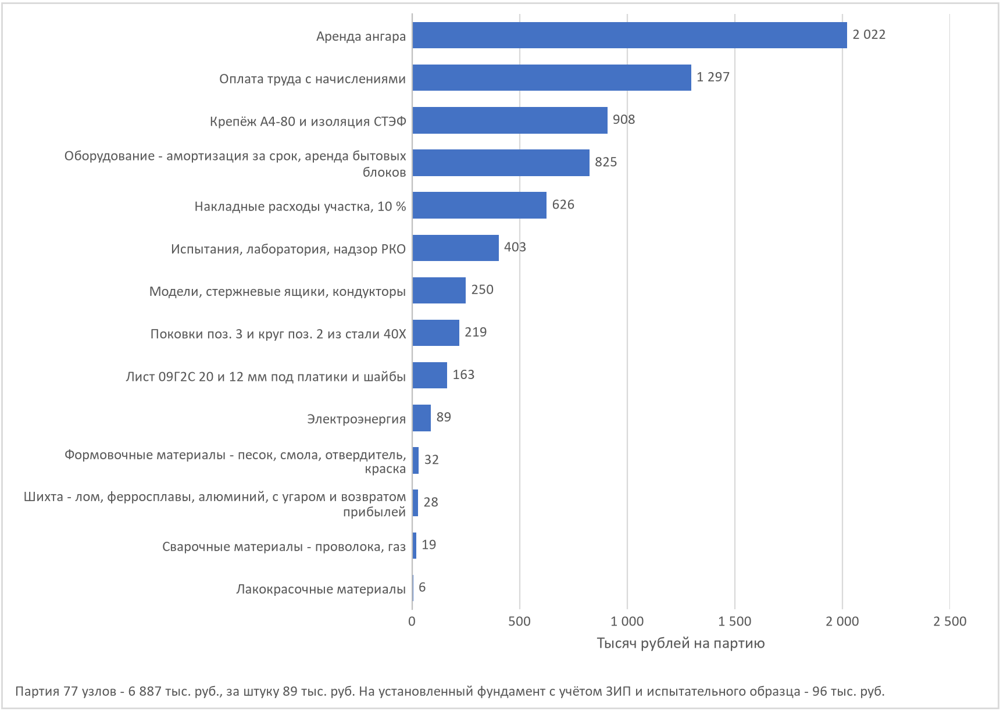

# Узел КД. Фундамент-замок модуля - ВГ-2026.46.00

> Проверок узла 62, не выполнено 0.

## 1. Узел и его устройство

Узлом КД выбран фундамент для крепления модульных номеров солнечной палубы - твистлок типа «ласточкин хвост». Он держит «трансформер» - 7 типов модулей в темах круизов на 18 слотах, на судно 72 фундамента. Узел собирается из четырёх основных деталей и шайбы-подковы и выпускается как самостоятельное производство в арендованном цехе рядом с верфью. С экономикой судна узел связан одной цифрой - себестоимостью за штуку (раздел 11).

- **Корпус (поз. 1)** - отливка из стали 20ГСЛ, габарит 175 × 160 × 76 мм, масса 7,55 кг по 3D-модели. Снизу две опорные полосы «ласточкина хвоста» с гранями под 35° к вертикали, ими корпус лежит на платике и приварен к нему. Сверху плечо площадью 102 см², на которое садится угловой фитинг контейнера, и центратор 60 × 116 × 30 мм - он входит в отверстие фитинга 124,5 × 63,5 по ISO 1161 и принимает сдвиг. Через корпус проходит отверстие Ø30 под вал запора, внутри - полость рукоятки и передняя прорезь с двумя вырезами-фиксаторами на 74° друг от друга.
- **Элемент запирающий, конус-голова (поз. 3)** - поковка из стали 40Х. Голова 104 × 54 мм проходит отверстие фитинга в положении «открыто» и повёрнутая на 74° держит фитинг лепестками. Вал Ø30 вставляется в корпус сверху.
- **Стержень (поз. 2)** - рукоятка Ø14 × 127 мм из круга 40Х. Заводится через прорезь корпуса в поперечное отверстие вала, ввёртывается в него резьбой М14×1,5 на анаэробном фиксаторе и поворачивает запор на 74° от выреза до выреза.
- **Шайба разрезная, подкова (поз. 5)** - Ø50 × 12 мм из листа 09Г2С, стоит в проточке вала Ø22 под корпусом и опирается на низ корпуса вокруг отверстия по всему кругу. Отрыв идёт с бурта вала через шайбу на корпус, стержень поз. 2 только поворачивает запор. В полости рукоятки шайба не помещается - свод полости есть только со стороны рукоятки, а высота 15 мм занята стержнем. Шайба заводится снизу через окно 110 × 60 мм в платике, разрез - на ширину проточки.
- **Платик (поз. 4)** - лист 09Г2С 375 × 280 × 20 мм с четырьмя овальными отверстиями 26 × 45 под болты М24 и окном 110 × 60 мм под шайбу. Корпус приварен к нему угловыми швами катетом 10 мм длиной 726 мм.
- **Крепление к палубе.** Настил солнечной палубы - алюминиевый сплав АМг5, стальной платик к нему не приварить. Поэтому платик ставится на подкладной лист АМг5 425 × 330 × 8 мм, приваренный к настилу над подпалубной балкой Т 260 × 8 / 130 × 12, через прокладку из стеклотекстолита. Болты М24 А4-80 стоят в изолирующих втулках, сталь и алюминий не касаются.
- **Высота опоры 77 мм** от настила до низа фитинга - хвост 46, платик 20, прокладка 3, подкладной лист 8 мм.

*Узел ВГ-2026.46.00, сборка*

## 2. Чертежи и 3D-модель (3.1, 3.2)

| Документ | Что в нём |
|---|---|
| ВГ-2026.46.00 СБ | сборочный чертёж - корпус на платике, запор, стержень, крепление к палубе, технические требования |
| ВГ-2026.46.01 | корпус - отливка, размеры по 3D-модели корпуса |
| ВГ-2026.46.02…04 | стержень, запирающий элемент, платик |
| 3D-модель корпуса | одно тело в формате STEP, объём 961,6 см³, масса 7,55 кг, из неё сняты все размеры корпуса |
| Спецификация | ГОСТ 2.106-2019, два листа |
| Отчёты МКЭ | расчёт сборки корпуса, платика и запора, раздел 4,2 |

Масса стальных деталей узла - 24,20 кг против 24,51 кг в модели МКЭ (расхождение -1,3 %), центр тяжести на высоте Z = -39,0 мм против -41,4. Размеры платика и запора подобраны по массе, центру тяжести и моментам инерции модели МКЭ и по отверстию фитинга ISO 1161.

*Узел ВГ-2026.46.00, взрыв-схема*

| Поз. | Обозначение | Наименование | Кол. | Материал | Масса, кг |
|---|---|---|---|---|---|
| 1 | ВГ-2026.46.01 | Корпус (отливка) | 1 | Сталь 20ГСЛ ГОСТ 977-88 | 7,55 |
| 2 | ВГ-2026.46.02 | Стержень Ø14 × 127 | 1 | Круг 40Х ГОСТ 2590-2006 | 0,15 |
| 3 | ВГ-2026.46.03 | Элемент запирающий (конус-голова) | 1 | Сталь 40Х, поковка КП 590 | 1,45 |
| 4 | ВГ-2026.46.04 | Платик 375 × 280 × 20 | 1 | Лист 09Г2С ГОСТ 19281-2014 | 14,93 |
| 5 | ВГ-2026.46.05 | Шайба разрезная (подкова) Ø50/22,5 × 12 | 1 | Лист 09Г2С ГОСТ 19281-2014 | 0,12 |
| 6 | ВГ-2026.46.06 | Прокладка изолирующая 375 × 280 × 3 | 1 | СТЭФ ГОСТ 12652-74 | 0,56 |
| 7 | ВГ-2026.46.07 | Втулка изолирующая Ø32/24,5 × 14 | 4 | СТЭФ ГОСТ 12652-74 | 0,01 |
| 8 | ВГ-2026.46.08 | Шайба изолирующая Ø50/25 × 3 | 4 | СТЭФ ГОСТ 12652-74 | 0,01 |
| 9 | ВГ-2026.46.09 | Лист подкладной 425 × 330 × 8 (ставится верфью при постройке) | 1 | АМг5 ГОСТ 21631-76 | 2,97 |
| 10 |  | Болт М24×80 А4-80 ГОСТ Р ИСО 4014-2013 | 4 |  | 0,40 |
| 11 |  | Гайка М24 самоконтрящаяся А4-80 ГОСТ Р 50273-92 | 4 |  | 0,11 |
| 12 |  | Шайба 24 увеличенная А4-80 ГОСТ 6958-78 | 4 |  | 0,05 |

## 3. Материалы с обоснованием (3.3)

| Деталь | Материал | σт / σв, МПа | Почему |
|---|---|---|---|
| Корпус поз. 1 | сталь 20ГСЛ, ГОСТ 977-88 | 294 / 540 | литьё сложной формы, ударная вязкость 491 кДж/м², сваривается с платиком без подогрева, нормализация 900…920 °С, отпуск 600…650 °С |
| Запирающий элемент поз. 3 | сталь 40Х, поковка КП 590 ГОСТ 8479-70 из стали ГОСТ 4543-2016 | 590 / 735 | лепестки головы работают на изгиб и износ о фитинг, улучшение у поставщика - закалка 830…850 °С в масле, отпуск 540…580 °С, 235…277 НВ |
| Стержень поз. 2 | круг 40Х ГОСТ 2590-2006 | 590 / 735 | в улучшенном состоянии, как запор |
| Шайба поз. 5 | сталь 09Г2С, лист 12, ГОСТ 19281-2014, класс прочности 325 | 325 / 450 | та же сталь, что у платика, режется плазмой в своём цехе, без термообработки. Запас по смятию и изгибу - раздел 4,3 |
| Платик поз. 4 | сталь 09Г2С, лист ГОСТ 19281-2014, класс прочности 325 | 325 / 450 | как в расчёте МКЭ, вязкая на морозе, хорошо сваривается |
| Болты, гайки, шайбы | нержавеющая А4-80, ГОСТ Р ИСО 3506-1-2009 | 600 / 800 | открытая палуба, с алюминием - только через изоляцию |
| Прокладка, втулки, шайбы | стеклотекстолит СТЭФ, ГОСТ 12652-74 | смятие до 100 | жёсткий диэлектрик, не ползёт под затяжкой, рвёт гальваническую пару сталь и АМг5 |
| Лист подкладной | АМг5, лист ГОСТ 21631-76 | 125 / 275 | материал надстройки, приваривается к настилу |

Отчёты МКЭ выполнены для корпуса и платика из проката 09Г2С и ВСт3сп5. Для литья таких марок в ГОСТ 977-88 нет, поэтому корпус - литая сталь 20ГСЛ. Запас по текучести пропорционален пределу текучести, для 20ГСЛ при той же нагрузке он не ниже 3,05 × 294 / 225 = 3,98. Сравнение материалов для корпуса:

| Материал | Стандарт | σт, МПа | σв, МПа | δ, % | KCU, кДж/м² | Литьё | Сварка | Цена, отн. | Запас при 33,1 кН | Запас при 88,5 кН | Вывод |
|---|---|---|---|---|---|---|---|---|---|---|---|
| 20Л | ГОСТ 977-88 | 216 | 412 | 22 | 491 | хорошие | хорошая | 1,00 | 2,93 | 1,09 | запас по текучести на 27 % ниже 20ГСЛ, эксплуатационный случай не проходит |
| 25Л | ГОСТ 977-88 | 235 | 441 | 19 | 392 | хорошие | удовлетворительная | 1,02 | 3,19 | 1,19 | ниже ударная вязкость, а узел работает на удар - посадка модуля краном |
| 20ГЛ | ГОСТ 977-88 | 275 | 540 | 18 | 491 | хорошие | хорошая | 1,06 | 3,73 | 1,39 | близка к 20ГСЛ, но предел текучести на 6 % ниже |
| 20ГСЛ | ГОСТ 977-88 | 294 | 540 | 18 | 491 | хорошие | хорошая | 1,10 | 3,99 | 1,49 | принято. Самая прочная из свариваемых литых сталей без закалки, судовое литьё, приварка к платику и заварка дефектов без подогрева |
| 35ХГСЛ | ГОСТ 977-88 | 343 | 590 | 14 | 294 | удовлетворительные | плохая | 1,35 | 4,65 | 1,74 | прочнее, но ударная вязкость ниже на 40 %, сварка с подогревом и повторной термообработкой |
| ВЧ 50 | ГОСТ 7293-85 | 320 | 500 | 7 | - | отличные | не сваривается | 0,85 | 4,34 | 1,62 | к платику не приварить, удлинение 7 %, хрупкость при ударе на морозе |
| 09Г2С | ГОСТ 19281-2014 | 300 | 450 | 21 | - | не льётся | хорошая | - | 4,07 | 1,52 | марки для литья в ГОСТ 977-88 нет. Корпус из проката - сварная конструкция из многих деталей |
| ВСт3сп5 | ГОСТ 14637-89 | 225 | 450 | 26 | - | не льётся | хорошая | - | 3,05 | 1,14 | то же, наименьший запас в отчётах МКЭ |

## 4. Расчёт на прочность (3.4)

### 4.1. Качка - из теории корабля этого судна

Нагрузки на фундамент дают инерция модуля при качке и ветер. Числа качки - из расчётов по теории корабля (приложение А записки). Судно очень остойчивое и жёсткое, поэтому период короткий, а ускорения на солнечной палубе высокие. Узел считается по самому короткому периоду в диапазоне осадок:

| Осадка, м | h, м | Период бортовой качки, с |
|---|---|---|
| 1,200 | 16,37 | 3,26 |
| 1,256 | 15,55 | 3,35 |
| 1,300 | 14,96 | 3,41 |

| Параметр | Значение | Откуда |
|---|---|---|
| Класс РКО, волна | «О», 2,0 м длиной 20 м | правила РКО |
| Амплитуда бортовой на резонансе | 19,8° без успокоителей, 10,9° с цистернами | расчёт качки с цистернами |
| Расчётный период бортовой | 3,26 с | расчёт периода качки |
| Килевая качка | ψ = h/L = 0,82°, период 2,69 с | судно длиной 140 м на волне 2 м |
| Ось качки | через ЦТ судна, z = 2,68 м | посадка судна |
| Ветер | 0,294 кПа на борт модуля | правила РКО |

Два случая. **Эксплуатация** - цистерны работают, крен 10,9°, допускаемые 0,6σт (запас 1,67). **Предельный** - цистерны осушены, резонанс, крен 19,8°, допускаемые 0,8σт (запас 1,25). Ускорения в системе судна при наибольшем крене θ - поперёк g·sinθ + ε·Δz, по вертикали g·cosθ ± ε·y, где ε = θ(2π/T)². Модуль опрокидывается на подветренную пару фитингов, наветренная пара отрывается. Сдвиг принимают две опоры из четырёх. Посадка модуля краном - удар 1,5 на две опоры, проверяется как предельный случай.

| Случай | θ, ° | a поперёк, м/с² | a верт., м/с² | Сжатие, кН | Отрыв, кН | Сдвиг, кН |
|---|---|---|---|---|---|---|
| Эксплуатация | 10,9 | 7,12 | 6,66 | 65,0 | 5,0 | 50,6 |
| Предельный | 19,8 | 12,88 | 9,23 | 88,5 | 26,2 | 89,5 |
| Посадка краном | - | - | - | 99,3 | - | - |
| Статика, вес на 4 опоры | - | - | - | 33,1 | - | - |

Модули тяжелее 10 т ставятся только в ряд ДП - в бортовом ряду к вертикальному ускорению от качки добавляется ε·y, и бассейн 13,5 т дал бы на опору 106,7 кН с запасом по МКЭ 1,23 при нужном 1,25, а в ДП - 88,5 кН и запас 1,49. Во всех темах бассейн стоит в ДП, предел по массе в бортовом ряду - 13,3 т.

Расчётный модуль - самый тяжёлый из тем круизов - бассейн, 13,5 т, как в расчёте МКЭ. Глубокий бассейн 18 т в темы не входит и на эти фундаменты не ставится. Рабочая нагрузка на опору (SWL), которая маркируется на платике - отрыв 10, сжатие 100, сдвиг 55 кН. На опору от каждого модуля тем, предельный случай:

| Модуль | Масса, т | Ряды | Сжатие, кН | Отрыв, кН | Сдвиг, кН |
|---|---|---|---|---|---|
| бассейн | 13,5 | ДП | 88,5 | 26,2 | 89,5 |
| спа | 5,5 | ЛБ, ДП, ПБ | 44,5 | 19,1 | 38,0 |
| люкс | 4,8 | ЛБ, ДП, ПБ | 39,0 | 16,9 | 33,5 |
| бар | 4,2 | ЛБ, ДП, ПБ | 34,3 | 15,0 | 29,6 |
| клуб | 4,0 | ЛБ, ДП, ПБ | 32,8 | 14,3 | 28,3 |
| офис | 3,6 | ЛБ, ДП, ПБ | 29,7 | 13,1 | 25,8 |
| детский | 3,0 | ЛБ, ДП, ПБ | 25,0 | 11,2 | 21,9 |

### 4.2. Расчёт методом конечных элементов

Сборка корпуса, платика и запора рассчитана в APM FEM для КОМПАС-3D v25. Расчётное ядро - APM Structure3D, аттестационный паспорт программы для ЭВМ № 488 от 19.12.2019, Ростехнадзор. Корпус и платик считались в двух вариантах материала, запор - сталь с пределом текучести 235 МПа.

| Параметр | Значение |
|---|---|
| Масса модели | 24,51 кг |
| Центр тяжести | 0,31; 2,65; -41,43 мм |
| Сетка | 10-узловые тетраэдры, сторона до 5 мм, 251 698 элементов, 420 713 узлов |
| Нагрузка | сила 33 100 Н вертикально вниз на плечо - вес модуля «бассейн» 13,5 т на четыре опоры |
| Закрепления | три группы граней по UX, UY, UZ, реакции 27 280 и 7 428 Н |
| Эквивалентное напряжение по Мизесу | до 192,3 МПа |
| Перемещение | до 0,0028 мм |
| Запас по текучести, 09Г2С (σт 300) | не ниже 4,06 |
| Запас по текучести, ВСт3сп5 (σт 225) | не ниже 3,05 |
| Запас по прочности (σв 450) | не ниже 6,10 |

Наименьшие запасы обоих отчётов дают одну точку с напряжением 73,9 МПа. Для корпуса 20ГСЛ запас по текучести при 33,1 кН - 3,98, по прочности - 7,31. На расчётное сжатие запас пересчитывается линейно, n = 3,98 × 33,1 / P:

| Случай | Сжатие P, кН | Запас n | Нужно | Напряжение, МПа |  |
|---|---|---|---|---|---|
| Эксплуатация | 65,0 | 2,03 | 1,67 | 145,0 | ок |
| Предельный | 88,5 | 1,49 | 1,25 | 197,7 | ок |
| Посадка краном | 99,3 | 1,33 | 1,25 | 221,8 | ок |

### 4.3. Отрыв и сдвиг - аналитические проверки

Отчёт МКЭ покрывает сжатие. Отрыв и сдвиг проверяются аналитически - голова и вал запора, проточка и бурт вала, шайба-подкова и низ корпуса под ней, шов корпуса с платиком, болты, платик у болта, балка под фундаментом. Стержень поз. 2 проверяется на поворот - рука 300 Н и случайная нагрузка 1000 Н на конце рукоятки. Болт затягивается моментом 510 Н·м.

| Элемент | Случай | Значение | Допускается | Запас | Как считано |
|---|---|---|---|---|---|
| Шов корпуса с платиком, катет 10 | эксплуатация | 17,0 МПа | 102,9 МПа | 6,07 | длина 726 мм, толщина 7,0, сдвиг на высоте 61 мм над платиком |
| Болт М24 А4-80 - растяжение | эксплуатация | 306,5 МПа | 480,0 МПа | 1,57 | затяжка 106 кН (0,5σт), внешняя 9,1 кН на болт, χ = 0,25 |
| Стык - нераскрытие | эксплуатация | 21,2 кН | 99,1 кН | 4,68 | остаток затяжки 99 кН не меньше 0,2 затяжки |
| Сдвиг платика - держит трение | эксплуатация | 50,6 кН | 84,0 кН | 1,66 | μ = 0,20 по стеклотекстолиту, 4 болта, минус отрыв |
| Платик 09Г2С у болта - изгиб | эксплуатация | 36,7 МПа | 195,0 МПа | 5,31 | консоль 37,5 мм от шва до болта, толщина 20, ширина 140 |
| Балка Т 260 × 8 / 130 × 12 АМг5 - изгиб | эксплуатация | 52,1 МПа | 75,0 МПа | 1,44 | пролёт 2,20 м между рамными бимсами, сила в середине, заделка по концам, W = 524 см³ |
| Шов корпуса с платиком, катет 10 | предельный | 32,8 МПа | 135,2 МПа | 4,12 | длина 726 мм, толщина 7,0, сдвиг на высоте 61 мм над платиком |
| Болт М24 А4-80 - растяжение | предельный | 314,5 МПа | 480,0 МПа | 1,53 | затяжка 106 кН (0,5σт), внешняя 20,5 кН на болт, χ = 0,25 |
| Стык - нераскрытие | предельный | 21,2 кН | 90,5 кН | 4,27 | остаток затяжки 91 кН не меньше 0,2 затяжки |
| Болт М24 - срез при проскальзывании | предельный | 63,4 МПа | 276,0 МПа | 4,35 | трения 81 кН не хватает - сдвиг на болты через втулки, овалы поперёк сдвига |
| Втулка изолирующая - смятие | предельный | 66,6 МПа | 110,0 МПа | 1,65 | втулка в листе АМг5 и настиле, 14 мм |
| Платик 09Г2С у болта - изгиб | предельный | 82,3 МПа | 260,0 МПа | 3,16 | консоль 37,5 мм от шва до болта, толщина 20, ширина 140 |
| Балка Т 260 × 8 / 130 × 12 АМг5 - изгиб | предельный | 52,1 МПа | 100,0 МПа | 1,92 | пролёт 2,20 м между рамными бимсами, сила в середине, заделка по концам, W = 524 см³ |
| Конус-голова 40Х - смятие днища фитинга | предельный | 14,7 МПа | 302,5 МПа | 20,55 | две площадки 20,2 × 44 за кромками отверстия 63,5 |
| Конус-голова - изгиб лепестка | предельный | 74,0 МПа | 472,0 МПа | 6,38 | плечо 26,9 мм от вала, сечение 54 × 23 |
| Вал поз. 3 - растяжение по отверстию | предельный | 91,4 МПа | 472,0 МПа | 5,16 | Ø30 с поперечной резьбой М14, 287 мм² |
| Вал поз. 3 - растяжение по проточке | предельный | 69,0 МПа | 472,0 МПа | 6,84 | проточка Ø22 под шайбу, 380 мм² |
| Бурт вала - срез | предельный | 63,3 МПа | 271,4 МПа | 4,29 | цилиндр Ø22 высотой 6 мм |
| Шайба поз. 5 - смятие буртом вала | предельный | 116,6 МПа | 357,5 МПа | 3,06 | кольцо Ø30/22,5 без разреза, 225 мм² |
| Шайба поз. 5 - срез по кромке отверстия корпуса | предельный | 30,5 МПа | 149,5 МПа | 4,91 | цилиндр Ø30 без разреза, толщина 12 |
| Шайба поз. 5 - изгиб кольца | предельный | 108,5 МПа | 260,0 МПа | 2,40 | бурт на радиусе 13,1, опора на корпус на радиусе 20,2 |
| Низ корпуса 20ГСЛ - смятие шайбой | предельный | 26,4 МПа | 323,4 МПа | 12,27 | кольцо Ø50/31 вокруг отверстия, 995 мм² |
| Центратор - смятие о стенку отверстия фитинга | предельный | 39,9 МПа | 323,4 МПа | 8,11 | плоская грань 93,5 мм на высоте 24 |
| Настил АМг5 под изолирующей шайбой - смятие | эксплуатация | 71,9 МПа | 112,5 МПа | 1,56 | затяжка на шайбу Ø50/25 |
| Стержень поз. 2 Ø14 - изгиб при повороте | эксплуатация | 111,4 МПа | 354,0 МПа | 3,18 | рука - 300 Н на конце, плечо 100 мм от вала |
| Стержень поз. 2 - смятие в отверстии вала | эксплуатация | 16,4 МПа | 531,0 МПа | 32,32 | момент 34 Н·м парой сил по длине отверстия Ø30 |
| Стержень поз. 2 Ø14 - изгиб при повороте | предельный | 371,2 МПа | 472,0 МПа | 1,27 | встали на рукоятку - 1000 Н на конце, плечо 100 мм от вала |
| Стержень поз. 2 - смятие в отверстии вала | предельный | 54,8 МПа | 649,0 МПа | 11,85 | момент 115 Н·м парой сил по длине отверстия Ø30 |

## 5. Технологический процесс (4.1)

Узел делается в своём цехе из четырёх деталей и шайбы по двум веткам. Литейная ветка - корпус поз. 1 литьём в песчаные формы. Плазменная ветка - платик поз. 4 и шайба поз. 5 из листа. Запирающий элемент поз. 3 - поковка по кооперации, стержень поз. 2 - из круга, обе детали проходят токарную обработку. Ветки сходятся на сварке корпуса с платиком, дальше окраска, сборка, приёмка и склад готовой продукции. Работы ведутся с соблюдением инструкций по охране труда и с применением СИЗ.

**Корпус поз. 1 - литьё.**

| Опер. | Уч. | Операция | Содержание | Оборудование | Тпз, ч | Тшт, ч |
|---|---|---|---|---|---|---|
| 005 | К | Модели и стержневые ящики | Деревянные модели на две отливки с литниками и прибылями, ящики стержней Ст. 1 и Ст. 2, усадка 2 % | Кооперация - модельный цех | 0,00 | 0,00 |
| 010 | ЛУ | Стержневая | Изготовить стержни Ст. 1 (отверстие) и Ст. 2 (полость рукоятки), уплотнить, выдержать до съёма 35 мин, окрасить | Смеситель ХТС, ящики стержневые ВГ-2026.46.01-СЯ1, -СЯ2 | 0,30 | 0,12 |
| 015 | ЛУ | Формовочная | Формовка низа и верха на две отливки, вентиляционные каналы, окраска, установка стержней, сборка и скрепление формы | Смеситель ХТС, вибростол, опоки 600 × 400 × 160/80, модели ВГ-2026.46.01-МД | 0,50 | 0,45 |
| 020 | ЛУ | Плавка и заливка | Плавка 20ГСЛ под стеклянным шлаком, выпуск при 1550…1600 °С, раскисление алюминием, заливка одной струёй, проба на химсостав и образцы от плавки | Печь индукционная ИСТ-0,16, ковш 0,25 т со стендом подогрева, пирометр | 1,00 | 0,25 |
| 025 | ЛУ | Охлаждение и выбивка | Выдержать в форме не менее 6 ч, выбить, удалить стержни, смесь - в отвал | Решётка выбивная | 0,10 | 0,06 |
| 030 | ЛУ | Обрубная | Отрезать прибыли и литники, зачистить места питателей и заусенцы, плечо под фитинг - заподлицо | Пневмошлифмашины DAEWOO 180 мм и DG-38LS, компрессор | 0,00 | 0,45 |
| 035 | ТУ | Термическая | Нормализация 900…920 °С, выдержка 1,5 ч, охлаждение на воздухе. Отпуск 600…650 °С, выдержка 2 ч, воздух | Электропечь камерная сопротивления ПН-12-2 | 0,30 | 0,07 |
| 040 | ОТК | Контроль отливки | ВИК 100 %, размеры по разметке 1 шт от плавки, твёрдость 10 % от садки, механические свойства от плавки | Стол ОТК, шаблоны, твердомер переносной | 0,10 | 0,12 |
| 045 | МУ | Сверлильная | Зенкеровать литое отверстие Ø26, развернуть Ø30H9, снять фаски | Станок 2Н135, зенкер Ø29,7, развёртка Ø30H9, кондуктор | 0,30 | 0,15 |

**Платик поз. 4 - плазменная резка.**

| Опер. | Уч. | Операция | Содержание | Оборудование | Тпз, ч | Тшт, ч |
|---|---|---|---|---|---|---|
| 005 | ПУ | Программирование раскроя | Карта раскроя листа 1500 × 6000 × 20 на 78 платиков, контуры, овалы и окно под шайбу в одной программе. Программа шайб поз. 5 на лист 12 | Система подготовки управляющих программ | 2,00 | 0,00 |
| 010 | ПУ | Плазменная резка | Уложить лист, резать платики 375 × 280 в размер (±1 мм), окно 110 × 60 и овалы 26 × 45 с недорезом 1 мм на сторону | Машина плазменной резки с ЧПУ NUMOREX NXB | 0,50 | 0,06 |
| 015 | ПУ | Зачистная | Снять грат и окалину с кромок, притупить острые кромки | Пневмошлифмашина угловая DAEWOO | 0,00 | 0,15 |
| 020 | МУ | Сверлильная | Калибровать концы овалов сверлом Ø26 по кондуктору, прямые участки - прямой шлифмашиной | Станок 2Н135, сверло Ø26, кондуктор овалов | 0,20 | 0,20 |
| 025 | ОТК | Контроль | Размеры платика и овалов, отсутствие грата | Штангенциркуль, линейка | 0,00 | 0,04 |

**Шайба поз. 5 - плазменная резка.**

| Опер. | Уч. | Операция | Содержание | Оборудование | Тпз, ч | Тшт, ч |
|---|---|---|---|---|---|---|
| 005 | ПУ | Плазменная резка | Резать шайбы Ø50 с отверстием Ø22,5 и разрезом 22,5 из листа 09Г2С 12 по программе | Машина плазменной резки с ЧПУ NUMOREX NXB | 0,30 | 0,02 |
| 010 | ПУ | Зачистная | Снять грат, притупить кромки, опорные торцы - заподлицо | Шлифмашина прямая Daewoo DG-38LS | 0,00 | 0,08 |
| 015 | ОТК | Контроль | Толщина 12, разрез 22,5…23,0, отверстие Ø22,5 | Штангенциркуль | 0,00 | 0,02 |

**Запирающий элемент поз. 3 - поковка.**

| Опер. | Уч. | Операция | Содержание | Оборудование | Тпз, ч | Тшт, ч |
|---|---|---|---|---|---|---|
| 005 | К | Поковка | Поковка из стали 40Х, улучшение на КП 590, сертификат с механическими испытаниями | Кооперация - кузнечное производство | 0,00 | 0,00 |
| 010 | ОТК | Входной контроль | Сертификат, твёрдость 235…277 НВ, размеры поковки | Твердомер переносной, штангенциркуль | 0,00 | 0,04 |
| 015 | МУ | Токарная | Точить вал Ø30f9, проточку Ø22 × 12,6 под шайбу поз. 5, бурт, торец, фаски | Станок 16К20, патрон трёхкулачковый | 0,50 | 0,38 |
| 020 | МУ | Сверлильная | Сверлить поперечное отверстие Ø12,5 в валу, нарезать резьбу М14×1,5-6Н | Станок 2Н135, кондуктор, метчик М14×1,5 | 0,20 | 0,12 |
| 025 | МУ | Слесарная | Зачистить облой головки, притупить кромки | Шлифмашина прямая Daewoo DG-38LS | 0,00 | 0,12 |
| 030 | ОТК | Контроль | Вал Ø30f9, резьба М14×1,5 калибром-пробкой, головка по шаблону | Калибр-скоба Ø30f9 | 0,00 | 0,04 |

**Стержень поз. 2 - из круга.**

| Опер. | Уч. | Операция | Содержание | Оборудование | Тпз, ч | Тшт, ч |
|---|---|---|---|---|---|---|
| 005 | К | Заготовка | Круг 40Х Ø16 ГОСТ 2590-2006 в улучшенном состоянии | Покупка | 0,00 | 0,00 |
| 010 | МУ | Токарная | Отрезать заготовку, точить Ø14h11 на длину 127, нарезать резьбу М14×1,5-6g на длину 20, фаски | Станок 16К20 | 0,20 | 0,13 |

**Узел - сварка, окраска, сборка.**

| Опер. | Уч. | Операция | Содержание | Оборудование | Тпз, ч | Тшт, ч |
|---|---|---|---|---|---|---|
| 005 | СУ | Сварочная | Корпус на платик по разметке, прихватки, шов Т1 катет 10 по замкнутому контуру корпуса, ГОСТ 14771-76, проволока Св-08Г2С Ø1,2 в смеси Ar и CO2 | Полуавтомат 400 А, стол сварочный, фильтровентиляционный агрегат | 0,30 | 0,40 |
| 010 | ОТК | Контроль сварки | ВИК швов 100 %, катет шаблоном | Шаблон сварщика УШС, лупа | 0,00 | 0,05 |
| 015 | ОУ | Окрасочная | Обезжирить, грунт ГФ-021 в два слоя с сушкой 1 ч при 100…105 °С, эмаль ПФ-115 бордовая, сушка 1 ч. Отверстие Ø30 и вал поз. 3 не окрашивать | Камера окрасочно-сушильная, краскораспылитель | 0,30 | 0,30 |
| 020 | СБ | Сборочная | Смазать вал поз. 3, вставить в корпус сверху. Снизу через окно платика завести шайбу поз. 5 в проточку вала. Стержень поз. 2 через прорезь ввернуть в резьбовое отверстие вала на анаэробном фиксаторе резьбы, проверить поворот между вырезами корпуса | Верстак | 0,10 | 0,25 |
| 025 | ОТК | Приёмо-сдаточный контроль | Поворот запора от выреза до выреза без заеданий, толщина покрытия, маркировка обозначения, номера и SWL | Толщиномер покрытий, клеймо | 0,00 | 0,10 |
| 030 | СГП | Консервация и упаковка | Консервационная смазка на вал, упаковка по 12 шт на поддон, склад готовой продукции | Поддоны, стеллаж | 0,00 | 0,05 |

Монтаж на судне:

1. Корпусный цех при постройке надстройки - приварить подкладные листы АМг5 к настилу над подпалубными балками по разметке.
2. Сверлить 4 отв. Ø32 в листе и настиле по кондуктору-шаблону платика, установить изолирующие втулки.
3. Уложить прокладку на герметике, поставить фундамент рукояткой в торцевой проход, болты сверху через овалы, снизу изолирующие шайбы и гайки.
4. Затянуть крест-накрест моментом 510 Н·м, герметизировать кромку прокладки.
5. Проверить поворот запоров, записать номера фундаментов по слотам в журнал.

Карты ЕСТД - маршрутные на корпус, платик, шайбу, запирающий элемент, стержень и сборку, операционные на стержни (010), формовку (015) и плавку (020) с переходами и режимами, карта эскизов формы, карта контроля.

| Опер. | Объект | Параметр | Средство | Объём | НД |
|---|---|---|---|---|---|
| 020 | Плавка | химсостав C, Mn, Si, S, P | лаборатория, кооперация | каждая плавка | ГОСТ 977-88 |
| 020 | Плавка | σ0,2, σв, δ, ψ, KCU | лаборатория, кооперация | образцы от плавки | ГОСТ 1497-84, ГОСТ 9454-78 |
| 040 | Отливка | внешний вид, раковины, трещины | ВИК, лупа ×4 | 100 % | ГОСТ 977-88, гр. 2 |
| 040 | Отливка | размеры | разметка, шаблоны | 1 от плавки | чертёж ВГ-2026.46.01 |
| 040 | Отливка | твёрдость после термообработки | твердомер переносной | 10 % от садки | ГОСТ 9012-59 |
| 045 | Корпус | отверстие Ø30H9 | калибр-пробка | 100 % | чертёж ВГ-2026.46.01 |
| 010 поз. 3 | Поковка | твёрдость 235…277 НВ, сертификат | твердомер | 100 % | ГОСТ 8479-70 |
| 030 поз. 3 | Запор | вал Ø30f9, проточка Ø22, резьба М14×1,5 | калибр-скоба, калибр-пробка | 100 % | чертёж ВГ-2026.46.03 |
| 015 поз. 5 | Шайба | толщина 12, разрез 22,5 | штангенциркуль | 10 % | чертёж ВГ-2026.46.05 |
| СБ 010 | Сварка | шов Т1 по замкнутому контуру, катет 10 | шаблон УШС | 100 % | ГОСТ 14771-76 |
| СБ 025 | Узел | поворот между вырезами, шайба в проточке, покрытие | щуп, толщиномер | 100 % | СБ, ТТ |
| СБ 025 | Узел | пробная нагрузка | лаборатория | по программе | ВГ-2026.46.00 ПМ |

## 6. Оснастка (4.2)

Для литья особое внимание - формам под заливку. От качества формы зависят точность отливки и её прочность. Серия 77 отливок мала, поэтому модели и стержневые ящики - деревянные, металлическая оснастка не окупится.

- **Модели** ВГ-2026.46.01-МД - две модели корпуса на плите с литниковой системой и прибылями, размеры больше детали на усадку 2,0 %, уклоны 1°30' по ГОСТ 3212-92 на вертикальных стенках деревянной модели и стержневых ящиков. Точность отливки 11-7-13-11 См.2,0 ГОСТ Р 53464-2009.
- **Ящики стержневые** -СЯ1 и -СЯ2 - стержень Ст. 1 отверстия Ø26 со знаками и стержень Ст. 2 полости рукоятки со знаком в передней прорези. Смеси на стержни 0,30 кг на отливку.
- **Опоки** 600 × 400 × 160/80 мм, две отливки в форме, разъём по опорным полосам, отливки в верхней полуформе. Смесь - ХТС на щелочной фенольной смоле 1,5 %, отвердитель 22 % от смолы, съём через 35 мин. На форму 0,084 т смеси и 1,3 кг смолы.
- **Прибыли** - модуль отливки 10,1 мм, теплового узла у сопряжения хвоста с плечом 12,1, прибыли нужно не меньше 14,5. Две открытые прибыли 37 × 125 × 60 мм на плече по обе стороны центратора, зеркало под утепляющей засыпкой - модуль 14,8, масса 4,08 кг. Питание - нужно 0,53 кг, прибыли отдают 0,82.
- **Литниковая система** на форму из двух отливок, металла 26,1 кг. Время заливки τ = S√G = 7,7 с, расчётный напор 172 мм. Сечения стояк, коллектор, питатели - 6,6, 7,9 и 9,3 см², расширяющаяся система для стали, стояк Ø29, 4 питателя в торцы опорных полос по разъёму. Выход годного 57,9 %.
- **Груз на форму.** Металл давит на верх с силой 1,0 кН с запасом 1,3, полуформа верха весит 0,9 кН, поэтому форма нагружается 20 кг или скрепляется скобами.
- **Кондукторы** - для калибровки концов овалов платика и для поперечного отверстия вала, кондуктор-шаблон для сверления листа и настила на судне.

## 7. Мощности (4.3)

Оборудование цеха - покупка с амортизацией за срок заказа или аренда. Цены - принято по рыночным ценам 2026 года:

| Оборудование | Назначение | Габарит, м | Мощность, кВт | Кол. | Способ | Цена, руб. |
|---|---|---|---|---|---|---|
| Печь индукционная тигельная ИСТ-0,16 с преобразователем частоты и градирней | плавка стали 20ГСЛ, 160 кг | 3,5 × 3,0 | 160,0 | 1 | покупка | 6 800 000 |
| Ковш разливочный чайниковый 0,25 т и стенд подогрева | подогрев ковша до 750 °С, заливка | 1,5 × 1,2 | 15,0 | 1 | покупка | 380 000 |
| Смеситель ХТС лопастной 0,1 м³ | смесь для форм и стержней | 1,6 × 1,2 | 5,5 | 1 | покупка | 450 000 |
| Стол вибрационный формовочный 1,0 × 1,0 м | уплотнение форм | 1,2 × 1,2 | 1,5 | 1 | покупка | 220 000 |
| Опоки сварные 600 × 400 × 160/80 со штырями | формы, оборот раз в сутки | 0,7 × 0,5 | - | 8 | покупка | 25 000 за шт. |
| Решётка выбивная инерционная | выбивка отливок | 1,5 × 1,2 | 3,0 | 1 | покупка | 320 000 |
| Пневмошлифмашины угловые DAEWOO (круг 180 мм) и прямые Daewoo DG-38LS | обрубка, зачистка отливок и платиков | - | - | 5 | покупка | 18 000 за шт. |
| Компрессор винтовой 11 кВт, 1,6 м³/мин, 8 бар, с ресивером | сжатый воздух для пневмоинструмента | 1,8 × 1,2 | 11,0 | 1 | покупка | 650 000 |
| Электропечь камерная сопротивления ПН-12-2 | нормализация и отпуск отливок, садка 100 кг | 2,0 × 1,6 | 30,0 | 1 | покупка | 950 000 |
| Машина плазменной резки с ЧПУ NUMOREX NXB, поле 2000 × 6000 мм, источник 125 А | раскрой листа 09Г2С 20 мм | 9,2 × 5,0 | 30,0 | 1 | покупка | 4 800 000 |
| Станок вертикально-сверлильный 2Н135 | отверстие Ø30 корпуса, овалы платика, отверстия поз. 2 и 3 | 1,3 × 0,8 | 4,0 | 1 | покупка | 950 000 |
| Станок токарно-винторезный 16К20, РМЦ 1000 | вал поз. 3, стержень поз. 2 | 2,8 × 1,2 | 11,0 | 1 | покупка | 2 900 000 |
| Полуавтомат сварочный 400 А, стол сварочный, фильтровентиляционный агрегат | сварка корпуса с платиком | 2,5 × 1,5 | 20,0 | 1 | покупка | 420 000 |
| Камера окрасочно-сушильная тупиковая 3 × 3 × 2,5 м, подогрев до 110 °С | грунт, эмаль, сушка | 4,0 × 3,5 | 24,0 | 1 | покупка | 1 450 000 |
| Верстаки слесарные и сборочные | сборка, слесарные работы | 2,0 × 0,8 | - | 3 | покупка | 30 000 за шт. |
| Стол контроля, плита поверочная, мерительный инструмент, твердомер, толщиномер, шаблоны | контроль | 2,0 × 1,2 | 0,5 | 1 | покупка | 280 000 |
| Вентиляция литейного участка - зонт над печью, отсосы обрубки | удаление газов и пыли | - | 15,0 | 1 | покупка | 900 000 |
| Стеллажи, поддоны, тележки гидравлические | склады материалов и готовой продукции | - | - | 1 | покупка | 220 000 |
| Блок-контейнеры бытовые - раздевалка, душ, конторка мастера | бытовые помещения | 6,0 × 2,4 | 6,0 | 2 | аренда | 14 000 в месяц |

Установленная мощность 342 кВт, с одновременностью 0,6 - 206 кВт при подключении ангара 250 кВт.

Трудоёмкость по операциям на узел и на партию 77 шт:

| Деталь | Опер. | Операция | Исполнитель | Тшт на узел, ч | На партию, ч |
|---|---|---|---|---|---|
| поз. 1 | 010 | Стержневая | Литейщик-формовщик | 0,12 | 9,5 |
| поз. 1 | 015 | Формовочная | Литейщик-формовщик | 0,45 | 35,1 |
| поз. 1 | 020 | Плавка и заливка | Плавильщик | 0,25 | 20,2 |
| поз. 1 | 025 | Охлаждение и выбивка | Литейщик-формовщик | 0,06 | 4,7 |
| поз. 1 | 030 | Обрубная | Литейщик-формовщик | 0,45 | 34,6 |
| поз. 1 | 035 | Термическая | Термист | 0,07 | 5,7 |
| поз. 1 | 040 | Контроль отливки | Контролёр ОТК | 0,12 | 9,3 |
| поз. 1 | 045 | Сверлильная | Станочник (токарь, сверловщик) | 0,15 | 11,8 |
| поз. 4 | 005 | Программирование раскроя | Оператор плазменной резки | 0,00 | 2,0 |
| поз. 4 | 010 | Плазменная резка | Оператор плазменной резки | 0,06 | 5,1 |
| поз. 4 | 015 | Зачистная | Оператор плазменной резки | 0,15 | 11,5 |
| поз. 4 | 020 | Сверлильная | Станочник (токарь, сверловщик) | 0,20 | 15,6 |
| поз. 4 | 025 | Контроль | Контролёр ОТК | 0,04 | 3,1 |
| поз. 5 | 005 | Плазменная резка | Оператор плазменной резки | 0,02 | 1,8 |
| поз. 5 | 010 | Зачистная | Оператор плазменной резки | 0,08 | 6,2 |
| поз. 5 | 015 | Контроль | Контролёр ОТК | 0,02 | 1,5 |
| поз. 3 | 010 | Входной контроль | Контролёр ОТК | 0,04 | 3,1 |
| поз. 3 | 015 | Токарная | Станочник (токарь, сверловщик) | 0,38 | 29,8 |
| поз. 3 | 020 | Сверлильная | Станочник (токарь, сверловщик) | 0,12 | 9,4 |
| поз. 3 | 025 | Слесарная | Станочник (токарь, сверловщик) | 0,12 | 9,2 |
| поз. 3 | 030 | Контроль | Контролёр ОТК | 0,04 | 3,1 |
| поз. 2 | 010 | Токарная | Станочник (токарь, сверловщик) | 0,13 | 10,2 |
| узел | 005 | Сварочная | Сварщик-сборщик | 0,40 | 31,1 |
| узел | 010 | Контроль сварки | Контролёр ОТК | 0,05 | 3,9 |
| узел | 015 | Окрасочная | Маляр | 0,30 | 23,4 |
| узел | 020 | Сборочная | Сварщик-сборщик | 0,25 | 19,4 |
| узел | 025 | Приёмо-сдаточный контроль | Контролёр ОТК | 0,10 | 7,7 |
| узел | 030 | Консервация и упаковка | Кладовщик | 0,05 | 3,9 |
| Итого |  |  |  | 4,22 | 331,9 |

Серия 71 шт отливается за 8 плавок по 10 отливок, одна плавка в день. Срок серии 12 рабочих дней. Загрузка оборудования за этот срок:

| Оборудование | Машинные часы серии | Фонд, ч | Загрузка, % |
|---|---|---|---|
| Вибростол формовки | 32,5 | 64 | 50,7 |
| Пост обрубки | 31,9 | 64 | 49,9 |
| Токарный 16К20 | 36,9 | 96 | 38,4 |
| Сверлильный 2Н135 | 34,1 | 96 | 35,5 |
| Сварочный пост | 28,7 | 96 | 29,9 |
| Печь ИСТ-0,16 | 16,0 | 64 | 25,0 |
| Окрасочная камера | 23,7 | 96 | 24,7 |
| Печь ПН-12-2 | 42,0 | 192 | 21,9 |
| Верстак сборки | 17,9 | 96 | 18,6 |
| Плазма NUMOREX NXB | 4,1 | 96 | 4,3 |
| Выбивная решётка | 2,2 | 64 | 3,5 |
| Смеситель ХТС | 1,7 | 64 | 2,7 |

Узкое место - вибростол формовки, 50,7 % фонда. Оборудование загружено меньше чем наполовину, запас мощности - на брак и на ЗИП других судов серии.

*Загрузка оборудования цеха серией фундаментов*

Организация производства - последовательность этапов и исполнители. Численность - от трудоёмкости серии и её срока (фонд 12 рабочих дней, литейщики - 8 дней плавок), малозагруженные профессии совмещаются:

| Штатная единица | Работы | Загрузка на человека, % | Человек |
|---|---|---|---|
| Начальник участка (мастер) | руководство цехом, приёмка материалов, учёт, связь с верфью и РКО | весь срок | 1 |
| Плавильщик и термист | плавка и заливка, термическая | 33,1 | 1 |
| Сварщик-сборщик, оператор плазменной резки и маляр | сварочная, сборочная, программирование раскроя, плазменная резка, зачистная, окрасочная | 92,2 | 1 |
| Литейщик-формовщик | стержневая, формовочная, охлаждение и выбивка, обрубная | 57,7 | 2 |
| Станочник (токарь, сверловщик) | сверлильная, токарная, слесарная | 78,9 | 1 |
| Контролёр ОТК | контроль отливки, контроль, входной контроль, контроль сварки, приёмо-сдаточный контроль | 29,0 | 1 |
| Кладовщик | приёмка и выдача материалов, консервация и упаковка | 0,5 ставки на весь срок | 1 |
| Итого |  |  | 8 |

## 8. Схема производства и кооперации (4.4)

Материал входит в цех и расходится на две стороны. С одной стороны литейный участок - формы, плавка, заливка, корпус поз. 1. С другой стороны машина плазменной резки - платики поз. 4. Поковки поз. 3 и круг поз. 2 идут прямо на токарный станок. В середине общий участок - сверлильный станок, сварка, окраска, сборка. Покупается и заказывается на стороне:

| Что | У кого | Вид | Куда в цехе |
|---|---|---|---|
| Лом стальной, ферросплавы, алюминий, бой стекла | металлоторговля | покупка | склад шихты |
| Песок кварцевый, смола, отвердитель, противопригарная краска | поставщик формовочных материалов | покупка | склад шихты |
| Лист 09Г2С 1500 × 6000 × 20 под платики и лист 1000 × 1500 × 12 под шайбы | металлобаза | покупка | склад листа |
| Поковки поз. 3 из стали 40Х, улучшение на КП 590 | кузнечное производство | кооперация | склад поковок |
| Круг 40Х Ø16 улучшенный для поз. 2 | металлобаза | покупка | склад поковок |
| Деревянные модели, стержневые ящики, кондукторы | модельный цех | кооперация | литейный участок |
| Химический анализ, механические испытания образцов, пробная и разрушающая нагрузка | аккредитованная лаборатория | кооперация | ОТК |
| Проволока Св-08Г2С, защитный газ | поставщик сварочных материалов | покупка | сварочный пост |
| Грунт ГФ-021, эмаль ПФ-115, растворитель | поставщик лакокрасочных материалов | покупка | окрасочная камера |
| Болты, гайки, шайбы А4-80, изоляция СТЭФ, фиксатор резьбы | поставщик крепежа | покупка | сборка |
| Надзор, акт испытаний установочной партии | Российское классификационное общество | надзор | ОТК |

*Схема производства и кооперации узла*

## 9. Компоновка производства (4.5)

Цех - арендованный ангар 36 × 24 м рядом с верфью в Санкт-Петербурге, рамы через 6 м, кран-балка подвесная 2 т, подключение 250 кВт. Ворота въезда в одном торце, выезда в другом, между ветками проезд 5 м. Литейная ветка - вдоль одной стены, плазменная - вдоль другой, общий участок и склад готовой продукции - у выезда, окрасочная камера - в углу. Под участками 446 м² из 864 (52 %), остальное - проезды и проходы не уже 1 м.

| № | Участок | Площадь, м² | Оборудование |
|---|---|---|---|
| 1 | Приёмка материалов, входной контроль | 18 | - |
| 2 | Склад шихты и формовочных материалов | 22 | Стеллажи, тележки |
| 3 | Стержневой участок | 14 | Смеситель ХТС |
| 4 | Формовочный участок | 21 | Вибростол формовки, Опоки |
| 5 | Плавильный участок | 22 | Печь ИСТ-0,16, Ковш и стенд подогрева, Вентиляция |
| 6 | Заливка и охлаждение форм | 32 | - |
| 7 | Выбивка | 10 | Выбивная решётка |
| 8 | Обрубка и зачистка отливок | 20 | Пост обрубки |
| 9 | Термический участок | 16 | Печь ПН-12-2 |
| 10 | ОТК отливок | 19 | Стол ОТК |
| 11 | Склад листа | 18 | Стеллажи, тележки |
| 12 | Машина плазменной резки | 51 | Плазма NUMOREX NXB |
| 13 | Зачистка платиков | 18 | - |
| 14 | Склад поковок и проката | 11 | Стеллажи, тележки |
| 15 | Токарный станок | 12 | Токарный 16К20 |
| 16 | Сверлильный станок | 18 | Сверлильный 2Н135 |
| 17 | Сварочный пост | 20 | Сварочный пост |
| 18 | Окрасочная камера | 22 | Окрасочная камера |
| 19 | Сборка, приёмо-сдаточный контроль | 18 | Верстак сборки |
| 20 | Склад готовой продукции | 25 | Стеллажи, тележки |
| - | Бытовые блоки, конторка мастера | 26 | Бытовые блоки |
| - | Щитовая, компрессор | 12 | Компрессор |

*Планировка цеха в ангаре*

## 10. Сроки освоения, программа выпуска и испытаний (4.6)

| Этап | Начало | Конец | Раб. дней | Кто | Привязка |
|---|---|---|---|---|---|
| РКД узла, расчёт, согласование с РКО | 21.01.2027 | 17.02.2027 | 20 | ПБ | задача 6 карты постройки |
| Технология, карты ЕСТД, программы раскроя | 18.02.2027 | 10.03.2027 | 15 | технолог, мастер |  |
| Договор аренды ангара, заказ оборудования | 30.07.2027 | 19.08.2027 | 15 | УРП, МТО | задача 8.2 карты постройки |
| Поставка и монтаж оборудования, подключение, пусконаладка | 20.08.2027 | 30.09.2027 | 30 | поставщики, мастер |  |
| Модели, стержневые ящики, кондукторы | 16.08.2027 | 10.09.2027 | 20 | модельный цех, кооперация | задача 7.4 карты постройки |
| Поковки поз. 3, лист, шихта, покупные изделия | 30.07.2027 | 09.09.2027 | 30 | МТО, кооперация |  |
| Набор и обучение персонала, аттестация сварщика | 17.09.2027 | 30.09.2027 | 10 | мастер, УП |  |
| Пробная плавка, установочная партия 6 шт | 01.10.2027 | 14.10.2027 | 10 | цех узла |  |
| Испытания установочной партии, акт РКО | 15.10.2027 | 28.10.2027 | 10 | ОТК, лаборатория, РКО | освоение |
| Серия 71 шт | 29.10.2027 | 15.11.2027 | 12 | цех узла | задача 10.3 карты постройки |
| Приёмка серии, консервация, отгрузка на склад верфи | 16.11.2027 | 22.11.2027 | 5 | ОТК, кладовщик |  |
| Освобождение площадки | 23.11.2027 | 06.12.2027 | 10 | мастер |  |
| Подкладные листы на настиле солнечной палубы | 03.02.2028 | 01.03.2028 | 20 | корпусный цех | задача 10.4.1 карты постройки |
| Установка 72 фундаментов на судне | 10.10.2028 | 23.10.2028 | 10 | достроечный цех | задача 11 карты постройки |

Программа - 72 на палубу (18 слотов по 4 опоры), 4 ЗИП и 1 на разрушающие испытания, всего 77. Установочная партия 6, серийная 71. Аренда ангара - 3,6 мес, с монтажа оборудования до освобождения площадки. Фундаменты уходят на склад верфи 22.11.2027, установка на судне на достройке - с 10.10.2028.

| Испытание | Содержание |
|---|---|
| Приёмо-сдаточные, 100 % | ВИК отливок и швов, размеры, поворот запора от выреза до выреза без заеданий, толщина покрытия |
| Механические свойства литья, от каждой плавки | химсостав, σ0,2, σв, δ, ψ, KCU на образцах в лаборатории по ГОСТ 977-88 |
| Пробная нагрузка, 3 шт от установочной партии и 1 шт от каждых 25 серийных | сжатие и отрыв до предельной расчётной нагрузки, выдержка 5 мин. Остаточной деформации нет, запор поворачивается |
| Разрушающие, 1 шт от установочной партии | отрыв до разрушения, разрушающая нагрузка не ниже двух предельных расчётных |

Пробная нагрузка равна предельной расчётной на опору - сжатие 89, отрыв 26, сдвиг 90 кН.

*Сроки подготовки и освоения производства фундаментов*

## 11. Себестоимость узла

Все ставки и цены - принято по рыночным ценам 2026 года. Оборудование остаётся на участке для других заказов, в узел идёт его амортизация за срок заказа. Труд - нормированные часы с коэффициентом использования 0,7 и ставками с начислениями 30,2 %, мастер и кладовщик - на весь срок аренды.

| Статья | Партия 77 шт, руб. | На узел, руб. |
|---|---|---|
| Шихта - лом, ферросплавы, алюминий, с угаром и возвратом прибылей | 28 408 | 369 |
| Лист 09Г2С 20 и 12 мм под платики и шайбы | 163 202 | 2 120 |
| Поковки поз. 3 и круг поз. 2 из стали 40Х | 219 335 | 2 849 |
| Формовочные материалы - песок, смола, отвердитель, краска | 32 183 | 418 |
| Модели, стержневые ящики, кондукторы | 250 000 | 3 247 |
| Сварочные материалы - проволока, газ | 19 157 | 249 |
| Лакокрасочные материалы | 5 575 | 72 |
| Крепёж А4-80 и изоляция СТЭФ | 908 215 | 11 795 |
| Оплата труда с начислениями | 1 296 548 | 16 838 |
| Аренда ангара | 2 021 760 | 26 257 |
| Оборудование - амортизация за срок, аренда бытовых блоков | 825 000 | 10 714 |
| Электроэнергия | 88 729 | 1 152 |
| Испытания, лаборатория, надзор РКО | 403 000 | 5 234 |
| Накладные расходы участка, 10 % | 626 111 | 8 131 |
| **Итого** | **6 887 223** | **89 444** |

**Себестоимость узла - 89 444 руб. за штуку.** В стоимость судна входит вся партия - 6 887 223 руб., это 72 фундамента по 95 656 руб. с учётом 4 ЗИП и испытательного образца. Если оборудование списать на этот заказ целиком, узел стоил бы 394 384 руб.

*Себестоимость партии фундаментов по статьям*

## 12. Узел на судне и смена модуля у причала

Модуль садится фитингами на плечи четырёх корпусов, центраторы входят в отверстия фитингов, поворот стержней на 90° запирает конусы. Смена темы - в порту приписки. Портальный кран 16 т ставит модули через левый борт до дальнего ряда, вылет 20,3 м, модуль проносится над соседними с зазором 0,5 м.

*Смена модуля краном причала*

## 13. Принятые допущения

- Толщина днища фитинга ISO 1161 у отверстия 28 мм - по паспорту фитингов.
- Размеры платика, запора и стержня - по массе, центру тяжести и моментам инерции модели МКЭ.
- Цены оборудования, аренды, материалов и ставки труда - по рыночным ценам 2026 года.
- Нормы времени укрупнённые, по аналогам.
- Допускаемые напряжения 0,6σт и 0,8σт, испытательные нагрузки - согласуются с РКО при рассмотрении РКД.

## 14. Проверки узла

| Проверка | Значение | Норма |  | Примечание |
|---|---|---|---|---|
| Голова проходит отверстие фитинга «открыто» | 104 | 118,5 | ок | голова 104 × 54 в отверстии 124,5 × 63,5 |
| Голова держит «закрыто» | 20,2 | 15 | ок | лепесток за кромкой отверстия шириной 63,5 |
| Центратор входит в отверстие фитинга | 1,75 | 1,5 | ок | центратор 60 × 116, зазор 1,75 и 4,25 на сторону |
| Голова над днищем фитинга | 2 | 3 | ок | центратор 30 мм, днище фитинга 28 мм - свободный ход вверх |
| Стержень в полости и прорези | 14 | 14 | ок | полость 15 мм по высоте, прорезь 16, поворот в секторе 80° |
| Отрыв берёт шайба, а не стержень | 0,7 | 0,3 | ок | стержень до свода полости 0,7 мм, шайба до низа корпуса 0,3 мм - шайба садится первой |
| Шайба в проточке вала | 12,6 | 12,6 | ок | проточка Ø22 длиной 12,6, шайба 12 мм, разрез 22,5 |
| Шайба ставится снизу через окно платика | 55 | 52 | ок | окно 110 × 60 внутри опорных полос (X ±61,7), конец вала на 4,4 мм выше низа платика |
| Овалы платика - расстояние до края | 35,5 | 31,2 | ок | 4 овала 26 × 45 в точках X ±135, Y ±95, длинная ось по Y |
| Шайба болта не заходит на шов | 12,5 | 5 | ок | шайба Ø50 у болта, катет шва 10 |
| Болты мимо стенки подпалубной балки | 135 | 90 | ок | ось X корпуса - поперёк судна, болты в 135 мм от линии балки, пояс 130 |
| Высота опоры = высота фундамента в данных судна | 0,077 | 0,077 | ок | хвост 46 + платик 20 + прокладка 3 + лист 8 мм |
| Масса модели - против отчёта МКЭ | 24,2 | 24,51 | ок | корпус 7,55 по 3D, платик 14,93, запор 1,45, стержень 0,15, шайба 0,12, расхождение -1,3 % |
| Центр тяжести по высоте - против МКЭ | -39,03 | -41,43 | ок | платик под полосами хвоста, Z -66…-46 |
| Расчётный модуль - самый тяжёлый из тем | 13,5 | 13,5 | ок | бассейн 13,5 т, как в расчёте МКЭ, в темах - бар, бассейн, детский, клуб, люкс, офис, спа |
| Не ставится на фундаменты - вне тем | 0 | 0 | ок | бассейн глубокий - 18 т, в темы не входит, нагрузка на опору выше расчётной |
| Нагрузка МКЭ = вес модуля на четыре опоры | 33,1 | 33,1 | ок | 13,5 т × 9,81 / 4 |
| Порог правила размещения ниже предела по МКЭ | 10 | 13,33 | ок | модули тяжелее 10 т - только в ряду ДП. В бортовом ряду запас 1,25 держится до 13,3 т |
| Корпус и платик - напряжение по МКЭ (эксплуатация) | 145 | 176,4 | ок | запас 1,22, сжатие 65,0 кН против 33,1 в отчёте МКЭ, запас по текучести 20ГСЛ 2,03 при нужном 1,67 |
| Корпус и платик - напряжение по МКЭ (предельный) | 197,7 | 235,2 | ок | запас 1,19, сжатие 88,5 кН против 33,1 в отчёте МКЭ, запас по текучести 20ГСЛ 1,49 при нужном 1,25 |
| Корпус и платик - напряжение по МКЭ (посадка) | 221,8 | 235,2 | ок | запас 1,06, сжатие 99,3 кН против 33,1 в отчёте МКЭ, запас по текучести 20ГСЛ 1,33 при нужном 1,25 |
| Шов корпуса с платиком, катет 10 (эксплуатация) | 17 | 102,9 | ок | запас 6,07, длина 726 мм, толщина 7,0, сдвиг на высоте 61 мм над платиком |
| Болт М24 А4-80 - растяжение (эксплуатация) | 306,5 | 480 | ок | запас 1,57, затяжка 106 кН (0,5σт), внешняя 9,1 кН на болт, χ = 0,25 |
| Стык - нераскрытие (эксплуатация) | 21,2 | 99,1 | ок | запас 4,68, остаток затяжки 99 кН не меньше 0,2 затяжки |
| Сдвиг платика - держит трение (эксплуатация) | 50,6 | 84 | ок | запас 1,66, μ = 0,20 по стеклотекстолиту, 4 болта, минус отрыв |
| Платик 09Г2С у болта - изгиб (эксплуатация) | 36,7 | 195 | ок | запас 5,31, консоль 37,5 мм от шва до болта, толщина 20, ширина 140 |
| Балка Т 260 × 8 / 130 × 12 АМг5 - изгиб (эксплуатация) | 52,1 | 75 | ок | запас 1,44, пролёт 2,20 м между рамными бимсами, сила в середине, заделка по концам, W = 524 см³ |
| Шов корпуса с платиком, катет 10 (предельный) | 32,8 | 135,2 | ок | запас 4,12, длина 726 мм, толщина 7,0, сдвиг на высоте 61 мм над платиком |
| Болт М24 А4-80 - растяжение (предельный) | 314,5 | 480 | ок | запас 1,53, затяжка 106 кН (0,5σт), внешняя 20,5 кН на болт, χ = 0,25 |
| Стык - нераскрытие (предельный) | 21,2 | 90,5 | ок | запас 4,27, остаток затяжки 91 кН не меньше 0,2 затяжки |
| Болт М24 - срез при проскальзывании (предельный) | 63,4 | 276 | ок | запас 4,35, трения 81 кН не хватает - сдвиг на болты через втулки, овалы поперёк сдвига |
| Втулка изолирующая - смятие (предельный) | 66,6 | 110 | ок | запас 1,65, втулка в листе АМг5 и настиле, 14 мм |
| Платик 09Г2С у болта - изгиб (предельный) | 82,3 | 260 | ок | запас 3,16, консоль 37,5 мм от шва до болта, толщина 20, ширина 140 |
| Балка Т 260 × 8 / 130 × 12 АМг5 - изгиб (предельный) | 52,1 | 100 | ок | запас 1,92, пролёт 2,20 м между рамными бимсами, сила в середине, заделка по концам, W = 524 см³ |
| Конус-голова 40Х - смятие днища фитинга (предельный) | 14,7 | 302,5 | ок | запас 20,55, две площадки 20,2 × 44 за кромками отверстия 63,5 |
| Конус-голова - изгиб лепестка (предельный) | 74 | 472 | ок | запас 6,38, плечо 26,9 мм от вала, сечение 54 × 23 |
| Вал поз. 3 - растяжение по отверстию (предельный) | 91,4 | 472 | ок | запас 5,16, Ø30 с поперечной резьбой М14, 287 мм² |
| Вал поз. 3 - растяжение по проточке (предельный) | 69 | 472 | ок | запас 6,84, проточка Ø22 под шайбу, 380 мм² |
| Бурт вала - срез (предельный) | 63,3 | 271,4 | ок | запас 4,29, цилиндр Ø22 высотой 6 мм |
| Шайба поз. 5 - смятие буртом вала (предельный) | 116,6 | 357,5 | ок | запас 3,06, кольцо Ø30/22,5 без разреза, 225 мм² |
| Шайба поз. 5 - срез по кромке отверстия корпуса (предельный) | 30,5 | 149,5 | ок | запас 4,91, цилиндр Ø30 без разреза, толщина 12 |
| Шайба поз. 5 - изгиб кольца (предельный) | 108,5 | 260 | ок | запас 2,40, бурт на радиусе 13,1, опора на корпус на радиусе 20,2 |
| Низ корпуса 20ГСЛ - смятие шайбой (предельный) | 26,4 | 323,4 | ок | запас 12,27, кольцо Ø50/31 вокруг отверстия, 995 мм² |
| Центратор - смятие о стенку отверстия фитинга (предельный) | 39,9 | 323,4 | ок | запас 8,11, плоская грань 93,5 мм на высоте 24 |
| Настил АМг5 под изолирующей шайбой - смятие (эксплуатация) | 71,9 | 112,5 | ок | запас 1,56, затяжка на шайбу Ø50/25 |
| Стержень поз. 2 Ø14 - изгиб при повороте (эксплуатация) | 111,4 | 354 | ок | запас 3,18, рука - 300 Н на конце, плечо 100 мм от вала |
| Стержень поз. 2 - смятие в отверстии вала (эксплуатация) | 16,4 | 531 | ок | запас 32,32, момент 34 Н·м парой сил по длине отверстия Ø30 |
| Стержень поз. 2 Ø14 - изгиб при повороте (предельный) | 371,2 | 472 | ок | запас 1,27, встали на рукоятку - 1000 Н на конце, плечо 100 мм от вала |
| Стержень поз. 2 - смятие в отверстии вала (предельный) | 54,8 | 649 | ок | запас 11,85, момент 115 Н·м парой сил по длине отверстия Ø30 |
| Прибыли питают отливку | 0,53 | 0,82 | ок | две прибыли 37 × 125 × 60 на плече, модуль 14,8 при нужном 14,5 |
| Модуль прибыли | 14,8 | 14,5 | ок | тепловой узел 12,1 мм, 1,2 модуля отливки 10,1 |
| Выход годного | 57,9 | 50 | ок | металла на форму 26,1 кг на две отливки |
| Верхняя опока вмещает отливку с прибылью | 136 | 160 | ок | прибыль от плеча, над ней 30 мм смеси |
| Платики - из одного листа | 78 | 77 | ок | лист 1500 × 6000, 5 × 15 и 3 в остатке, использование 81 % |
| Планировка - зоны в ангаре и не пересекаются | 1 | 1 | ок | ангар 36 × 24, под зонами 446 м² (52 %) |
| Главный проезд между ветками | 5 | 3 | ок | от ворот въезда до ворот выезда |
| Мощность цеха в пределах подключения | 206 | 250 | ок | установленная 342 кВт, одновременность 0,6 |
| Узкое место - загрузка за срок серии | 50,7 | 100 | ок | Стол вибрационный формовочный 1,0 × 1,0 м |
| Штат покрывает трудоёмкость серии | 92,2 | 100 | ок | 8 человек, серия 12 раб. дней, литьё 8 дней |
| Серия - после испытаний установочной партии | 29.10.2027 | 28.10.2027 | ок | акт РКО до начала серии |
| Фундаменты готовы до установки на судне | 231 | 20 | ок | отгрузка 22.11.2027, установка с 10.10.2028 |
| Себестоимость - статьи сходятся | 6887223 | 6887223 | ок | за штуку 89444 руб. |
