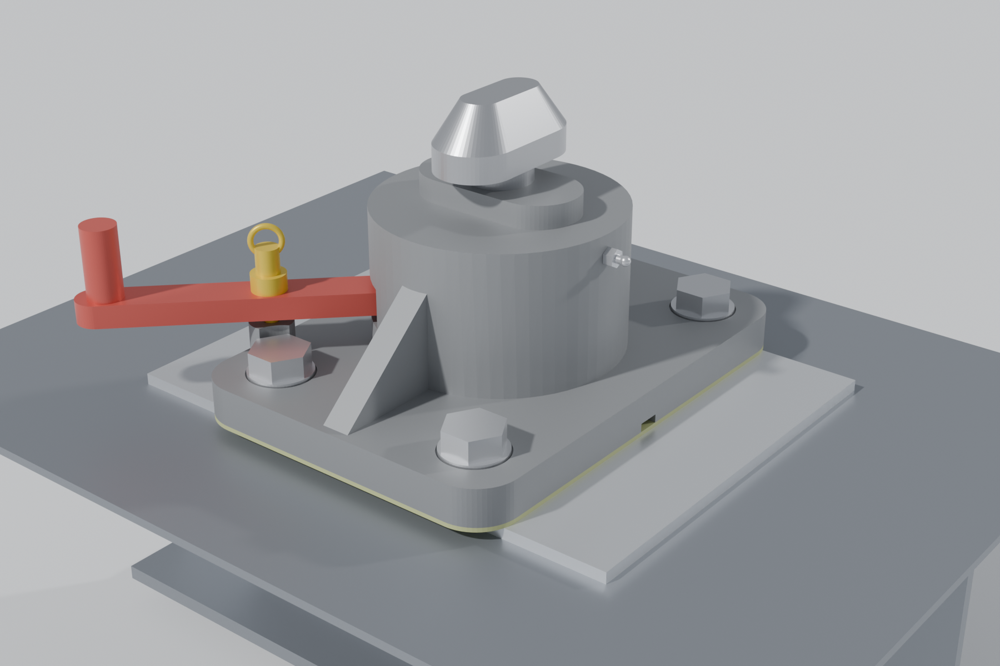
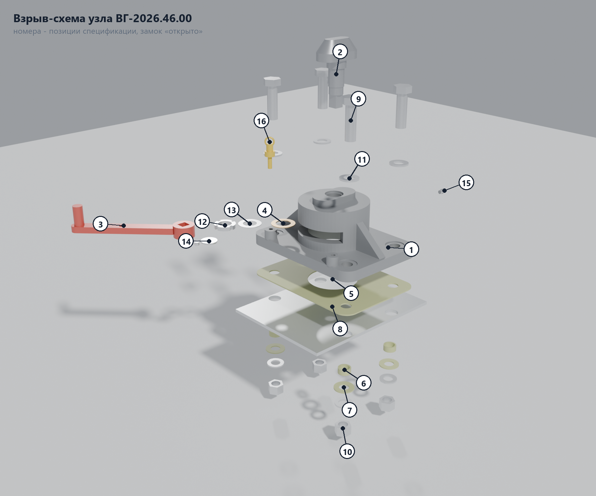
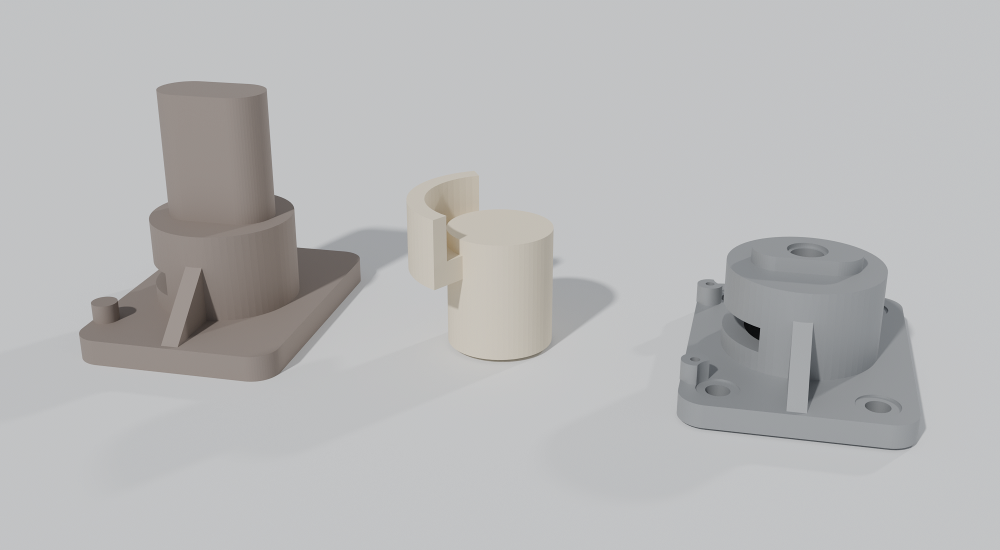
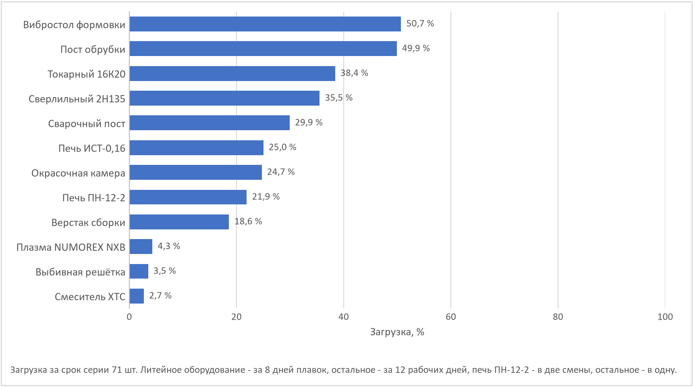
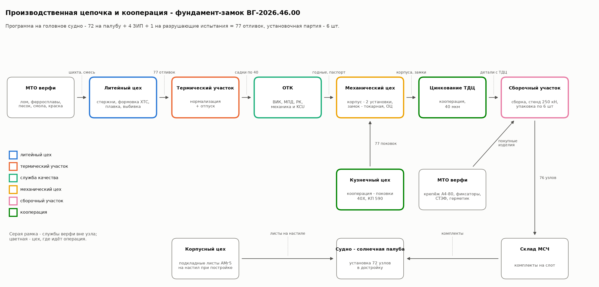
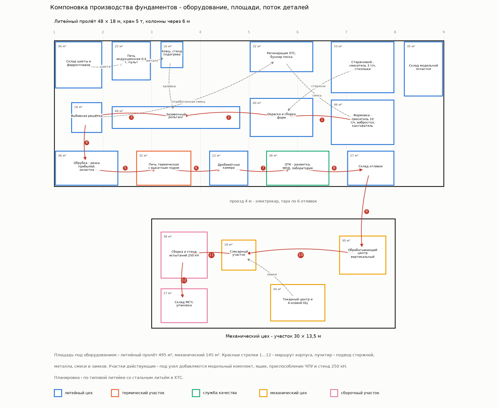
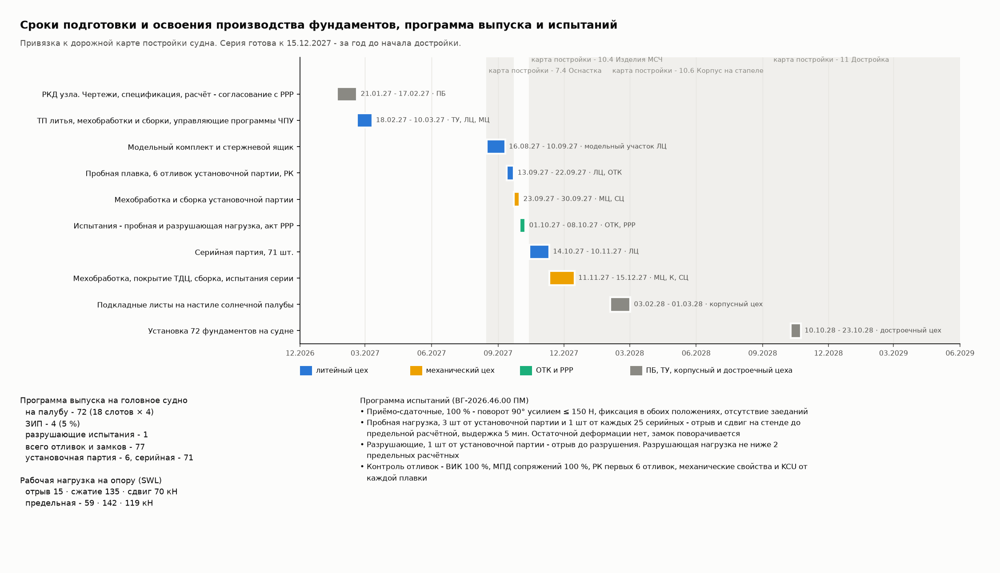
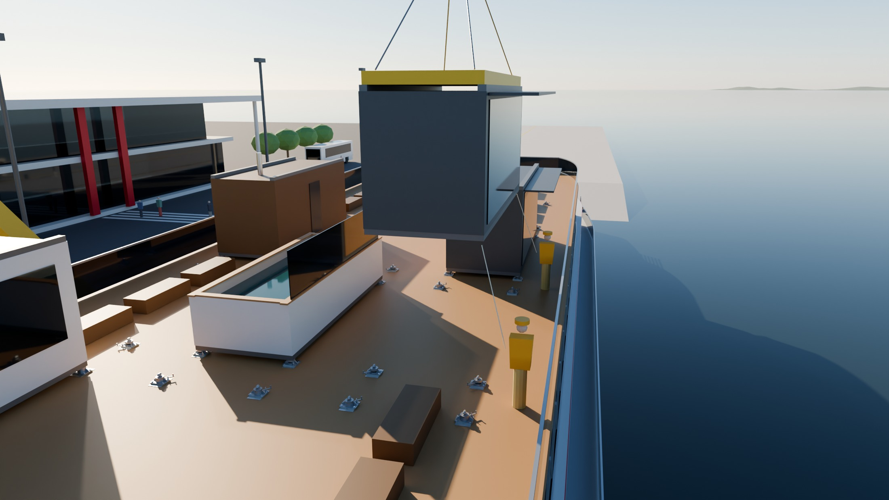

# Узел КД. Литой фундамент-замок модуля - ВГ-2026.46.00

> Проверок узла 44, не выполнено 0.

## 1. Почему этот узел и как он устроен

Узлом КД выбран фундамент для крепления модульных номеров солнечной палубы. Основа - эскизный 3D-проект узла (`docs/команда/солнечная_палуба/Чертёж крепления.jpg`) - литой корпус на болтах и поворотный конус с рукояткой. Узел держит «трансформер» - 8 модулей на 18 слотах, 72 фундаментов на судно.

- **Корпус (поз. 1)** - отливка из 20ГЛ - фланец 240 × 330 × 26 на четырёх болтах, над ним стакан Ø170, открытый к палубе. Сверху площадка, на которую садится угловой фитинг контейнера, и упор 118 × 58 × 16 - он входит в нижнюю часть отверстия фитинга 124,5 × 63,5 и принимает сдвиг.
- **Замок (поз. 2)** - поковка 40Х - конус 104 × 54 на валу Ø36. Снизу вал держит круглая шлицевая гайка М33×1,5 через бронзовую шайбу. Отрыв модуля идёт в верхнюю стенку корпуса, а не в резьбу рычага.
- **Рычаг (поз. 3)** надет на квадрат 22 вала внутри стакана и выходит через окно 120°. Положения «открыто» и «закрыто» через 90°, пружинный фиксатор входит в приливы корпуса.
- **Установка.** Корпус ставится на лист АМг5 380 × 290 × 8, приваренный к настилу над подпалубной балкой Т 260 × 8 / 130 × 12, через прокладку из стеклотекстолита. Болты М24 А4-80 стоят в изолирующих втулках, так что сталь и алюминий не касаются.
- **Высота опоры 135 мм** от настила до низа фитинга. Модуль с фундаментом 3,04 м при свободных 5,50 м под мостом.

*Узел в сборе - конус «закрыто», рычаг на фиксаторе, болты в изолирующих втулках*

## 2. Чертежи и 3D (3.1, 3.2)

| Документ | Файл | Что на нём |
|---|---|---|
| ВГ-2026.46.00 СБ | `CAD/узел/ВГ-2026_46_00_СБ.dxf` | разрез А-А, вид сверху, разрез Б-Б, 16 позиций, ТТ, техническая характеристика |
| ВГ-2026.46.01 | `CAD/узел/ВГ-2026_46_01_корпус.dxf` | корпус - размеры, шероховатость, допуски формы, ТТ на отливку |
| ВГ-2026.46.01 ЛФ | `CAD/узел/ВГ-2026_46_01_ЛФ_отливка.dxf` | элементы литейной формы по ГОСТ 3.1125-88 |
| ВГ-2026.46.01-МП СБ | `CAD/узел/ВГ-2026_46_01-МП_плита_модельная.dxf` | оснастка - плита модельная верха и низа |
| ВГ-2026.46.01-СЯ СБ | `CAD/узел/ВГ-2026_46_01-СЯ_ящик_стержневой.dxf` | оснастка - ящик стержневой |
| Спецификация | `renders/горизонт_2026/чертежи/46_спецификация_лист1.png` | ГОСТ 2.106-2019, 2 листа |
| 3D сборки | `CAD/STEP/VG-2026_46_00_twistlock.step` | 36 тел с именами по всем 16 позициям спецификации, пересечений 0 |
| 3D корпуса, отливки, стержня | `CAD/STEP/VG-2026_46_01_{body,casting,core}.step` | отливка - с припусками и прибылью, стержень - с ногой-знаком |
| 3D для модели судна | `CAD/GLB/VG-2026_46_00_twistlock_open.glb`, `…_casting.glb`, `…_core.glb` | glTF из того же скрипта - детали с именами позиций. Ставятся в модель судна и в сцену «Фундамент» |

*Взрыв-схема узла «открыто» с номерами позиций по спецификации. Детали из окна корпуса выходят по направлению рычага, крепёж - по осям болтов*

Чертёж и 3D построены по одним размерам. Масса корпуса по модели сходится с библиотекой до 1,1 %%. Сечения на чертежах строятся теми же булевыми операциями, что и тела. Растры листов - `renders/горизонт_2026/чертежи_dxf/ВГ-2026_46_*.png`.

## 3. Материалы с обоснованием (3.3)

| Деталь | Материал | σт / σв, МПа | Почему |
|---|---|---|---|
| Корпус | сталь 20ГЛ, ГОСТ 977-88 | 275 / 540 | литьё с ударной вязкостью 491 кДж/м² при посадке модуля краном. Сваривается без подогрева - дефекты отливки заваривают по ГОСТ 977 |
| Замок | сталь 40Х, поковка КП 590 ГОСТ 8479-70 из стали ГОСТ 4543-2016 | 590 / 735 | лепестки головки работают на изгиб и износ о фитинг. Улучшение даёт твёрдость 235…277 НВ и запас по усталости резьбы |
| Рычаг | сталь 09Г2С, лист ГОСТ 19281-2014 | 325 / 470 | лист как у корпусных конструкций, вязкий на морозе |
| Болты, гайки | нержавеющая А4-80, ГОСТ Р ИСО 3506-1-2009 | 600 / 800 | открытая палуба, пресная вода, с алюминием - только через изоляцию |
| Прокладка, втулки, шайбы | стеклотекстолит СТЭФ, стеклотекстолит ГОСТ 12652-74 | смятие ≤ 100 | жёсткий диэлектрик. Не ползёт под затяжкой, в отличие от паронита, и рвёт гальваническую пару сталь - АМг5 |
| Шайба упорная | БрАЖ9-4, ГОСТ 18175-78 | 200 / 500 | пара трения с гайкой при повороте под нагрузкой |
| Лист подкладной | АМг5, лист ГОСТ 21631-76 | 125 / 275 | материал надстройки - приваривается к настилу |

Сравнение литейных материалов для корпуса:

| Материал | σт, МПа | σв, МПа | δ, % | KCU, кДж/м² | Литейные свойства | Свариваемость | Цена, отн. | Вывод |
|---|---|---|---|---|---|---|---|---|
| 20Л | 216 | 412 | 22 | 491 | хорошо | хорошо | 1,00 | мягче - верхняя стенка и фланец выходят на 30 % толще, масса 72 фундаментов растёт |
| 20ГЛ | 275 | 540 | 18 | 491 | хорошо | хорошо | 1,08 | принято. Прочнее 20Л при той же ударной вязкости и свариваемости - дефекты отливки заваривают без подогрева |
| 25Л | 235 | 441 | 19 | 392 | хорошо | удовл. | 1,02 | ударная вязкость ниже, а работа узла ударная - посадка модуля краном |
| 35ХГСЛ | 343 | 590 | 14 | 294 | удовл. | плохо | 1,35 | нужна закалка, ударная вязкость вдвое ниже, заварка дефектов - с подогревом и повторной термообработкой |
| ВЧ 50 | 320 | 500 | 7 | - | отлично | нет | 0,85 | дешевле и льётся лучше, но относительное удлинение 7 % и хрупкость при ударе на морозе, заварка практически невозможна |
| АК7ч | 200 | 230 | 2 | - | отлично | удовл. | 1,40 | снимает гальваническую пару с настилом, но упор и отверстие фитинга изнашиваются, а объём узла вырастает вдвое |

## 4. Расчёт на прочность (3.4)

### 4.1. Качка - из теории корабля этого судна

Нагрузки на фундамент дают инерция модуля при качке и ветер. Числа качки - из расчётов по теории корабля (приложение А записки). Судно очень остойчивое и жёсткое, поэтому период короткий, а ускорения на солнечной палубе высокие. Период зависит от осадки, узел считается по самому короткому:

| Осадка, м | h, м | Период бортовой качки, с |
|---|---|---|
| 1,200 | 16,37 | 3,26 |
| 1,256 | 15,55 | 3,35 |
| 1,300 | 14,96 | 3,41 |

| Параметр | Значение | Откуда |
|---|---|---|
| Класс РРР, волна | «О», 2,0 м длиной 20 м | правила РРР |
| Амплитуда бортовой на резонансе | 19,8° без успокоителей, 10,9° с цистернами | расчёт качки с цистернами |
| Расчётный период бортовой | 3,26 с - самый короткий в диапазоне осадок 1,20…1,30 м | расчёт периода качки |
| Килевая качка | ψ = h/L = 0,82°, период 2,69 с | судно длиной 140 м на волне 2 м |
| Ось качки | через ЦТ судна, z = 2,68 м | посадка судна |
| Ветер | 0,294 кПа на борт модуля | правила РРР, давление ветра |

Два случая. **Эксплуатация** - цистерны работают, крен 10,9°, допускаемые 0,6σт. **Предельный** - цистерны осушены, резонанс, крен 19,8°, допускаемые 0,8σт. Ускорения в системе судна при наибольшем крене θ - поперёк g·sinθ + ε·Δz, по вертикали g·cosθ ± ε·y, где ε = θ(2π/T)². Модуль опрокидывается на подветренную пару фитингов, наветренная пара отрывается. Сдвиг принимают две опоры из четырёх. Посадка модуля краном - удар 1,5 на две опоры.

| Случай | θ, ° | a поперёк, м/с² | a верт., м/с² | Сжатие, кН | Отрыв, кН | Сдвиг, кН |
|---|---|---|---|---|---|---|
| Эксплуатация | 10,9 | 7,16 | 6,66 | 99,6 | 13,0 | 67,0 |
| Предельный | 19,8 | 12,95 | 3,84 | 142,2 | 59,1 | 119,2 |
| Посадка краном | - | - | - | 132,4 | - | - |

Расчётный модуль - самый тяжёлый в каталоге - бассейн глубокий, 18,0 т. Его нет в темах, поэтому у узла запас на будущие темы. Рабочая нагрузка на опору (SWL), которая маркируется на фланце - отрыв 15, сжатие 135, сдвиг 70 кН.

На опору от каждого модуля каталога, предельный случай (отрыв есть и у лёгких модулей - у них ветер и качка сильнее веса):

| Модуль | Масса, т | Сжатие, кН | Отрыв, кН | Сдвиг, кН |
|---|---|---|---|---|
| офис | 3,6 | 29,8 | 13,1 | 25,9 |
| спа | 5,5 | 44,6 | 19,2 | 38,2 |
| бассейн | 13,5 | 107,1 | 44,7 | 90,0 |
| бассейн глубокий | 18,0 | 142,2 | 59,1 | 119,2 |
| детский | 3,0 | 25,1 | 11,2 | 22,0 |
| клуб | 4,0 | 32,9 | 14,4 | 28,5 |
| люкс | 4,8 | 39,1 | 17,0 | 33,7 |
| бар | 4,2 | 34,4 | 15,1 | 29,8 |

### 4.2. Проверки

| Элемент | Случай | Значение | Допускается | Запас | Как считано |
|---|---|---|---|---|---|
| Головка конуса 40Х - изгиб лепестка | эксплуатация | 44,1 МПа | 354,0 МПа | 8,02 | лепесток 20 мм за кромкой отверстия 63.5, плечо 20 мм, сечение 54 × 18 |
| Головка - смятие днища фитинга | эксплуатация | 7,3 МПа | 247,5 МПа | 34,06 | две площадки 20 × 44, фитинг литой, как корпус |
| Вал 40Х - растяжение по резьбе М33×1,5 | эксплуатация | 16,7 МПа | 354,0 МПа | 21,13 | внутренний диаметр резьбы 31.4 мм |
| Гайка круглая - срез витков | эксплуатация | 17,5 МПа | 206,5 МПа | 11,79 | высота гайки 10 мм, коэффициент полноты витка 0,75 |
| Верхняя стенка стакана 20ГЛ - изгиб | эксплуатация | 11,5 МПа | 165,0 МПа | 14,34 | кольцевая пластина, заделка по стенке Ø122, нагрузка по шайбе Ø58, a/b = 2.10, β = 0.80 |
| Упор - смятие стенкой отверстия фитинга | эксплуатация | 69,8 МПа | 247,5 МПа | 3,55 | контакт по прямому участку 60 мм на высоте 16 |
| Упор - срез по основанию | эксплуатация | 13,1 МПа | 96,2 МПа | 7,33 | площадь основания без отверстия вала 5104 мм² |
| Стенка стакана у окна - растяжение и изгиб | эксплуатация | 28,2 МПа | 165,0 МПа | 5,84 | окно 120° снимает 33 % сечения. Момент сопротивления принят половиной целого |
| Болт М24 А4-80 - растяжение | эксплуатация | 315,1 МПа | 480,0 МПа | 1,52 | затяжка 106 кН (0,5σт), внешняя 21.3 кН на болт, χ = 0.25 |
| Стык - нераскрытие | эксплуатация | 21,2 кН | 89,9 кН | 4,24 | остаток затяжки 90 кН не меньше 0,2 затяжки |
| Сдвиг корпуса - держит трение | эксплуатация | 67,0 кН | 82,8 кН | 1,24 | μ = 0.20 по стеклотекстолиту, 4 болта, минус отрыв |
| Фланец 20ГЛ у болта - изгиб | эксплуатация | 94,6 МПа | 165,0 МПа | 1,74 | консоль 63 мм от стакана, толщина 26 мм, эффективная ширина 2e |
| Балка Т 260 × 8 / 130 × 12 АМг5 - изгиб | эксплуатация | 69,5 МПа | 75,0 МПа | 1,08 | пролёт 2.20 м между рамными бимсами, сила в середине, заделка по концам, W = 524 см³ |
| Настил АМг5 под изолирующей шайбой - смятие | эксплуатация | 71,9 МПа | 112,5 МПа | 1,56 | затяжка на шайбу Ø50/25 |
| Головка конуса 40Х - изгиб лепестка | предельный | 201,5 МПа | 472,0 МПа | 2,34 | лепесток 20 мм за кромкой отверстия 63.5, плечо 20 мм, сечение 54 × 18 |
| Головка - смятие днища фитинга | предельный | 33,2 МПа | 302,5 МПа | 9,12 | две площадки 20 × 44, фитинг литой, как корпус |
| Вал 40Х - растяжение по резьбе М33×1,5 | предельный | 76,5 МПа | 472,0 МПа | 6,17 | внутренний диаметр резьбы 31.4 мм |
| Гайка круглая - срез витков | предельный | 80,0 МПа | 271,4 МПа | 3,39 | высота гайки 10 мм, коэффициент полноты витка 0,75 |
| Верхняя стенка стакана 20ГЛ - изгиб | предельный | 52,5 МПа | 220,0 МПа | 4,19 | кольцевая пластина, заделка по стенке Ø122, нагрузка по шайбе Ø58, a/b = 2.10, β = 0.80 |
| Упор - смятие стенкой отверстия фитинга | предельный | 124,1 МПа | 302,5 МПа | 2,44 | контакт по прямому участку 60 мм на высоте 16 |
| Упор - срез по основанию | предельный | 23,3 МПа | 126,5 МПа | 5,42 | площадь основания без отверстия вала 5104 мм² |
| Стенка стакана у окна - растяжение и изгиб | предельный | 55,1 МПа | 220,0 МПа | 3,99 | окно 120° снимает 33 % сечения. Момент сопротивления принят половиной целого |
| Болт М24 А4-80 - растяжение | предельный | 333,3 МПа | 480,0 МПа | 1,44 | затяжка 106 кН (0,5σт), внешняя 47.0 кН на болт, χ = 0.25 |
| Стык - нераскрытие | предельный | 21,2 кН | 70,7 кН | 3,34 | остаток затяжки 71 кН не меньше 0,2 затяжки |
| Втулка изолирующая - смятие при проскальзывании | предельный | 88,7 МПа | 110,0 МПа | 1,24 | если трения 76 кН не хватит - сдвиг на болты через втулки СТЭФ |
| Фланец 20ГЛ у болта - изгиб | предельный | 208,4 МПа | 220,0 МПа | 1,06 | консоль 63 мм от стакана, толщина 26 мм, эффективная ширина 2e |
| Балка Т 260 × 8 / 130 × 12 АМг5 - изгиб | предельный | 74,6 МПа | 100,0 МПа | 1,34 | пролёт 2.20 м между рамными бимсами, сила в середине, заделка по концам, W = 524 см³ |
| Настил АМг5 под изолирующей шайбой - смятие | предельный | 71,9 МПа | 137,5 МПа | 1,91 | затяжка на шайбу Ø50/25 |
| Рычаг 09Г2С - изгиб, 1 кН на конце | эксплуатация | 146,5 МПа | 260,0 МПа | 1,77 | плечо 175 мм от стенки стакана, сечение 28 × 16 |
| Вал - усталость по впадине резьбы | эксплуатация | 8,4 МПа | 70,2 МПа | 8,39 | амплитуда отрыва, σ₋₁ = 0,43σв = 316, Kσ резьбы 3,0, запас 1,5 |

Самые нагруженные места - фланец у болта в предельном случае (запас 1,06) и подпалубная балка. Балка увеличена с Т 200 × 8 / 100 × 10 до Т 260 × 8 / 130 × 12 - при посадке модуля краном прежняя давала бы 130 МПа при допускаемых 75.

## 5. Технологический процесс (4.1)

### 5.1. Способ литья - своя литейка, ХТС

Корпус льётся в своей литейке. Способ выбран из доступных для стальной отливки 25…30 кг партией 77 шт:

| Способ | Класс точности | Оснастка | Стоимость формы | Решение |
|---|---|---|---|---|
| ПГС по-сырому | 12…14 | деревянная модель | низкая | подвесной болван и тонкая нога-знак в сырой смеси обваливаются. Точность хуже - припуски растут, мехобработки больше |
| ХТС альфа-сет в опоках | 9…11 | модельная плита и ящик из модельного пластика | средняя | принято. Прочная форма держит стержень с ногой-знаком, нет сушки, песок регенерируется на 90 %, смола без серы - нет газовых раковин в стали |
| Литьё по выплавляемым моделям | 5…7 | пресс-форма, линия керамики | высокая | точнее, но пресс-форма окупается на тысячах штук. Для 77 отливок по 28 кг и стенки 24…30 мм невыгодно |
| Литьё по газифицируемым моделям | 8…10 | пресс-форма пенополистирола | средняя | науглероживание низкоуглеродистой 20ГЛ от пенополистирола - вне ГОСТ 977 по углероду в поверхностном слое |
| Кокиль | 7…9 | стальной кокиль | высокая | сталь в кокиле даёт отбел и трещины у стакана, стойкость кокиля при 1580 °С мала, окупается на больших сериях |

### 5.2. Подготовка формы

- **Положение в форме.** Подошва фланца лежит по разъёму, весь корпус - в полуформе верха. Площадка смотрит вверх, под прибыль. Полость стакана и окно даёт один стержень, его нижний знак стоит в полуформе низа.
- **Стержень с ногой-знаком.** Знак окна продлён вверх до верха модели. Знак только по высоте окна давал бы поднутрение, и модель нельзя было бы вынуть из формы. Стержень весит 3,2 кг ХТС.
- **Прибыль** рассчитана по модулям охлаждения. Тепловой узел - верхняя стенка с припуском, модуль 17,5 мм, прибыли нужно не меньше 21,0. Прибыль открытая, овальная 130 × 70 по контуру упора, высотой 150 мм, зеркало под утепляющей засыпкой - модуль 23,7 мм, масса 9,4 кг. Питание - нужно 1,69 кг, прибыль отдаёт 1,89. Упор вырезается фрезой из шейки прибыли, поэтому металл под сдвиговым упором самый плотный.
- **Холодильники** Х1…Х4 наружные, у корней рёбер и у приливов фиксатора. Они ускоряют затвердевание дальних от прибыли узлов, чтобы усадка шла к прибыли.
- **Литниковая система** на форму из двух отливок, металла 82,5 кг. Время заливки τ = S√G = 13,6 с, расчётный напор по Асатиани 199 мм. Сечения стояк : коллектор : питатели = 11,0 : 13,1 : 15,3 см², расширяющаяся система для стали, стояк Ø37, 4 питателя в торцы фланцев по разъёму. Выход годного 60,6 %.
- **Груз на форму.** Металл давит на верх с силой 5,5 кН (с запасом 1,3), полуформа верха весит 2,3 кН. Поэтому форма нагружается 350 кг или скрепляется четырьмя скобами.
- **Смесь.** Песок кварцевый 1К, смола альфа-сет 1,5 %, отвердитель 22 % от смолы, съём через 35 мин, регенерация 90 %. На форму идёт 0,256 т смеси и 3,8 кг смолы. Модели крупнее детали на 1,8 % (усадка).

*Отливка с прибылью и стержень с ногой-знаком, 3D-модель*

### 5.3. Маршрут

| Опер. | Цех | Операция | Содержание | Оборудование | Тпз, ч | Тшт, ч |
|---|---|---|---|---|---|---|
| 005 | ЛЦ | Стержневая | Изготовить стержень полости и окна из ХТС - засыпка, уплотнение вибрацией 20 с, отверждение 35 мин, окраска | Смеситель ХТС непрерывный 3 т/ч, вибростол, ящик стержневой ВГ-2026.46.01-СЯ | 0,30 | 0,12 |
| 010 | ЛЦ | Формовочная | Формовка низа и верха по модельной плите, отверждение, протяжка, окраска, установка 4 холодильников и 2 стержней, сборка формы | Смеситель ХТС 10 т/ч, вибростол, плита модельная ВГ-2026.46.01-МП, опоки 800×500×290/150 | 0,50 | 0,30 |
| 015 | ЛЦ | Плавка и заливка | Плавка 20ГЛ, раскисление алюминием 1 кг/т, заливка при 1560…1580 °С. Проба на химсостав и клиновая проба от плавки | Печь индукционная тигельная 0,4 т, ковш чайниковый 0,5 т, пирометр | 0,80 | 0,25 |
| 020 | ЛЦ | Выбивная | Охлаждение в форме не менее 3 ч, выбивка, удаление стержня, возврат смеси на регенерацию | Решётка выбивная инерционная, линия регенерации ХТС | 0,10 | 0,10 |
| 025 | ЛЦ | Обрубная | Отрезать прибыль с припуском 8 мм над упором, отбить литники, зачистить заусенцы и места питателей | Резак газокислородный, шлифмашина угловая | 0,10 | 0,35 |
| 030 | ТО | Термическая | Нормализация 900…920 °С, выдержка 2 ч, охлаждение на воздухе, отпуск 600…650 °С, 3 ч, воздух | Печь камерная электрическая с выкатным подом | 0,50 | 0,08 |
| 035 | ЛЦ | Очистная | Очистка дробью до степени Sa 2 | Дробемётная камера | 0,10 | 0,06 |
| 040 | ОТК | Контроль отливки | ВИК 100 %, размеры по разметке 1 шт от формы, МПД сопряжений стакана и фланца, твёрдость. Механика и KCU по клиновой пробе от плавки, РК первых 6 отливок - подтверждение технологии формы | Лаборатория - разрывная машина, копёр, дефектоскоп МПД, рентгеновский аппарат | 0,30 | 0,25 |
| 045 | ЛЦ | Исправление дефектов | По разрешению ОТК - выборка, заварка электродами УОНИ-13/55, МПД после заварки (ГОСТ 977-88) | Пост ручной дуговой сварки | 0,00 | 0,05 |
| 050 | МЦ | Фрезерная с ЧПУ, установ 1 | База - упор и наружная поверхность стакана - фрезеровать подошву в размер, сверлить 4 отв. Ø26 | Обрабатывающий центр вертикальный, тиски гидравлические | 0,40 | 0,30 |
| 055 | МЦ | Фрезерная с ЧПУ, установ 2 | Фрезеровать площадку и упор 118×58×16, расточить Ø36H9 и выточку Ø44×5, цековать 4 × Ø46, сверлить 2 отв. Ø10,5 фиксатора, сверлить и нарезать М10×1 маслёнки, канал Ø5 | Обрабатывающий центр вертикальный, приспособление с пальцами по отв. Ø26 | 0,60 | 0,55 |
| 060 | МЦ | Слесарная | Зачистить окно и полость, притупить кромки 1…2 мм | Верстак | 0,00 | 0,15 |
| 065 | ОТК | Контроль детали | Размеры по чертежу, шероховатость, резьбы | Калибры, КИМ портативная | 0,10 | 0,12 |
| 070 | К | Покрытие | ТДЦ 40 мкм по ГОСТ Р 9.316-2006. Отверстия Ø36 и Ø44 обработаны с учётом слоя покрытия | Кооперация - участок термодиффузионного цинкования | 0,00 | 0,00 |

Замок - 005 поковка, 010 токарная с чпу, 015 фрезерная с чпу, 020 контроль. Сборка - 005 сборочная, 010 испытательная, 015 маркировка и консервация. Монтаж на судне - 1) Корпусный цех при постройке надстройки - приварить подкладные листы к настилу над балками по разметке от ДП и шпангоутов, 2) Сверлить 4 отв. Ø32 в листе и настиле по кондуктору-шаблону, установить втулки изолирующие, 3) Уложить прокладку на герметике, поставить корпус, болты сверху, снизу шайбы изолирующие и гайки, 4) Затянуть крест-накрест моментом из расчёта затяжки 0,5σт, герметизировать кромку прокладки, 5) Проверить поворот замков и фиксацию. Записать номера фундаментов по слотам в журнал.

Карты ЕСТД (`renders/горизонт_2026/чертежи/46_*.png`) - маршрутные на корпус, замок и сборку. Операционные на стержни (005), формовку (010) и плавку (015) - с переходами и режимами, карта эскизов формы в сборе, карта контроля.

| Опер. | Объект | Параметр | Средство | Объём | НД |
|---|---|---|---|---|---|
| 015 | Плавка | химсостав C, Mn, Si, S, P | спектрометр | каждая плавка | ГОСТ 977-88 |
| 015 | Плавка | σ0,2, σв, δ, ψ, KCU | разрывная машина, копёр | клиновая проба от плавки | ГОСТ 1497-84, ГОСТ 9454-78 |
| 040 | Отливка | внешний вид, раковины, трещины | ВИК, лупа ×4 | 100 % | ГОСТ 977-88, гр. 3 |
| 040 | Отливка | размеры и припуски | разметочная плита, шаблоны | 1 от формы | чертёж ЛФ |
| 040 | Отливка | трещины в сопряжениях стакана | МПД | 100 % | ГОСТ Р 56512-2015 |
| 040 | Отливка | усадочная пористость узлов | РК | первые 6 отливок | ГОСТ 7512-82 |
| 040 | Отливка | твёрдость после термообработки | твердомер Бринелля | 10 % от садки | ГОСТ 9012-59 |
| 065 | Деталь | Ø36H9, выточка Ø44 | калибр-пробка | 100 % | чертёж ВГ-2026.46.01 |
| 065 | Деталь | параллельность площадки 0,1 | индикатор на плите | 10 % | чертёж ВГ-2026.46.01 |
| СБ 005 | Узел | осевой зазор вала 0,2…0,5 | щуп | 100 % | СБ, ТТ 2 |
| СБ 010 | Узел | усилие поворота ≤ 150 Н, фиксация | динамометр | 100 % | СБ, ТТ 4 |
| СБ 010 | Узел | пробная нагрузка | стенд 250 кН | по программе испытаний | ВГ-2026.46.00 ПМ |

## 6. Оснастка (4.2)

- **Плита модельная** ВГ-2026.46.01-МП. Верх - две модели отливки (сплошные - полость и окно даёт стержень), модели прибылей, стояка, коллектора и питателей, штыри под опоки, низ - знаки стержней. Модели из полиуретанового пластика фрезеруются по `VG-2026_46_01_casting.step`, стойкость 500 съёмов при программе 77.
- **Ящик стержневой** ВГ-2026.46.01-СЯ - разъём по плоскости окна, засыпка через торец знака. Стержень формуется знаком вверх.
- **Приспособление** для установки 2 - плита с двумя пальцами по отверстиям Ø26 (указано в МК). Кондуктор-шаблон для сверления листа и настила на судне.

## 7. Мощности (4.3)

| Цех | Нормо-часы на партию | Свободный фонд, ч/год | Доля, % |
|---|---|---|---|
| ЛЦ | 96,6 | 591 | 16,3 |
| МЦ | 140,5 | 492 | 28,5 |
| ОТК | 36,7 | 690 | 5,3 |
| СЦ | 31,3 | 788 | 4,0 |
| ТО | 6,7 | 886 | 0,8 |

| Цех | Оборудование (берём своё) | Операции | Кол. | Примечание |
|---|---|---|---|---|
| ЛЦ | Печь индукционная тигельная 0,4 т | плавка 20ГЛ | 1 | ч/плавку 1,5 |
| ЛЦ | Смеситель ХТС непрерывного действия 10 т/ч с линией регенерации | формовка | 1 |  |
| ЛЦ | Смеситель ХТС 3 т/ч и вибростол | стержни | 1 |  |
| ЛЦ | Опоки 800 × 500 × 290/150 | формы | 8 | оборот 2 раза в смену |
| ЛЦ | Решётка выбивная инерционная | выбивка | 1 |  |
| ТО | Печь камерная электрическая с выкатным подом, садка 2 т | нормализация, отпуск | 1 | садка 40 отливок |
| ЛЦ | Камера дробемётная | очистка | 1 |  |
| ОТК | Разрывная машина, маятниковый копёр, МПД, рентгеновский аппарат | контроль | 1 |  |
| МЦ | Обрабатывающий центр вертикальный | корпус, установ 1 и 2 | 1 |  |
| МЦ | Токарный центр и 4-осевой обрабатывающий центр | замок | 1 |  |
| СЦ | Стенд гидравлический 250 кН | испытания | 1 |  |

Партия занимает меньше трети свободного фонда любого цеха. Своих мощностей хватает, новое оборудование - только стенд 250 кН. Кооперация - поковки 40Х и термодиффузионное цинкование. Состав оборудования литейки и текущая загрузка цехов приняты по типовой литейке со стальным литьём.

*Загрузка своих мощностей партией*

## 8. Схема производства и кооперации (4.4)

*Производственная цепочка и кооперация*

## 9. Планировка участка (4.5)

*Компоновка производства - оборудование, площади, поток деталей*

## 10. Сроки освоения, программа выпуска и испытаний (4.6)

| Этап | Начало | Конец | Раб. дней | Кто | Привязка |
|---|---|---|---|---|---|
| РКД узла. Чертежи, спецификация, расчёт - согласование с РРР | 21.01.2027 | 17.02.2027 | 20 | ПБ | в составе РКД |
| ТП литья, мехобработки и сборки, управляющие программы ЧПУ | 18.02.2027 | 10.03.2027 | 15 | ТУ, ЛЦ, МЦ |  |
| Модельный комплект и стержневой ящик | 16.08.2027 | 10.09.2027 | 20 | модельный участок ЛЦ | задача 7.4 карты постройки |
| Пробная плавка, 6 отливок установочной партии, РК | 13.09.2027 | 22.09.2027 | 8 | ЛЦ, ОТК |  |
| Мехобработка и сборка установочной партии | 23.09.2027 | 30.09.2027 | 6 | МЦ, СЦ |  |
| Испытания - пробная и разрушающая нагрузка, акт РРР | 01.10.2027 | 08.10.2027 | 6 | ОТК, РРР | освоение |
| Серийная партия, 71 шт. | 14.10.2027 | 10.11.2027 | 20 | ЛЦ | задача 10.4 карты постройки |
| Мехобработка, покрытие ТДЦ, сборка, испытания серии | 11.11.2027 | 15.12.2027 | 25 | МЦ, К, СЦ |  |
| Подкладные листы на настиле солнечной палубы | 03.02.2028 | 01.03.2028 | 20 | корпусный цех | стапель |
| Установка 72 фундаментов на судне | 10.10.2028 | 23.10.2028 | 10 | достроечный цех | достройка |

Программа - 72 на палубу + 4 ЗИП + 1 на разрушающие испытания = 77, установочная партия 6, серийная 71.

| Испытание | Содержание |
|---|---|
| Приёмо-сдаточные, 100 % | поворот 90° усилием ≤ 150 Н, фиксация в обоих положениях, отсутствие заеданий |
| Пробная нагрузка, 3 шт от установочной партии и 1 шт от каждых 25 серийных | отрыв и сдвиг на стенде до предельной расчётной, выдержка 5 мин. Остаточной деформации нет, замок поворачивается |
| Разрушающие, 1 шт от установочной партии | отрыв до разрушения. Разрушающая нагрузка не ниже 2 предельных расчётных |
| Контроль отливок | ВИК 100 %, МПД сопряжений 100 %, РК первых 6 отливок, механические свойства и KCU от каждой плавки |

*Сроки подготовки и освоения производства*

## 11. Узел на судне - модель и смена модуля у причала

В модели судна стоят все 72 опоры - те же тела, что в КД. Под модулем замок «закрыто» - конус повёрнут поперёк отверстия фитинга, рычаг на фиксаторе. На свободном слоте - «открыто», рычаг смотрит в торцевой проход - у кормовых опор слота в корму, у носовых в нос. Нижние фитинги модуля полые, с отверстием 124,5 × 63,5 мм - конус и упор входят в них без касания стенок. Аудит модели - 0 пересечений глубже 25 мм, 0 незамкнутых тел.

Смена темы - в порту приписки (Самара, начало и конец кольца). Судно стоит лагом левым бортом к стенке с кордоном 1,80 м над водой, портальный кран 16 т на рельсах вдоль кордона ставит модули через левый борт до дальнего ряда у правого - вылет 20,3 м. Модуль проносится над соседними с зазором 0,5 м - подъём над слотом 2,96 м считается по высотам модулей темы на пути от кордона. Пассажиры сходят по телескопическому трапу из гаража (уклон 0,046), автомобили - по кормовой аппарели на бетонный пандус 1:8 (уклон аппарели 0,075). Оба не круче 0,08 - проходимы для кресла-коляски. 

*Секция люкса А-3-ПБ на крюке над своим слотом - замки открыты, стропальщики держат оттяжки. Слева - мелкий бассейн, над которым модуль пронесли*

*Порт приписки - кран над солнечной палубой, дорожка от вокзала к трапу, фургон съезжает по аппарели на пандус, площадка модулей других тем за тыловым рельсом*

| Проверка стоянки | Значение | Норма |  | Примечание |
|---|---|---|---|---|
| Трап - уклон при кордоне 1.80 м над водой | 0.046 | 0.08 | ок | перепад 0.10 м на 2.15 м от двери гаража до кордона |
| Трап - сход без ступеней | 1.22…2.18 | 1.8 | ок | кордон над водой, при выдвижении до 6.0 м уклон не круче 0.08 |
| Аппарель на пандусе - уклон | 0.075 | 0.08 | ок | откос 1:8, носок пандуса на 0.30 м под водой. Автомобиль и кресло-коляска съезжают на откос |
| Аппарель - носок на откосе | -8.974 | -0.8 | ок | носок x = -8.97 между гребнем -17.60 и торцом -0.80 |
| Кранцы - зазор до борта | 0.1 | 0.05 | ок | лицо стенки y = -8.85, кранец Ø0.5 м |
| Кран - вылет до дальнего ряда | 20.3 | 32.0 | ок | ось крана y = -16.10, ближний ряд 11.9 м (не меньше 8) |
| Кран - самый тяжёлый модуль каталога с траверсой | 14.8 | 16.0 | ок | бассейн с водой 13.5 т + траверса 1.3 т, в теме - до 14.8 т |
| Кран - крюк под оголовком | 19.041 | 28.1 | ок | подъём над слотом 2.96 м - пронос над соседними с зазором 0.5 м |
| Швартовы | 4 | 4 | ок | кормовой продольный 8 м, кормовой шпринг 14 м, носовой шпринг 14 м, носовой продольный 17 м |

## 12. Принятые допущения

- Толщина днища фитинга ISO 1161 у отверстия 28 мм - по паспорту фитингов поставщика контейнеров.
- Оборудование литейки, текущая загрузка цехов и планировка - по данным верфи.
- Нормы времени - укрупнённые, уточняются по нормативам верфи.
- Допускаемые напряжения 0,6σт и 0,8σт, испытательные нагрузки - согласовать с РРР при рассмотрении РКД.
- Узел сделан по чертежу крепления и техническому заданию на модульное решение.
- Кран порта - класса 16 т / 32 м, отметка кордона 1,80 м над водой - приняты для Самары.

## 13. Проверки узла

| Проверка | Значение | Норма |  | Примечание |
|---|---|---|---|---|
| Конус проходит отверстие фитинга «открыто» | 104.0 | 118.5 | ок | головка 104 × 54 в отверстии 124.5 × 63.5 |
| Головка держит «закрыто» | 20.25 | 15.0 | ок | лепесток за кромкой отверстия шириной 63.5 |
| Зазор упора в отверстии фитинга | 2.75 | 4.0 | ок | упор 118 × 58 - по длине 3.2, по ширине 2.8 на сторону |
| Упор ниже днища фитинга | 16.0 | 20.0 | ок | над упором шейка поворачивается в днище 28 мм |
| Высота опоры = высота фундамента в данных судна | 0.135 | 0.135 | ок | корпус 124 + прокладка 3 + лист 8 мм |
| Головка конуса 40Х - изгиб лепестка (эксплуатация) | 44.1 | 354.0 | ок | запас 8.02, лепесток 20 мм за кромкой отверстия 63.5, плечо 20 мм, сечение 54 × 18 |
| Головка - смятие днища фитинга (эксплуатация) | 7.3 | 247.5 | ок | запас 34.06, две площадки 20 × 44, фитинг литой, как корпус |
| Вал 40Х - растяжение по резьбе М33×1,5 (эксплуатация) | 16.7 | 354.0 | ок | запас 21.13, внутренний диаметр резьбы 31.4 мм |
| Гайка круглая - срез витков (эксплуатация) | 17.5 | 206.5 | ок | запас 11.79, высота гайки 10 мм, коэффициент полноты витка 0,75 |
| Верхняя стенка стакана 20ГЛ - изгиб (эксплуатация) | 11.5 | 165.0 | ок | запас 14.34, кольцевая пластина, заделка по стенке Ø122, нагрузка по шайбе Ø58, a/b = 2.10, β = 0.80 |
| Упор - смятие стенкой отверстия фитинга (эксплуатация) | 69.8 | 247.5 | ок | запас 3.55, контакт по прямому участку 60 мм на высоте 16 |
| Упор - срез по основанию (эксплуатация) | 13.1 | 96.2 | ок | запас 7.33, площадь основания без отверстия вала 5104 мм² |
| Стенка стакана у окна - растяжение и изгиб (эксплуатация) | 28.2 | 165.0 | ок | запас 5.84, окно 120° снимает 33 % сечения. Момент сопротивления принят половиной целого |
| Болт М24 А4-80 - растяжение (эксплуатация) | 315.1 | 480.0 | ок | запас 1.52, затяжка 106 кН (0,5σт), внешняя 21.3 кН на болт, χ = 0.25 |
| Стык - нераскрытие (эксплуатация) | 21.2 | 89.9 | ок | запас 4.24, остаток затяжки 90 кН не меньше 0,2 затяжки |
| Сдвиг корпуса - держит трение (эксплуатация) | 67.0 | 82.8 | ок | запас 1.24, μ = 0.20 по стеклотекстолиту, 4 болта, минус отрыв |
| Фланец 20ГЛ у болта - изгиб (эксплуатация) | 94.6 | 165.0 | ок | запас 1.74, консоль 63 мм от стакана, толщина 26 мм, эффективная ширина 2e |
| Балка Т 260 × 8 / 130 × 12 АМг5 - изгиб (эксплуатация) | 69.5 | 75.0 | ок | запас 1.08, пролёт 2.20 м между рамными бимсами, сила в середине, заделка по концам, W = 524 см³ |
| Настил АМг5 под изолирующей шайбой - смятие (эксплуатация) | 71.9 | 112.5 | ок | запас 1.56, затяжка на шайбу Ø50/25 |
| Головка конуса 40Х - изгиб лепестка (предельный) | 201.5 | 472.0 | ок | запас 2.34, лепесток 20 мм за кромкой отверстия 63.5, плечо 20 мм, сечение 54 × 18 |
| Головка - смятие днища фитинга (предельный) | 33.2 | 302.5 | ок | запас 9.12, две площадки 20 × 44, фитинг литой, как корпус |
| Вал 40Х - растяжение по резьбе М33×1,5 (предельный) | 76.5 | 472.0 | ок | запас 6.17, внутренний диаметр резьбы 31.4 мм |
| Гайка круглая - срез витков (предельный) | 80.0 | 271.4 | ок | запас 3.39, высота гайки 10 мм, коэффициент полноты витка 0,75 |
| Верхняя стенка стакана 20ГЛ - изгиб (предельный) | 52.5 | 220.0 | ок | запас 4.19, кольцевая пластина, заделка по стенке Ø122, нагрузка по шайбе Ø58, a/b = 2.10, β = 0.80 |
| Упор - смятие стенкой отверстия фитинга (предельный) | 124.1 | 302.5 | ок | запас 2.44, контакт по прямому участку 60 мм на высоте 16 |
| Упор - срез по основанию (предельный) | 23.3 | 126.5 | ок | запас 5.42, площадь основания без отверстия вала 5104 мм² |
| Стенка стакана у окна - растяжение и изгиб (предельный) | 55.1 | 220.0 | ок | запас 3.99, окно 120° снимает 33 % сечения. Момент сопротивления принят половиной целого |
| Болт М24 А4-80 - растяжение (предельный) | 333.3 | 480.0 | ок | запас 1.44, затяжка 106 кН (0,5σт), внешняя 47.0 кН на болт, χ = 0.25 |
| Стык - нераскрытие (предельный) | 21.2 | 70.7 | ок | запас 3.34, остаток затяжки 71 кН не меньше 0,2 затяжки |
| Втулка изолирующая - смятие при проскальзывании (предельный) | 88.7 | 110.0 | ок | запас 1.24, если трения 76 кН не хватит - сдвиг на болты через втулки СТЭФ |
| Фланец 20ГЛ у болта - изгиб (предельный) | 208.4 | 220.0 | ок | запас 1.06, консоль 63 мм от стакана, толщина 26 мм, эффективная ширина 2e |
| Балка Т 260 × 8 / 130 × 12 АМг5 - изгиб (предельный) | 74.6 | 100.0 | ок | запас 1.34, пролёт 2.20 м между рамными бимсами, сила в середине, заделка по концам, W = 524 см³ |
| Настил АМг5 под изолирующей шайбой - смятие (предельный) | 71.9 | 137.5 | ок | запас 1.91, затяжка на шайбу Ø50/25 |
| Рычаг 09Г2С - изгиб, 1 кН на конце (эксплуатация) | 146.5 | 260.0 | ок | запас 1.77, плечо 175 мм от стенки стакана, сечение 28 × 16 |
| Вал - усталость по впадине резьбы (эксплуатация) | 8.4 | 70.2 | ок | запас 8.39, амплитуда отрыва, σ₋₁ = 0,43σв = 316, Kσ резьбы 3,0, запас 1,5 |
| Прибыль питает отливку | 1.69 | 1.89 | ок | прибыль овальная 130 × 70 высотой 150, 9.4 кг, усадка 4.5 % отливки и прибыли |
| Выход годного | 60.6 | 50.0 | ок | металла на форму 82.5 кг на две отливки |
| Верхняя опока вмещает отливку с прибылью | 283.0 | 290.0 | ок | прибыль открытая - выходит на верх полуформы |
| Мощности ЛЦ на партию | 96.6 | 591 | ок | 16.3 % свободного фонда |
| Мощности МЦ на партию | 140.5 | 492 | ок | 28.5 % свободного фонда |
| Мощности ОТК на партию | 36.7 | 690 | ок | 5.3 % свободного фонда |
| Мощности СЦ на партию | 31.3 | 788 | ок | 4.0 % свободного фонда |
| Мощности ТО на партию | 6.7 | 886 | ок | 0.8 % свободного фонда |
| Фундаменты готовы до достройки | 15.12.2027 | 13.09.2028 | ок | серия собрана и испытана до начала достройки по карте постройки |
